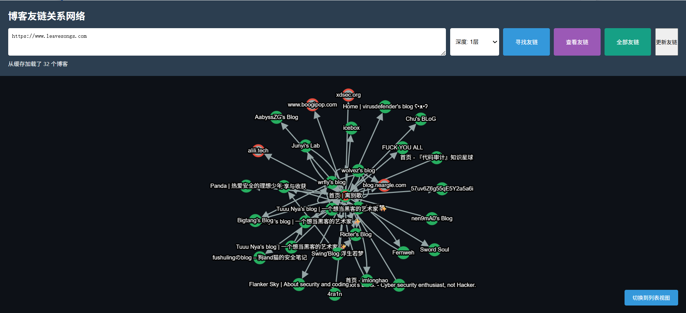

# BlogLink Network Visualizer

## 目录
- [BlogLink Network Visualizer](#bloglink-network-visualizer)
  - [目录](#目录)
- [项目介绍](#项目介绍)
  - [✨ 功能特性](#-功能特性)
  - [🚀 快速开始](#-快速开始)
    - [环境要求](#环境要求)
    - [安装依赖](#安装依赖)
    - [配置（可选）](#配置可选)
    - [启动服务](#启动服务)
    - [访问系统](#访问系统)
  - [📖 使用指南](#-使用指南)
    - [1. 开始查找](#1-开始查找)
    - [2. 查看结果](#2-查看结果)
    - [3. 数据管理](#3-数据管理)
  - [📁 项目结构](#-项目结构)
  - [🔌 API 接口](#-api-接口)
  - [🛠️ 技术栈](#️-技术栈)
  - [⚠️ 注意事项](#️-注意事项)
  - [📝 许可证](#-许可证)
  - [🤝 贡献](#-贡献)
  - [📧 联系方式](#-联系方式)
- [为什么要写这个项目](#为什么要写这个项目)
- [中文安全博客列表](#中文安全博客列表)
- [微信公众号列表](#微信公众号列表)
- [国外安全博客列表](#国外安全博客列表)


# 项目介绍

这是一个用于发现、挖掘并可视化博客友链关系网络的工具，支持递归查找、AI 智能过滤以及图形化展示友链关系。




## ✨ 功能特性

- 🕷️ **递归查找** - 支持1-3层深度的友链递归发现
- 🤖 **AI智能过滤** - 自动识别并过滤企业域名
- 📊 **可视化展示** - 交互式网络图展示友链关系
- 💾 **本地缓存** - 支持离线查看历史数据
- 🎯 **黑白名单** - 灵活的域名过滤机制
- 📋 **双视图模式** - 表格/图形视图自由切换

## 🚀 快速开始

### 环境要求

- Python 3.8+
- 现代浏览器（Chrome/Firefox/Edge）

### 安装依赖

```bash
cd backend
pip install -r requirements.txt
```

### 配置（可选）

如需启用AI检测功能，创建 `backend/.env` 文件：

```bash
AI_API_KEY=your_api_key_here
AI_BASE_URL=https://api.linkapi.ai/v1
```

> 不配置AI功能不影响基本查找和可视化

### 启动服务

**方式一：一键启动（推荐）**

```bash
python start.py
```

**方式二：手动启动**

```bash
# 终端1 - 启动后端
cd backend
python run.py

# 终端2 - 启动前端
cd frontend
python -m http.server 3000
```

### 访问系统

- 🌐 前端界面: http://localhost:3000
- 🔌 后端API: http://localhost:8011

## 📖 使用指南


### 1. 开始查找

- 输入一个或多个博客URL（每行一个）
- 选择查找深度（1-3层）
- 点击"查找友链"按钮

### 2. 查看结果

- **表格视图** - 默认显示，列出所有博客信息
- **图形视图** - 点击"切换到图形视图"查看关系网络
- **交互操作** - 点击节点高亮其连接关系

### 3. 数据管理

- **查看缓存** - 加载历史数据
- **黑名单管理** - 过滤不需要的域名
- **全部友链** - 查看所有已发现的博客

## 📁 项目结构

```
SecUnion/
├── backend/              # 后端服务
│   ├── main.py          # FastAPI主服务
│   ├── crawler.py       # 发现引擎
│   ├── parser.py        # 友链解析器
│   ├── ai_detector.py   # AI域名检测
│   ├── storage.py       # 数据存储层
│   ├── domain_filter.py # 域名过滤器
│   ├── graph_builder.py # 图结构构建
│   ├── url_normalizer.py# URL标准化
│   ├── run.py           # 启动脚本
│   └── requirements.txt # 依赖列表
├── frontend/            # 前端页面
│   ├── index.html      # 主页面
│   ├── graph.js        # 可视化逻辑
│   └── styles.css      # 样式文件
├── data/               # 数据目录
│   ├── blogs.json      # 博客缓存
│   └── domain_filter.json # 黑白名单
├── start.py            # 一键启动脚本
└── README.md           # 项目文档
```

## 🔌 API 接口

| 接口 | 方法 | 说明 |
|------|------|------|
| `/crawl` | POST | 启动查找任务 |
| `/status/{job_id}` | GET | 查询任务状态 |
| `/cache` | GET | 获取缓存数据 |
| `/all_blogs` | GET | 获取所有博客 |
| `/blacklist` | POST | 添加黑名单 |
| `/stop/{job_id}` | POST | 停止查找任务 |

## 🛠️ 技术栈

**后端**
- FastAPI - 现代Web框架
- aiohttp - 异步HTTP客户端
- BeautifulSoup4 - HTML解析
- NetworkX - 图数据结构

**前端**
- Cytoscape.js - 网络图可视化
- 原生JavaScript - 无框架依赖

## ⚠️ 注意事项

1. 请遵守目标网站的 robots.txt 规则
2. 默认每个域名间隔1秒请求，避免服务器过载
3. AI检测功能需要API密钥，不配置则跳过
4. 数据存储在本地JSON文件，建议定期备份

## 📝 许可证

MIT License

## 🤝 贡献

欢迎提交 Issue 和 Pull Request！

## 📧 联系方式

如有问题或建议，请通过 GitHub Issues 联系。

# 为什么要写这个项目

平时在查找文章的时候经常能看到一些非常有意思的博客，可以了解每位师傅的经历、技术，和师傅们交流，但是发现有意思的博客总是带有随机性，所有想想能不能做一个系统，帮忙搜集国内的安全博客呢？

有的师傅说：“在中国，独立博客的时代已经过去了。”
的确，越来越多的博主转向了公众号、知乎专栏、知识星球、微博等平台。相比之下，这些平台拥有更大的流量池和推荐机制，能够让内容更容易被看见，也更容易触达新的读者。

但我和有些人一样依然偏爱独立博客。
因为它拥有属于自己的域名，能够自由排版、自由表达，也承载着更鲜明的个人风格与长期积累的内容价值。

不可否认的是，独立博客在“如何被更多人发现”这件事上，确实面临不小的挑战。
“酒香也怕巷子深”，同样一篇内容，发布在个人博客和自媒体平台上，即使作者主动传播，读者增长速度往往也很难与平台型产品相比。

因此，我做了这个工具。
我希望它能够帮助连接更多独立博主，在保留独立博客自由与个性的同时，构建一个更容易被发现、更容易相互连接的创作与阅读网络。通过它，你可以看到自己关注的博主还关注了谁，也可以沿着友链网络不断发现新的作者、新的内容与新的圈子。

为了满足更加多样化的使用需求，项目后续还扩展支持了微信公众号以及国外安全博客列表等内容源，进一步丰富了信息发现与关系探索的范围。


# 中文安全博客列表

| 名称                       | 网站                                                         |
| -------------------------- | ------------------------------------------------------------ |
| 先知技术社区               | [https://xz.aliyun.com](https://xz.aliyun.com/)              |
| chybeta博客                | [https://chybeta.github.io](https://chybeta.github.io/)      |
| EVILCOS-余弦博客           | [https://evilcos.me](https://evilcos.me/)                    |
| whynot博客                 | https://notwhy.github.io/#blog                               |
| 离别歌 (Phithon的博客)     | [https://www.leavesongs.com](https://www.leavesongs.com/)    |
| zhchbin博客                | [http://zhchbin.github.io](http://zhchbin.github.io/)        |
| Klaus                      | http://klaus.link/articles                                   |
| quininer                   | [https://quininer.github.io](https://quininer.github.io/)    |
| JISEC                      | [https://www.jisec.com](https://www.jisec.com/)              |
| l3m0n                      | https://www.cnblogs.com/iamstudy                             |
| Magic_Zero                 | https://www.cnblogs.com/magic-zero                           |
| Gorgias                    | [https://gorgias.me](https://gorgias.me/)                    |
| 薇拉vera(左左薇拉)         | [https://www.zuozuovera.com](https://www.zuozuovera.com/)    |
| Wins0n                     | [https://programlife.net](https://programlife.net/)          |
| Yaseng                     | [https://yaseng.org](https://yaseng.org/)                    |
| backlion                   | [http://www.backlion.org](http://www.backlion.org/)          |
| 杀死比特                   | https://www.cnblogs.com/killbit                              |
| KINGX                      | [https://kingx.me](https://kingx.me/)                        |
| rebeyond                   | https://www.cnblogs.com/rebeyond                             |
| anhkgg                     | [https://anhkgg.com](https://anhkgg.com/)                    |
| 3gstudent(三好学生)        | [https://3gstudent.github.io](https://3gstudent.github.io/)  |
| c0ny1(回忆飘如雪)          | [http://gv7.me](http://gv7.me/)                              |
| Nuclear Atk(lcx.cc)        | [https://lcx.cc](https://lcx.cc/)                            |
| K0shl                      | [http://whereisk0shl.top](http://whereisk0shl.top/)          |
| Misaki                     | [https://misakikata.github.io](https://misakikata.github.io/) |
| Hcamael                    | [https://nobb.site](https://nobb.site/)                      |
| Coco413                    | [https://www.coco413.com](https://www.coco413.com/)          |
| Hurricane618(风之栖息地)   | [http://hurricane618.me](http://hurricane618.me/)            |
| LittleHann                 | https://www.cnblogs.com/LittleHann                           |
| Evi1cg                     | [https://evi1cg.me](https://evi1cg.me/)                      |
| 浮萍                       | [https://fuping.site](https://fuping.site/)                  |
| 羊小弟                     | https://www.cnblogs.com/yangxiaodi                           |
| 国光                       | [https://www.sqlsec.com](https://www.sqlsec.com/)            |
| 我是小三                   | https://www.cnblogs.com/2014asm                              |
| xmsec(陌小生)              | [https://www.xmsec.cc](https://www.xmsec.cc/)                |
| kangel                     | [https://j-kangel.github.io](https://j-kangel.github.io/)    |
| Yunen                      | [https://www.0x002.com](https://www.0x002.com/)              |
| Pa55w0rd                   | [https://www.pa55w0rd.online](https://www.pa55w0rd.online/)  |
| 5am3                       | [http://blog.5am3.com](http://blog.5am3.com/)                |
| Sariel.D                   | [https://blog.sari3l.com](https://blog.sari3l.com/)          |
| tr1ple(Wfzsec)             | https://www.cnblogs.com/tr1ple                               |
| iosmosis                   | [https://iosmosis.github.io](https://iosmosis.github.io/)    |
| Xishir                     | [https://www.codemonster.cn](https://www.codemonster.cn/)    |
| NightShadow(奈沙夜影)      | https://blog.csdn.net/whklhhhh                               |
| Brucetg                    | [https://brucetg.github.io](https://brucetg.github.io/)      |
| H4lo                       | https://www.cnblogs.com/H4lo                                 |
| 独自等待-信息安全博客      | [https://www.waitalone.cn](https://www.waitalone.cn/)        |
| 小生很忙                   | [https://chaoge123456.github.io](https://chaoge123456.github.io/) |
| Jayl1n                     | [https://jayl1n.github.io](https://jayl1n.github.io/)        |
| Firmy                      | [https://firmianay.github.io](https://firmianay.github.io/)  |
| E99p1ant                   | [https://github.red](https://github.red/)                    |
| ThunderJie                 | [https://thunderjie.github.io](https://thunderjie.github.io/) |
| Se7en                      | [https://www.se7ensec.cn](https://www.se7ensec.cn/)          |
| MagicBlue(蓝知)            | [https://magicbluech.github.io](https://magicbluech.github.io/) |
| 淚笑                       | https://www.cnblogs.com/leixiao-                             |
| 童话                       | [https://tonghuaroot.com](https://tonghuaroot.com/)          |
| Vicen                      | https://www.cnblogs.com/P201521440001                        |
| zifangsky的个人博客        | [https://www.zifangsky.cn](https://www.zifangsky.cn/)        |
| Sukka's Blog               | [https://blog.skk.moe](https://blog.skk.moe/)                |
| Flanker Sky                | [https://blog.flanker017.me](https://blog.flanker017.me/)    |
| 记事本                     | [http://rk700.github.io](http://rk700.github.io/)            |
| 氷 菓                      | [https://dangokyo.me](https://dangokyo.me/)                  |
| Swing'Blog 有恨无人省      | [https://bestwing.me](https://bestwing.me/)                  |
| Mike Dos Zhang             | [https://mikedoszhang.blogspot.com](https://mikedoszhang.blogspot.com/) |
| 2019's blog                | [https://mem2019.github.io](https://mem2019.github.io/)      |
| 灯塔实验室                 | http://plcscan.org/blog                                      |
| IceSword Lab               | [https://www.iceswordlab.com](https://www.iceswordlab.com/)  |
| 不忘初心 方得始终          | [http://terenceli.github.io](http://terenceli.github.io/)    |
| Hackfun                    | [https://hackfun.org](https://hackfun.org/)                  |
| Hack Inn                   | [http://www.hackinn.com](http://www.hackinn.com/)            |
| Poacher's Blog             | [http://www.bugsafe.cn](http://www.bugsafe.cn/)              |
| NULL PWNED                 | [http://www.nul.pw](http://www.nul.pw/)                      |
| Trustlook                  | [https://blog.trustlook.com](https://blog.trustlook.com/)    |
| 莿鸟栖草堂                 | [https://www.cnxct.com](https://www.cnxct.com/)              |
| Green_m's blog             | https://green-m.github.io                                    |
| Li4n0's NoteBook           | [http://0n0.fun](http://0n0.fun/)                            |
| VeroFess的代码站           | [http://blog.binklac.com](http://blog.binklac.com/)          |
| Medici.Yan's Blog          | [http://blog.evalbug.com](http://blog.evalbug.com/)          |
| Panda                      | [https://www.cnpanda.net](https://www.cnpanda.net/)          |
| Ruilin                     | [http://rui0.cn](http://rui0.cn/)                            |
| 梧桐雨blog                 | [http://wutongyu.info](http://wutongyu.info/)                |
| pirogue                    | [http://pirogue.org](http://pirogue.org/)                    |
| bsmali4的小窝              | [http://www.codersec.net](http://www.codersec.net/)          |
| 李劼杰的博客               | [http://www.lijiejie.com](http://www.lijiejie.com/)          |
| 岚光                       | [https://0x0d.im](https://0x0d.im/)                          |
| todaro's blog              | [http://b.cp0.win](http://b.cp0.win/)                        |
| Donot                      | http://www.cnblogs.com/donot                                 |
| zhengjim                   | https://www.cnblogs.com/zhengjim                             |
| 码中春秋's Blog            | [https://blog.taielab.com](https://blog.taielab.com/)        |
| 黑海洋                     | [https://blog.upx8.com](https://blog.upx8.com/)              |
| Whwlsfb's Tech Blog        | [https://blog.wanghw.cn](https://blog.wanghw.cn/)            |
| Posts on 青鸟的博客        | https://blue-bird1.github.io/posts                           |
| 90Sec - 专注于网络空间安全 | https://forum.90sec.com/latest                               |
| Chen's Blog                | [https://gh0st.cn](https://gh0st.cn/)                        |
| Holmesian Blog             | [https://holmesian.org](https://holmesian.org/)              |
| K4YT3X                     | [https://k4yt3x.com](https://k4yt3x.com/)                    |
| K8哥哥’s Blog              | [http://k8gege.org](http://k8gege.org/)                      |
| Somnus's blog              | [https://Foxgrin.github.io](https://foxgrin.github.io/)      |
| Les1ie                     | [https://iansmith123.github.io](https://iansmith123.github.io/) |
| 专注APT攻击与防御          | [https://micropoor.blogspot.com](https://micropoor.blogspot.com/) |
| AnonySec'Blog              | [https://payloads.cn](https://payloads.cn/)                  |
| Wh0ale's Blog              | [https://wh0ale.github.io](https://wh0ale.github.io/)        |
| Black-Hole's Blog          | [https://www.bugs.cc](https://www.bugs.cc/)                  |
| Uknow's blog               | [https://uknowsec.cn](https://uknowsec.cn/)                  |
| 风雪之隅(鸟哥)             | [https://www.laruence.com](https://www.laruence.com/)        |
| giantbranch's blog         | [https://www.giantbranch.cn](https://www.giantbranch.cn/)    |
| 杨龙                       | [https://www.yanglong.pro](https://www.yanglong.pro/)        |
| dieyushi Blog              | [https://www.zzsec.org](https://www.zzsec.org/)              |
| BaCde's Blog               | [https://bacde.me](https://bacde.me/)                        |
| Proteas的专栏              | https://blog.csdn.net/Proteas                                |
| 傲慢的上校的专栏           | https://blog.csdn.net/aomandeshangxiao                       |
| 博客园_人怜直节生来瘦      | https://www.cnblogs.com/goodhacker                           |
| 能哥的专栏                 | https://blog.csdn.net/CWangChao                              |
| 小刀志                     | [https://xiaodaozhi.com](https://xiaodaozhi.com/)            |
| 博客园_挖洞的土拨鼠        | https://www.cnblogs.com/KevinGeorge                          |
| 博客园_luoyesiqiu          | https://www.cnblogs.com/luoyesiqiu                           |
| Exploit的小站~             | https://blog.csdn.net/u011721501                             |
| 博客园_Afant1              | https://www.cnblogs.com/afanti                               |
| 博客园_Sevck's Blog        | https://www.cnblogs.com/sevck                                |
| 博客园_知彼知己，百战不殆  | http://www.cnblogs.com/r00tgrok                              |
| 博客园_H4ck3R-XiX          | https://www.cnblogs.com/H4ck3R-XiX                           |
| rutk1t0r's blog            | [https://www.rutk1t0r.org](https://www.rutk1t0r.org/)        |
| pzhxbz的技术笔记本         | [http://pzhxbz.cn](http://pzhxbz.cn/)                        |
| ARTHURCHIAO'S BLOG         | [http://arthurchiao.art](http://arthurchiao.art/)            |
| admin-神风                 | https://www.cnblogs.com/wh4am1                               |
| nice0e3                    | https://www.cnblogs.com/nice0e3                              |
| yanghaoi's blog            | [https://yanghaoi.github.io](https://yanghaoi.github.io/)    |
| 博客园_飘渺红尘            | https://www.cnblogs.com/piaomiaohongchen                     |
| glzjin 赵                  | [https://www.zhaoj.in](https://www.zhaoj.in/)                |
| 博客园_PaperPen's Blog     | https://www.cnblogs.com/paperpen                             |
| tom0li-涤声                | [https://tom0li.github.io](https://tom0li.github.io/)        |
| Driver Tom's Blog          | [https://drivertom.blogspot.com](https://drivertom.blogspot.com/) |
| 宋宝华                     | https://blog.csdn.net/21cnbao                                |
| povcfe                     | [https://povcfe.github.io](https://povcfe.github.io/)        |
| toooold                    | [https://toooold.com](https://toooold.com/)                  |
| print()                    | [https://www.o2oxy.cn](https://www.o2oxy.cn/)                |
| EtherDream's Blog          | https://www.cnblogs.com/index-html                           |
| LFYSEC                     | [https://lfysec.top](https://lfysec.top/)                    |
| LoRexxar's Blog            | [https://lorexxar.cn](https://lorexxar.cn/)                  |
| 不安全                     | [https://buaq.net](https://buaq.net/)                        |
| CatBro's Blog              | [https://catbro666.github.io](https://catbro666.github.io/)  |
| TRY博客                    | [https://www.nctry.com](https://www.nctry.com/)              |
| Tr0y's Blog                | https://www.tr0y.wang/atom.xml                               |
| 明天的乌云                 | https://blog.xlab.app/atom.xml                               |
| darkless                   | https://darkless.cn/atom.xml                                 |
| 代码审计星球               | https://govuln.com/news/feed                                 |
| DoubleMice                 | [https://doublemice.github.io](https://doublemice.github.io/) |
| 博客园 - hac425            | https://www.cnblogs.com/hac425                               |
| 素十八                     | [https://su18.org](https://su18.org/)                        |
| Senber's Blog              | [https://senberhu.github.io](https://senberhu.github.io/)    |
| rebirthwyw                 | [https://blog.rebirthwyw.top](https://blog.rebirthwyw.top/)  |
| MiaoTony's小窝             | [https://miaotony.xyz](https://miaotony.xyz/)                |
| rmb122's notebook          | [https://rmb122.com](https://rmb122.com/)                    |
| 梅子酒の笔记本             | [https://meizjm3i.github.io](https://meizjm3i.github.io/)    |
| AresX's Blog               | [https://ares-x.com](https://ares-x.com/)                    |
| 白帽Wiki - 一个简单的wiki  | [https://key08.com](https://key08.com/)                      |
| 半块西瓜皮                 | [https://guage.cool](https://guage.cool/)                    |
| AabyssZG's Blog            | [https://blog.zgsec.cn](https://blog.zgsec.cn/)              |
| 白帽酱の博客               | [https://rce.moe](https://rce.moe/)                          |
| fdvoid0's blog             | [https://fdlucifer.github.io](https://fdlucifer.github.io/)  |
| Huli's blog                | [https://blog.huli.tw](https://blog.huli.tw/)                |
| 她和她的猫                 | [https://her-cat.com](https://her-cat.com/)                  |
| imlonghao                  | [https://imlonghao.com](https://imlonghao.com/)              |


# 微信公众号列表

| nickname_english               | url                                               |
| ------------------------------ | ------------------------------------------------- |
| crossoverJie                   | https://mp.weixin.qq.com/s/BAXPWH8HQsJl_oftxs-viA |
| 升斗安全                       | https://mp.weixin.qq.com/s/r9-GNFIECz734cv0zFzKHw |
| 君哥的体历                     | https://mp.weixin.qq.com/s/lc4d0SCDTW3I78TipOSFmQ |
| 夜组安全                       | https://mp.weixin.qq.com/s/1LmbFxfGmTmNnOPO363GLA |
| 威努特安全网络                 | https://mp.weixin.qq.com/s/NDC6RN9sydFAXrmkFn_CPA |
| 安全代码                       | https://mp.weixin.qq.com/s/ANiYzLRTrd8g3UbGzbL-aA |
| 开源情报技术研究院             | https://mp.weixin.qq.com/s/zEgm0RXYTJIyRb6ZJB5y7Q |
| 悬镜安全                       | https://mp.weixin.qq.com/s/FXIeUacOcd_xL57fWFefnA |
| 暗镜                           | https://mp.weixin.qq.com/s/KTLzYNIUrLJ5T002hW9_SA |
| 武文学网安                     | https://mp.weixin.qq.com/s/goQNgUXWeqWe-PQ630LZpw |
| 渗透安全HackTwo                | https://mp.weixin.qq.com/s/aFBz_Qm6nAOiBIHUFxHqNQ |
| 火绒安全                       | https://mp.weixin.qq.com/s/7LbOET2OVbh7vKDqJiuWYA |
| 犀牛安全                       | https://mp.weixin.qq.com/s/p_u8rTc4VGuDPAJr45Mn6A |
| 玄道夜谈                       | https://mp.weixin.qq.com/s/j223_xrhIbnjvJLB_5EZdw |
| 生有可恋                       | https://mp.weixin.qq.com/s/2uoJ5hs53064v-0IJoxOdg |
| 网空闲话plus                   | https://mp.weixin.qq.com/s/BFKRrV4E5--2Is0bs_NnCA |
| 网络安全快乐屋                 | https://mp.weixin.qq.com/s/PbFbCaFght0FYfggrMTKCA |
| 计算机与网络安全               | https://mp.weixin.qq.com/s/arJd4nukznwjZZfJwKOQSw |
| 运维星火燎原                   | https://mp.weixin.qq.com/s/IsdCfC-l_TDq6Cq3A0xSHg |
| 锐鉴安全                       | https://mp.weixin.qq.com/s/MjE7RTV5AwPQn3ZyKsHShA |
| 青衣十三楼飞花堂               | https://mp.weixin.qq.com/s/KdrncaeWRRuAUWEL45pdSw |
| 0x八月                         | https://mp.weixin.qq.com/s/IANI8agooJzdITvzS3wbqg |
| 360威胁情报中心                | https://mp.weixin.qq.com/s/QWe2m4qdp45u1cuA5rgLwQ |
| AI与代码安全                   | https://mp.weixin.qq.com/s/jtDphEANjJ4j0feF6JLG5w |
| AI员工上线                     | https://mp.weixin.qq.com/s/TRnG0zMyh4tXE4juzPHvig |
| AI安全工坊                     | https://mp.weixin.qq.com/s/AGXsfbffkwPotSnw0hag4Q |
| AI怎么玩                       | https://mp.weixin.qq.com/s/HitzkToFmUykM-uoPwmVBA |
| APT-101                        | https://mp.weixin.qq.com/s/0EpWI_Mqer-0eIE0BD_iqA |
| B1ackTide安全团队              | https://mp.weixin.qq.com/s/b3A6XyApXB9nCM90fOP9IQ |
| CISP                           | https://mp.weixin.qq.com/s/6av_5buY0LJG72R0zRJ5Qw |
| CppGuide                       | https://mp.weixin.qq.com/s/CHwr4JIv6zFvxPItdUGgEg |
| F1A4安全团队                   | https://mp.weixin.qq.com/s/o9Hpbc-QXpgfhC7TxdYe7w |
| GGDog Sec                      | https://mp.weixin.qq.com/s/Kda_NnQmf16qLqVK8wZ0Jw |
| H4ll0 H4ck3r                   | https://mp.weixin.qq.com/s/bA4QfIlrLyvFjG_n8ZO0Jg |
| HACK之道                       | https://mp.weixin.qq.com/s/A1gKbL-c8YPB9YmfGuS0-Q |
| HackSee安全生活                | https://mp.weixin.qq.com/s/cc-1zrbsBtj8ecoKliIAlQ |
| Hacking黑白红                  | https://mp.weixin.qq.com/s/fatdiqFfGqNx0GuwVAYKlQ |
| ISC2网络安全                   | https://mp.weixin.qq.com/s/xNtNgf2yAQBn_5IztAUNRA |
| KK安全说                       | https://mp.weixin.qq.com/s/uAqoi0FE7ruytWP7AQspDg |
| Khan安全团队                   | https://mp.weixin.qq.com/s/dEeYavINRKw0BatBJmlK3w |
| Kv2的万事屋                    | https://mp.weixin.qq.com/s/CFhrB_ukb8noVEFa7H9dIQ |
| NUX战队                        | https://mp.weixin.qq.com/s/Yf-gsSPGBNqaZIKysPS3Ww |
| Nday Poc                       | https://mp.weixin.qq.com/s/59sCVVXzG_GA8mfNpczNBA |
| NowSec                         | https://mp.weixin.qq.com/s/eiEczQpjhIpMTYB8EFT5-g |
| Ots安全                        | https://mp.weixin.qq.com/s/sMYrklpCaRpDbZKfeNjfDg |
| Oxo Security                   | https://mp.weixin.qq.com/s/kDciklp7cTo42V42qkD1mQ |
| Relay学安全                    | https://mp.weixin.qq.com/s/kRGAVrCpqOSv9k36rAU-qQ |
| Sec Online                     | https://mp.weixin.qq.com/s/wfILCpvPZ1Drg_tFFJB70A |
| SecureNexusLab                 | https://mp.weixin.qq.com/s/aK5j8lBoMGKG622Gwl6klA |
| TtTeam                         | https://mp.weixin.qq.com/s/NMPIPcnkvGHbmyJMUgZD3g |
| Z2O安全攻防                    | https://mp.weixin.qq.com/s/f7Ew-AsdPdxwTTATAXEBmQ |
| huan666                        | https://mp.weixin.qq.com/s/uvsdPsJUuAA3uEBg_bwI6g |
| securitainment                 | https://mp.weixin.qq.com/s/QwD2UHllVll7eGkn8kLZoQ |
| solar应急响应团队              | https://mp.weixin.qq.com/s/qroXGg01A5-HElqYFqU6pg |
| 与智慧做朋友                   | https://mp.weixin.qq.com/s/AmdIaM-AEyTXTAHiF8yRcw |
| 中国信息安全                   | https://mp.weixin.qq.com/s/RRKh909hB5k0BxFLIoCvIw |
| 中国电信安全                   | https://mp.weixin.qq.com/s/UHoGmTh3DBZLk541fKtXmA |
| 中国软件评测中心               | https://mp.weixin.qq.com/s/1Z5SuS6oFE32MJ7AC6NQqA |
| 中学生CTF                      | https://mp.weixin.qq.com/s/69aC-cpQOLqpoVKNO51KKg |
| 乌雲安全                       | https://mp.weixin.qq.com/s/sAB1jgaKlKySFDIgCLeDow |
| 亚信安全                       | https://mp.weixin.qq.com/s/34HPro4rFyOIo2O4oQImYQ |
| 代码卫士                       | https://mp.weixin.qq.com/s/YAFjThPbE7fCwoDb_LN06g |
| 信息安全国家工程研究中心       | https://mp.weixin.qq.com/s/yo1iRvBR3eSWBN-ixfB8Qg |
| 信息网络安全杂志               | https://mp.weixin.qq.com/s/o1_a4k-3GminKOGDnIO6ZQ |
| 公安部网络安全等级保护中心     | https://mp.weixin.qq.com/s/bWbyTZOSLo-2ndyYNJsQeA |
| 内生安全联盟                   | https://mp.weixin.qq.com/s/BaZWHyYuojI3iN13UJNmdw |
| 利刃信安                       | https://mp.weixin.qq.com/s/fs9fPToIRdz66Gv8kygb_Q |
| 剑外思归客                     | https://mp.weixin.qq.com/s/OsMe_LCz8g-NjQuKyq1zxw |
| 北山安全                       | https://mp.weixin.qq.com/s/Yz2HFWUhu7_r2nynQ-Pu3w |
| 君说安全                       | https://mp.weixin.qq.com/s/f7bK5mFbs6ozT2TUmo9_Sw |
| 启明星辰集团                   | https://mp.weixin.qq.com/s/xdSbsDyEdYQ150QhbmoUsg |
| 吾爱破解论坛                   | https://mp.weixin.qq.com/s/sxInQiGdc3ONqESBaC5Cig |
| 嘶吼专业版                     | https://mp.weixin.qq.com/s/JZ6wXU4XzcmH7HVW-PkWYQ |
| 墨菲安全                       | https://mp.weixin.qq.com/s/r4mpvh44us151rX0opbC_w |
| 天融信                         | https://mp.weixin.qq.com/s/gPq7XjbxfVKBSD-OZAw0dQ |
| 好靶场                         | https://mp.weixin.qq.com/s/pRNyVoxAlziR3h2kj_70rA |
| 安世加                         | https://mp.weixin.qq.com/s/rgZERyc5eoN0OACh0MoJcA |
| 安全分析与研究                 | https://mp.weixin.qq.com/s/DEwYIgPYiZdUmrhNLiJzAw |
| 安全圈的那点事儿               | https://mp.weixin.qq.com/s/UAljNRzcqa_dTHeq54lpwg |
| 安全天书                       | https://mp.weixin.qq.com/s/yD9DsNTpv1POBNUuQRBQHg |
| 安全极客                       | https://mp.weixin.qq.com/s/wXIi6JiKLxdhGV218qRXSQ |
| 安全社                         | https://mp.weixin.qq.com/s/yW1ud59ubiztZK-PMKDiBQ |
| 安全脉脉                       | https://mp.weixin.qq.com/s/Sz3k7H_xuJdssrrEVoTGtA |
| 安在                           | https://mp.weixin.qq.com/s/axflo0Hz-SRurSD_RXolEw |
| 安天集团                       | https://mp.weixin.qq.com/s/FJVIaP1ary5OYjNo7X7ijw |
| 安安是个小妹妹                 | https://mp.weixin.qq.com/s/0a6nLmChLd0Eox7k-sOeVQ |
| 小叶Sec                        | https://mp.weixin.qq.com/s/-739Jf9Cof0gpoqjZmwLEA |
| 小桃说信息安全                 | https://mp.weixin.qq.com/s/DEo6o_yQ_IDJA_QX0yWHGg |
| 小话安全                       | https://mp.weixin.qq.com/s/rjDGz0I9s9FKq36CBgGWRA |
| 尺物科技                       | https://mp.weixin.qq.com/s/6bPm_T2KNjyKBxcaRyPb8g |
| 工业信息安全创新中心           | https://mp.weixin.qq.com/s/NOyXXkAnjU0adUYjCAfvwQ |
| 平航科技                       | https://mp.weixin.qq.com/s/nwVMXXaxJOyEYGXh0RXsNg |
| 幻泉之洲                       | https://mp.weixin.qq.com/s/JyE_8udveXaaPr2AOQ94lg |
| 广州网警                       | https://mp.weixin.qq.com/s/aXuN_0a4FrbYgAoJox2EfQ |
| 异空间安全                     | https://mp.weixin.qq.com/s/MXkSNfiIpaHn0B-X3-zcIQ |
| 弥天安全实验室                 | https://mp.weixin.qq.com/s/yzJtnx1rEdOVKvFCCco4Yg |
| 快手技术                       | https://mp.weixin.qq.com/s/nO59NE0gKSxVmJ5-L0Et7g |
| 懒虫零信噪                     | https://mp.weixin.qq.com/s/P5BywR9dCtBkCk-hW1GYvA |
| 搞安全的面具侠                 | https://mp.weixin.qq.com/s/WBJSyztsyhhWNN_52adqew |
| 攻防录                         | https://mp.weixin.qq.com/s/KFB4g3ZIGLxYQsIiZrK4kQ |
| 数世咨询                       | https://mp.weixin.qq.com/s/0DgFmePeVzYDnAMeXvVhcw |
| 星络安全实验室                 | https://mp.weixin.qq.com/s/OqS-aKp03ywBJczQmq6BPA |
| 星阅安全                       | https://mp.weixin.qq.com/s/HxI695Uh6gq0Sjq1dSGKcw |
| 智榜样网络安全学习中心         | https://mp.weixin.qq.com/s/g3PiGNf20mKMve13BDJvuw |
| 梓陌说科技                     | https://mp.weixin.qq.com/s/zqGAmSudMUNZ2InLCWK8aQ |
| 棉花糖fans                     | https://mp.weixin.qq.com/s/jUOgggKv-8CYHEJgb-Ts4A |
| 江南信安                       | https://mp.weixin.qq.com/s/nzG8rgLXoELTN49UOb7k6Q |
| 江苏国保信息系统测评中心       | https://mp.weixin.qq.com/s/oWD5fxaiqcLzv0p5TCWwHQ |
| 渗透测试安全日记               | https://mp.weixin.qq.com/s/eH8nYo7wBqc5aLGlkDEs3A |
| 滴滴技术                       | https://mp.weixin.qq.com/s/HxuaMv62rqVN6xi-Zdb7VQ |
| 爱唠叨的Nil                    | https://mp.weixin.qq.com/s/5TC5fXnHSRYVIizY18zv5g |
| 独眼情报                       | https://mp.weixin.qq.com/s/E-augo6BkWtHUhjJN76H5Q |
| 玄枢战队-Arcane Hub            | https://mp.weixin.qq.com/s/NlH62oiOylKsAlONDdB4Kw |
| 略懂安全的三秋                 | https://mp.weixin.qq.com/s/PKoq_xial5QbfJEk3kSIWA |
| 白帽子安全笔记2.0              | https://mp.weixin.qq.com/s/dY34QijOTaGFXPjaimhDDg |
| 盛邦安全WebRAY                 | https://mp.weixin.qq.com/s/HT67puHl8uatAPgRXBKZgg |
| 知微守望                       | https://mp.weixin.qq.com/s/1VZvTDDjAevm2wdSOmsw2w |
| 知远战略与防务研究所           | https://mp.weixin.qq.com/s/AM22zUbGWVPOOoltVZl4gA |
| 神州希望网络安全               | https://mp.weixin.qq.com/s/VohAqD650JyguMKVZ6W4MQ |
| 等保测评和商密评估             | https://mp.weixin.qq.com/s/TRWbwGDKDMVx2x_D4OWQjQ |
| 等级保护测评                   | https://mp.weixin.qq.com/s/DJRWZZKgOLd5vzhu_SJuKw |
| 红客攻防实验室                 | https://mp.weixin.qq.com/s/Cn0xH-Ag59ahUeKd6CXbhQ |
| 绿盟科技研究通讯               | https://mp.weixin.qq.com/s/gEXTDV9PyoyAidnddMlaHw |
| 网安工具库                     | https://mp.weixin.qq.com/s/3jxxsEeJtmaAmGt-nU3-Ow |
| 网御星云                       | https://mp.weixin.qq.com/s/zY7XyqfUU1iiOk76uAboAw |
| 网络安全与等保测评             | https://mp.weixin.qq.com/s/1Xc2aL0IU05dP58QXFV4Ng |
| 网络安全小杨                   | https://mp.weixin.qq.com/s/WUCuhLZGNo9Ey3N58aTs0A |
| 网络技术干货圈                 | https://mp.weixin.qq.com/s/yO4Bd_bW6ietFKvsmFiZEg |
| 网络技术联盟站                 | https://mp.weixin.qq.com/s/Cjp2G9nQ4YZg-n6uX0evbg |
| 腾讯技术工程                   | https://mp.weixin.qq.com/s/Cf64Qq2l6cYF4xtE4vxFUA |
| 芳华绝代安全团队               | https://mp.weixin.qq.com/s/PlOawY_CWAKZKTsSpLk2bg |
| 苏州信息安全法学所             | https://mp.weixin.qq.com/s/z-uOclAcAFKOjFKmqHiVOw |
| 蚁景网络安全                   | https://mp.weixin.qq.com/s/f4NJA2xC70aBHWYNKs35jQ |
| 赛哈文                         | https://mp.weixin.qq.com/s/cNG-i4uIfDrpuNdF26vXXw |
| 赛查查                         | https://mp.weixin.qq.com/s/x4yDjvfHqqaCord8ttGGOQ |
| 进击的HACK                     | https://mp.weixin.qq.com/s/LHsyF1JXN03bxzkt8CPGGw |
| 逍遥子讲安全                   | https://mp.weixin.qq.com/s/0KBtIJHvDtAWz0uv8v1Pgg |
| 道一安全                       | https://mp.weixin.qq.com/s/_sL1ODxt-Wk4r13aNC5GdA |
| 酷帥王子                       | https://mp.weixin.qq.com/s/Lrmy4rLgZDSu_wWHQTuCdg |
| 重生之咸鱼说安全               | https://mp.weixin.qq.com/s/OGDbzjPs3elpcrAnB-1sag |
| 金刚狼不懂安全                 | https://mp.weixin.qq.com/s/fJyIpOq2Pu5J8uNOO0dTyA |
| 金盾信安                       | https://mp.weixin.qq.com/s/DDJlljUKP6ldxOWqfIyq3Q |
| 银基科技INGEEK                 | https://mp.weixin.qq.com/s/YQDmk1G0cMjzC4PG6ki3HA |
| 阿里云安全                     | https://mp.weixin.qq.com/s/VYiE-E9d55k6hEgyxzFgsw |
| 零攻防                         | https://mp.weixin.qq.com/s/w80Bn1mpBQ-G9Q7FlgLNdw |
| 雷神众测                       | https://mp.weixin.qq.com/s/DIeVE7qcwq6bYJovhqKAhA |
| 青藤云安全                     | https://mp.weixin.qq.com/s/39juWORdW8KBHTdb8Iq5hA |
| 黑鸟                           | https://mp.weixin.qq.com/s/uNo23VgaLl5ts8TGj6djZA |
| 0day收割机                     | https://mp.weixin.qq.com/s/LvglH-z2uEZoaHFnvrbH3Q |
| AI技术笔记                     | https://mp.weixin.qq.com/s/zjgoCFiInXwzNPvLoB9Lpg |
| AI紫队安全研究                 | https://mp.weixin.qq.com/s/KlTQUryWksih8dxSnT_1pQ |
| AI赋能汽车                     | https://mp.weixin.qq.com/s/a2YO_GjecP93QRR1XD56ew |
| AlphaNet                       | https://mp.weixin.qq.com/s/TljMH0rVbVgZBbBKFDgOTQ |
| C4安全                         | https://mp.weixin.qq.com/s/sArNXjFuoHCh3TQYZ0cqNA |
| ChaMd5安全团队                 | https://mp.weixin.qq.com/s/Uk5u5N03_89Hzp2L67j0eQ |
| EnhancerSec                    | https://mp.weixin.qq.com/s/6LRGhtyc6jYlxazYWEfBUw |
| FreeBuf                        | https://mp.weixin.qq.com/s/6uI0nswsR50Y9XiU9DKgdg |
| Gamer茶馆                      | https://mp.weixin.qq.com/s/PKs9yM-4vK3LFT9GKBIEhg |
| Ghost Wolf Lab                 | https://mp.weixin.qq.com/s/tv54IKxeAlcVFebqg8EvHA |
| HZ安全实验室                   | https://mp.weixin.qq.com/s/w209qpYhnHWvuItItHFxjw |
| Ms08067安全实验室              | https://mp.weixin.qq.com/s/nlGvbNeWNWkQczNQe_bsdg |
| OneMoreThink                   | https://mp.weixin.qq.com/s/jGGqvGyFWgJRalT7BrIkRA |
| SCERT科技服务平台              | https://mp.weixin.qq.com/s/7m7f0j9ZOISZYSjoTs0saA |
| SecWiki                        | https://mp.weixin.qq.com/s/0qyF70H7RJnV1gtFR9ewrA |
| Security for AI                | https://mp.weixin.qq.com/s/ThSdOqOtc3NwBYA_2eBmoQ |
| Secu的矛与盾                   | https://mp.weixin.qq.com/s/IhydbLuceUcjEuuuxeOnIw |
| Septemberend                   | https://mp.weixin.qq.com/s/8Jf_krbGRnfakKGxGcZKJw |
| Serendipity的小屋              | https://mp.weixin.qq.com/s/BYL3aGLmaoe7ZOEQxMoQog |
| T0daySeeker                    | https://mp.weixin.qq.com/s/f8MmkHhkHGgMANz78r7Qqg |
| WK安全                         | https://mp.weixin.qq.com/s/jIsj7HbpYxkK9MYGcOhOCA |
| Web安全工具库                  | https://mp.weixin.qq.com/s/PFk_o71t8piCWh0h0ulccQ |
| W不懂安全                      | https://mp.weixin.qq.com/s/lBaa4ztX0Fnsx2aBzhwlmg |
| YY的黑板报                     | https://mp.weixin.qq.com/s/msimubQn4jsuMSR97Nu0Ug |
| Zacarx随笔                     | https://mp.weixin.qq.com/s/eo5pdHJ0-xLxdaBk8xKZlw |
| 一只岸上的鱼                   | https://mp.weixin.qq.com/s/q6gT6LnM8jVqGYKgnS6hHg |
| 不秃头的安全                   | https://mp.weixin.qq.com/s/sqo1V6w8sJCedU0z7MD-CA |
| 东方隐侠安全团队               | https://mp.weixin.qq.com/s/zlYdOoK2PoVc01JgwFG5EA |
| 中国网络空间安全协会           | https://mp.weixin.qq.com/s/q332RfvF9VGJ0Cigcr6wQA |
| 中孚信息                       | https://mp.weixin.qq.com/s/HKCGRGnghVEImuJ7G0sUlQ |
| 云影安全实验室                 | https://mp.weixin.qq.com/s/qXrolaIF9QrO4599YQ0UvA |
| 信安世纪                       | https://mp.weixin.qq.com/s/6LwWfiCcld1hIWtfkkVLPQ |
| 信安百科                       | https://mp.weixin.qq.com/s/lzb1E82qB7rU6Be1J9a8gQ |
| 信通云服                       | https://mp.weixin.qq.com/s/PppisO4FOMGayss99h3hWQ |
| 先进攻防                       | https://mp.weixin.qq.com/s/2LtXB6lk1imYHBWxIRgLqQ |
| 全球技术地图                   | https://mp.weixin.qq.com/s/Z8uKydmp8SSnyZQ3G4ShCg |
| 全频带阻塞干扰                 | https://mp.weixin.qq.com/s/l2LvTvqXU7EJeRyVgDWSvw |
| 北风漏洞复现文库               | https://mp.weixin.qq.com/s/z2jMS1OyYuGeqrXtLzX85w |
| 合合信息                       | https://mp.weixin.qq.com/s/aXSSqQFQj_8qdUH87jXq1Q |
| 启明星辰安全简讯               | https://mp.weixin.qq.com/s/prXa8S7vaDAjsQblfmLgsA |
| 大仙安全说                     | https://mp.weixin.qq.com/s/qlw-mUnBQ1rcERGFXO3iEg |
| 大学生信息安全竞赛             | https://mp.weixin.qq.com/s/s5nhiDzvxCXsBkFeJLSfUQ |
| 天御攻防实验室                 | https://mp.weixin.qq.com/s/mJhd_nfcOYdxNP6cvW4uhQ |
| 夯磅棱                         | https://mp.weixin.qq.com/s/07287qZKsjttZCq1hy1Llw |
| 奇安信集团                     | https://mp.weixin.qq.com/s/amxAJqMTl2h8IOSXDHrEMQ |
| 如棠安全                       | https://mp.weixin.qq.com/s/HgBpxA7c0mPTbyyHzb8hAA |
| 安全info                       | https://mp.weixin.qq.com/s/vGTlvT3kOjaPbNf_UBxYRQ |
| 安全内参                       | https://mp.weixin.qq.com/s/ie4FpfU8vr5Ak9ImK_S3wg |
| 安全圈                         | https://mp.weixin.qq.com/s/fov39H7SAQvH9nl-9XgjTQ |
| 安全圈猎头                     | https://mp.weixin.qq.com/s/_MsTM7oizcK6pxELy0t9EQ |
| 安全牛                         | https://mp.weixin.qq.com/s/uEtbX9cKtJtQ0S1LxGdh3A |
| 安全狗的自我修养               | https://mp.weixin.qq.com/s/rZoLaN7tdKcj59h2U99cfA |
| 安恒信息                       | https://mp.weixin.qq.com/s/AIZZkeA-d0vxbtSvlq61TA |
| 实战安全研究                   | https://mp.weixin.qq.com/s/PyepoFSuQ63E3RnpQa9nsA |
| 山石网科新视界                 | https://mp.weixin.qq.com/s/soheHN4FQlwuSkPj_z88OQ |
| 工联安全众测                   | https://mp.weixin.qq.com/s/ZUjrtoMzWkEu5opxB4ClkA |
| 德斯克安全小课堂               | https://mp.weixin.qq.com/s/yu9aQC4q3oiQVEKE2mmSgA |
| 恒星EDU                        | https://mp.weixin.qq.com/s/-zZoVKGsFvCLkQcRq-cMaw |
| 情报分析师Pro                  | https://mp.weixin.qq.com/s/iNduPrzHYsG2OCZNAbU1GA |
| 掌控安全EDU                    | https://mp.weixin.qq.com/s/P1aaa10JCsniV2eLf6ojhA |
| 攻防SRC                        | https://mp.weixin.qq.com/s/wxWCGcNjfWCa_srWGEy7Jw |
| 数据安全合规交流部落           | https://mp.weixin.qq.com/s/zdCcWvhLyT_ix8KFej9MlQ |
| 数说安全                       | https://mp.weixin.qq.com/s/Dt2E2oiThpMW2Rlm8yUQIQ |
| 星羽安全                       | https://mp.weixin.qq.com/s/dvWPswiY2FMK7LdJicRXYw |
| 晨星安全团队                   | https://mp.weixin.qq.com/s/T-hht3kxX0WRogDTIDyR0Q |
| 智探AI应用                     | https://mp.weixin.qq.com/s/kXH0Ec40302nhR98A70khg |
| 梆梆安全                       | https://mp.weixin.qq.com/s/wJWHo6Jnj9HrLayTTBrtOw |
| 武汉网络安全                   | https://mp.weixin.qq.com/s/wdYJRioKT0NBF3Bfegt_Fw |
| 沐昊安全                       | https://mp.weixin.qq.com/s/PD1z16XzOrr5vJ29UD_S0A |
| 泷羽Sec                        | https://mp.weixin.qq.com/s/BNXCg9h_t5a8_0Km-Hi45A |
| 洞悉安全团队                   | https://mp.weixin.qq.com/s/h4Bw4MrH_gbV0W0sa1seuw |
| 深信服科技                     | https://mp.weixin.qq.com/s/3oV0038VjY8eSdZp75LjJg |
| 渊亭防务                       | https://mp.weixin.qq.com/s/l7ny_x2G6HKL-b1w8Paf1w |
| 漏洞盒子VulBox                 | https://mp.weixin.qq.com/s/nz3vLp5maC1BFRhsmxOG3A |
| 狗窝集团                       | https://mp.weixin.qq.com/s/LEg8p-tNyuy_I-6ILQkEOQ |
| 看雪学苑                       | https://mp.weixin.qq.com/s/2j4Ze2vDhsZY3MGpBmGdRA |
| 网络安全直通车                 | https://mp.weixin.qq.com/s/mvtIwboy2maG8SFNcxvyOA |
| 网络安全等保与关保             | https://mp.weixin.qq.com/s/1w2m-YYede3Khz9mF1o_Yg |
| 网络空间信息安全学习           | https://mp.weixin.qq.com/s/ObkFz9zaY078gnLHzdrvIg |
| 腾讯安全                       | https://mp.weixin.qq.com/s/JLJ8Q-KrIt0xkphXtoga3Q |
| 腾讯安全威胁情报中心           | https://mp.weixin.qq.com/s/yfRs2ZmiunQ7MjHoHDho2w |
| 船山信安                       | https://mp.weixin.qq.com/s/e_rnIIooaLAEygp4ncYobg |
| 补天平台                       | https://mp.weixin.qq.com/s/IkUsX7IfU0hfApjVG5AaxQ |
| 补天漏洞响应平台               | https://mp.weixin.qq.com/s/WTP_frckJlvyEJc0AeGHCA |
| 观安信息                       | https://mp.weixin.qq.com/s/T0hUvu7EC9NgirTijhF0fA |
| 谈思实验室                     | https://mp.weixin.qq.com/s/WziB4VvF0qSoc_CO39d8AA |
| 谷安培训                       | https://mp.weixin.qq.com/s/NubfrdoeV-Y1p16oXY8_Ow |
| 赛博研究院                     | https://mp.weixin.qq.com/s/l0ASDVTIg_pUyR-2wwXsyQ |
| 赛欧思安全研究实验室           | https://mp.weixin.qq.com/s/wqgEvNBWQvDt2sMG3sy9HA |
| 赵武的自留地                   | https://mp.weixin.qq.com/s/7KrqXc6z2lUqJ9vkIuHGvA |
| 透明魔方                       | https://mp.weixin.qq.com/s/lgmBIz6hGWuMo-9ElYk2Lw |
| 金夏安全                       | https://mp.weixin.qq.com/s/L8CDuyQrUCkb_WSjaIzq6w |
| 金天的网络安全                 | https://mp.weixin.qq.com/s/LZz8kROUG6jBIHTpYF0UvA |
| 银联安全应急响应中心           | https://mp.weixin.qq.com/s/m7IdD6VaOTwkhszwy1GSwQ |
| 长城杯网数智安全大赛           | https://mp.weixin.qq.com/s/EtKV_y6GTD4I-1gYXeBelg |
| 阿乐你好                       | https://mp.weixin.qq.com/s/P-2Jn6KWhsGAiQ4G0TOB1w |
| 零知实验室                     | https://mp.weixin.qq.com/s/WkQJvG4kVll-4SWZpAW8HA |
| 骨哥说事                       | https://mp.weixin.qq.com/s/hBnsqIjHUsF_4BHzbyE6ow |
| 黑客茶话会                     | https://mp.weixin.qq.com/s/5HfawGWrG4T4oVpRI6GNAg |
| 黑白之道                       | https://mp.weixin.qq.com/s/EjQI8lwxwiFwUcxG601XTQ |
| 鼎信安全                       | https://mp.weixin.qq.com/s/blggo21PypEA6O4LL2IBhw |
| 0xArgus                        | https://mp.weixin.qq.com/s/p6d_4rtARQsiU5Q_XwCUUQ |
| 404号浪漫                      | https://mp.weixin.qq.com/s/Dmxu0I_bQL24p6qRJMebQw |
| AI-security-innora             | https://mp.weixin.qq.com/s/r9fe0JFJ2y5dn4aWe54Qcw |
| AnWangsec                      | https://mp.weixin.qq.com/s/e2fyS9ecp9JmBdvC3TPmnQ |
| IoVSecurity                    | https://mp.weixin.qq.com/s/GZTdQwTLRVyzagSbMDrNgQ |
| LA安全实验室                   | https://mp.weixin.qq.com/s/_pGBwjQSRq7X2G3sqh9n3w |
| ListSec                        | https://mp.weixin.qq.com/s/oR-_oHANDc05tzIg2-nkoA |
| Purpleroc的札记                | https://mp.weixin.qq.com/s/2zopUkIf5XISMeD9_-Q__A |
| RCS-TEAM                       | https://mp.weixin.qq.com/s/PGPxGsx4XSu6M-hcB-EiNg |
| SOC安全分析之旅                | https://mp.weixin.qq.com/s/fBJZFTTXX8_fHknD0PFqtg |
| T先生 Mr.Think                 | https://mp.weixin.qq.com/s/Tb-JX-fRpEci-vrhGRJJpQ |
| fullbug                        | https://mp.weixin.qq.com/s/-Spq-8oBekwFgQ4jb06VpA |
| momo安全                       | https://mp.weixin.qq.com/s/JDbPC6-CnP1ZOmp8pNc_pg |
| sec0nd安全                     | https://mp.weixin.qq.com/s/YGGNDNdjFo6fcM-1ZcFh3Q |
| three安全之路                  | https://mp.weixin.qq.com/s/l5TdyHbqsyvatOc-TU4CCA |
| xsser的博客                    | https://mp.weixin.qq.com/s/IwRO9BUoSPmavgTn-Q525Q |
| yunXSecurity                   | https://mp.weixin.qq.com/s/1o3Eb7hEYxrM5ZdgeUE-IA |
| 丁爸 情报分析师的工具箱        | https://mp.weixin.qq.com/s/C1zgncmJc0qMWJxpA8VjkA |
| 书中自有代码来                 | https://mp.weixin.qq.com/s/kAm-_84dd1S1TJIaGnupUw |
| 六边形攻防安全                 | https://mp.weixin.qq.com/s/7eLMTvQbgzOsMhC2wmX2kQ |
| 哆啦安全                       | https://mp.weixin.qq.com/s/mvVDThV4YlEX3UC1RysC5w |
| 国家互联网应急中心CNCERT       | https://mp.weixin.qq.com/s/L9AKvAFMB6kE2EcRSvTxZw |
| 奇安信 CERT                    | https://mp.weixin.qq.com/s/1R2Wu6cG1rrCdCcXjVghvQ |
| 安全行者老霍                   | https://mp.weixin.qq.com/s/bqVzCXxGtk4L9UU8o57oMQ |
| 平凡在修行                     | https://mp.weixin.qq.com/s/wpSSKBdNTInvaiSIvFiu5w |
| 广东网警                       | https://mp.weixin.qq.com/s/GOAWz4xZ-MuLf-gEU7iqTQ |
| 建哥聊安全                     | https://mp.weixin.qq.com/s/GzATRpCbD9F4piBm_5oJ_Q |
| 技术分享交流                   | https://mp.weixin.qq.com/s/K6mHyPpM35Fi6x3ZkluzrA |
| 星夜AI安全                     | https://mp.weixin.qq.com/s/mAWmJwwxEDuhQLHyQgjtKA |
| 李白你好                       | https://mp.weixin.qq.com/s/iEFUw7sx2bJz6BIzTciO-w |
| 河南等级保护测评               | https://mp.weixin.qq.com/s/zg6MQCDO-ylywQzTaASqnQ |
| 洞见网安                       | https://mp.weixin.qq.com/s/P9s_AryfvOAij7uWLqpHYQ |
| 源影安全团队                   | https://mp.weixin.qq.com/s/kjUUAGVKEL4JxvUWC-kQBQ |
| 漏洞集萃                       | https://mp.weixin.qq.com/s/KT_PYLtH5v2QYgwEQ1ooyA |
| 矢安科技                       | https://mp.weixin.qq.com/s/7N32UBMPW68Czxr09WkqPg |
| 知树安全团队                   | https://mp.weixin.qq.com/s/PVf3KpoEer-z8M7RkDv2ig |
| 秦安战略                       | https://mp.weixin.qq.com/s/uNhDDcEAZ3fDt67lPs4mEA |
| 绿盟科技                       | https://mp.weixin.qq.com/s/q7OpGwvXRc8eIl7UH8hZqw |
| 网安寻路人                     | https://mp.weixin.qq.com/s/rHMg2IrhpMZxOHmKeUX62w |
| 网安杂谈                       | https://mp.weixin.qq.com/s/1SlxXyYntT9n14Ec0MZnyQ |
| 网络与安全实验室               | https://mp.weixin.qq.com/s/GhsUGV_zVCBxA5agDXRYxA |
| 网络侦查研究院                 | https://mp.weixin.qq.com/s/lCf5ILth6ERlRUFBKeJJMg |
| 网络安全实验室                 | https://mp.weixin.qq.com/s/SclofQ8vdSAZHmimuzZIUg |
| 老李的信息化自留地             | https://mp.weixin.qq.com/s/DeEDUf_0Oa8jGO-ukC9pdA |
| 老烦的草根安全观               | https://mp.weixin.qq.com/s/XR1v2F2Co86K_ds4gYp5sg |
| 苏说安全                       | https://mp.weixin.qq.com/s/h7L5Pwhxf-NBc5uAkTMw-Q |
| 菜根网络安全杂谈               | https://mp.weixin.qq.com/s/LQ8VZO9oNebmvS4GEfjVSQ |
| 蓝军开源情报                   | https://mp.weixin.qq.com/s/4wtDy-99K2jyt8uH3ILcxw |
| 贝雷帽SEC                      | https://mp.weixin.qq.com/s/qkhg0KLP9itHebZ8WeVGDg |
| 运维帮                         | https://mp.weixin.qq.com/s/Wz1IyoeIhMe4T9UKbBKhlA |
| 追风之自由                     | https://mp.weixin.qq.com/s/5kBDLqFHaNNTuwzMH5BaBA |
| 铁军哥                         | https://mp.weixin.qq.com/s/YFt3C-g9ssASRtLX56AzwA |
| 陌笙不太懂安全                 | https://mp.weixin.qq.com/s/7ymKdj84PvGyBPqWNFQ8Mg |
| 马哥网络安全                   | https://mp.weixin.qq.com/s/2yY7RhOpUkUtDTDM0j-HBQ |
| 驯海隔壁白帽子                 | https://mp.weixin.qq.com/s/Zu1hKty5dfGftA1BYue_8A |
| 黑客技术与网络安全             | https://mp.weixin.qq.com/s/cJd9m3gBaTfETUp5oYHvfQ |
| 360漏洞研究院                  | https://mp.weixin.qq.com/s/RDLbaD-8EFLcOHlrxDp99Q |
| Crush Sec                      | https://mp.weixin.qq.com/s/1haD7q7NG8KPUADg-u5Sjw |
| Gh0xE9                         | https://mp.weixin.qq.com/s/jcVZcS33ij0tha52j1XWnA |
| kali笔记                       | https://mp.weixin.qq.com/s/FHICimY-abx4Wjmvp6SrNg |
| vExpert                        | https://mp.weixin.qq.com/s/5-gAjL0wbCTKIrKK-T6AZw |
| zyliang                        | https://mp.weixin.qq.com/s/j8K1-dWaTCtqsLig_ZTFAw |
| 中成信息                       | https://mp.weixin.qq.com/s/C5qIfAuv8-YoCnZBf55q5w |
| 二进制空间安全                 | https://mp.weixin.qq.com/s/cM7pZHvM8toFnSkyZDiMbg |
| 像梦又似花                     | https://mp.weixin.qq.com/s/TmVA8TFOMcWCLNQKlxi-vg |
| 南风漏洞复现文库               | https://mp.weixin.qq.com/s/TqidPtWAX_Ysxy-t0ICZcg |
| 大眼睛网络安全                 | https://mp.weixin.qq.com/s/NuySPFQDDQwHqj7dYNhNOA |
| 安全渗透自学笔记               | https://mp.weixin.qq.com/s/mGnIxUtU-I0nkcmKltIJ-w |
| 安帝Andisec                    | https://mp.weixin.qq.com/s/MF_e8ZI-KWDWEllh-jS9Lw |
| 山水SRC                        | https://mp.weixin.qq.com/s/578hkpnejm0E0Ppfernemw |
| 情报分析师                     | https://mp.weixin.qq.com/s/4a8hfnWcaZwsW5xiU3ZAXQ |
| 情报分析站                     | https://mp.weixin.qq.com/s/2kzPUZGXceJRn4Vk_SlBuw |
| 数缘信安社区                   | https://mp.weixin.qq.com/s/GRwDtaE47dbvRuAFhCrOLQ |
| 祺印说信安                     | https://mp.weixin.qq.com/s/ONH4oamY0YmycruWtfu2Kg |
| 红蓝对抗技战术                 | https://mp.weixin.qq.com/s/uCLRoVsZkh_D6gIWzIBqCA |
| 网络漏洞侦探                   | https://mp.weixin.qq.com/s/MmfscSFxPMcWEMOvHlowwA |
| 聚铭网络                       | https://mp.weixin.qq.com/s/8SHmWbSZdD7vfnKTfz1bSw |
| 表哥带我                       | https://mp.weixin.qq.com/s/YubrJwISUJL3NkyzGvhzKg |
| 赛博知识驿站                   | https://mp.weixin.qq.com/s/lefaZES6jJKSW6jGy4OEIw |
| 陈冠男的游戏人生               | https://mp.weixin.qq.com/s/ReCq7Fvzt4jU3nfTp8_2ZQ |
| 非尝咸鱼贩                     | https://mp.weixin.qq.com/s/9gHtvlyYfvtI_t5oV4yrBg |
| 黑客驰                         | https://mp.weixin.qq.com/s/fs8no7C7h9Q_6ObLuxw-FQ |
| 360安全应急响应中心            | https://mp.weixin.qq.com/s/g4mi0NFd51vEFGOqNmIXaQ |
| 360数字安全                    | https://mp.weixin.qq.com/s/d_ShDhTy5HzYgsXNTUPPuQ |
| AI安全运营                     | https://mp.weixin.qq.com/s/092cvNnk-_P0zOQ7YvgQ3g |
| Beacon Tower Lab               | https://mp.weixin.qq.com/s/JqieLaLyMSgFV9girVQQAg |
| CNNVD安全动态                  | https://mp.weixin.qq.com/s/iOo55KslDM-YbSZs4-xmXQ |
| Hunter取证                     | https://mp.weixin.qq.com/s/HElaW2Yq47VGTO76LVslJg |
| IRTeam工业安全                 | https://mp.weixin.qq.com/s/GfbaRlZcYf2OgrtvgCUnIw |
| Kei sec                        | https://mp.weixin.qq.com/s/z8zNUBg1XBdKdTxqktl7-Q |
| OpenWrt                        | https://mp.weixin.qq.com/s/52G6d_fHrGMMkEqbrgULrQ |
| Real返璞归真                   | https://mp.weixin.qq.com/s/yQWLw7Pzoz12O3k5UX4fkA |
| Sec朝阳                        | https://mp.weixin.qq.com/s/kiNf37fF_fk4WfaqRR_5Kg |
| Timeline Sec                   | https://mp.weixin.qq.com/s/ukcAbyi6I1pXKemGr0CNJw |
| yudays实验室                   | https://mp.weixin.qq.com/s/eF5c3_mXFeDi-mhlrt1WOw |
| 信安客                         | https://mp.weixin.qq.com/s/KPnHhWdPTtd57Ktdl7TBTA |
| 信息安全研究                   | https://mp.weixin.qq.com/s/vAWU5zfzfS4Y2QVyEU05nQ |
| 公安部网安局                   | https://mp.weixin.qq.com/s/hU-qarmc_SS8yY5dQcneBg |
| 卫星黑客                       | https://mp.weixin.qq.com/s/WfYch4UXLR5d6POdby25vQ |
| 卫界安全-阿呆攻防              | https://mp.weixin.qq.com/s/LoyNrHUVlFo6zRVuwNzD5w |
| 句芒安全实验室                 | https://mp.weixin.qq.com/s/ynQE3DdwlI7lMxTWh7fbcA |
| 只会看监控的实习生             | https://mp.weixin.qq.com/s/mBnkz4wuXap39bC-YmdPwg |
| 周小粥讲安全                   | https://mp.weixin.qq.com/s/2EBxXfV5S5H7ioPzRgqBuQ |
| 国家网络空间安全云社区         | https://mp.weixin.qq.com/s/DyO0zGwXlXJ7POZANby1HQ |
| 夜组OSINT                      | https://mp.weixin.qq.com/s/QvkkuqVNANErWUJgH03-Fg |
| 大兵说安全                     | https://mp.weixin.qq.com/s/aQ6hAwqRqUMWpBIxSWIJSg |
| 天威诚信                       | https://mp.weixin.qq.com/s/GKLwbmNds8JV24tpAuaAnw |
| 安全学习那些事儿               | https://mp.weixin.qq.com/s/-c_Za7bf4inycLeuL3cp8g |
| 安全赛博                       | https://mp.weixin.qq.com/s/PJ6R5NfoBgiRPVkN0akSSA |
| 安天垂直响应平台               | https://mp.weixin.qq.com/s/R-VhGZfQfyqx08ZF6DHuyA |
| 安恒fan                        | https://mp.weixin.qq.com/s/yz-G7_39SZ2dw0lQ19of1Q |
| 安恒信息CERT                   | https://mp.weixin.qq.com/s/NzrZtU3VMV3udIkbLr3_uw |
| 小强说                         | https://mp.weixin.qq.com/s/6NIFbeKYwKHr1EM78yboNg |
| 小白爱学习Sec                  | https://mp.weixin.qq.com/s/sETxrCMO3zaPs7C0Db634Q |
| 小草培养创研中心               | https://mp.weixin.qq.com/s/IOg0jTSzxBZlSXSqun2Gtw |
| 尘宇安全                       | https://mp.weixin.qq.com/s/0GnKlBAVK4oa1iIBmWpKJw |
| 山海之关                       | https://mp.weixin.qq.com/s/M6Y3G2DsHN6_5fZYvl3_gw |
| 嵩艺                           | https://mp.weixin.qq.com/s/tznzdLoATF90Zae8cAoEDA |
| 度小满安全应急响应中心         | https://mp.weixin.qq.com/s/hwMj9g8AqIUwIqklOAdUzg |
| 弱口令安全实验室               | https://mp.weixin.qq.com/s/fcuJ0HlAaxmqYjVv5DZzdA |
| 微步在线研究响应中心           | https://mp.weixin.qq.com/s/57V-86JPnQDLzuv8kgV0VA |
| 教育网络信息安全               | https://mp.weixin.qq.com/s/7W8eyCdpqGoG9PIKttgAgg |
| 极客安全                       | https://mp.weixin.qq.com/s/ygZrUgGbs6pC1hr_Uf6q5g |
| 柠檬赏金猎人                   | https://mp.weixin.qq.com/s/CD8nRE5cS1NeCtnBc-D3_Q |
| 永信至诚                       | https://mp.weixin.qq.com/s/bO-6gTKy5c1U0nxTPF9x3A |
| 汇能云安全                     | https://mp.weixin.qq.com/s/4zLXYmQiCcS2lsodvkq7rA |
| 浅安安全                       | https://mp.weixin.qq.com/s/mU77oP3PonCzqXwL_oK3Sw |
| 深信服千里目安全技术中心       | https://mp.weixin.qq.com/s/hzYvWNyXum-hkfC5XrX7SA |
| 深圳市网络与信息安全行业协会   | https://mp.weixin.qq.com/s/wrZyiDG_fybfxg4wXVy5Ug |
| 湖南金盾评估中心               | https://mp.weixin.qq.com/s/zpCOWS6k999g9c8B2wkWMw |
| 白帽子                         | https://mp.weixin.qq.com/s/lsJhmUUjdJ_qnMZ1CtXe1Q |
| 白帽技术与网络安全             | https://mp.weixin.qq.com/s/fX27D4fh9jL3UsxetFAHhg |
| 神农Sec                        | https://mp.weixin.qq.com/s/Rn0cGiCHJGWpnmzrTrqKOA |
| 神龙叫                         | https://mp.weixin.qq.com/s/CIi1oUEpHtI8py9yN-QYyA |
| 移动安全星球                   | https://mp.weixin.qq.com/s/UIhK_w1B0TAyLqDQ4KEbEw |
| 简单读写                       | https://mp.weixin.qq.com/s/pITA5xF600ZhSA_gH7XKDA |
| 绿盟科技威胁情报               | https://mp.weixin.qq.com/s/UQJM04DVeWlBq0u1mQ3U5w |
| 网站安全说                     | https://mp.weixin.qq.com/s/Hz9X_dmj59luAIlaYOmOhQ |
| 网络安全和信息化               | https://mp.weixin.qq.com/s/XI3BaEYCdtvdnNCcaWVROg |
| 网络空间安全科学学报           | https://mp.weixin.qq.com/s/ktQv81yFito6kPi71hlMAw |
| 罗德攻防实验室                 | https://mp.weixin.qq.com/s/a1KTWKpOXDoZiH5q1YE-Uw |
| 联想全球安全实验室             | https://mp.weixin.qq.com/s/cPNNAwoxDHFExqbiwS1U_Q |
| 落水轩                         | https://mp.weixin.qq.com/s/vSV6zeYeaOo3Zvhe4d-xAQ |
| 蚁景网安                       | https://mp.weixin.qq.com/s/DnkhoIAod0aoQWDQUkZwuA |
| 蟹堡安全团队                   | https://mp.weixin.qq.com/s/3Xmv3Qz0KfrYq779ijLosQ |
| 谁不想当剑仙                   | https://mp.weixin.qq.com/s/rwRLMqHyvL3WfFdfXWajiQ |
| 超安全                         | https://mp.weixin.qq.com/s/k5klbF1QXiB5tq32B2yCJg |
| 迪哥讲事                       | https://mp.weixin.qq.com/s/aJSShUPUN43ANyZnuA_jIw |
| 重生之成为赛博女保安           | https://mp.weixin.qq.com/s/ac8-etGmoBvRD3o3OY0vDA |
| 野猪与安全                     | https://mp.weixin.qq.com/s/Q1tx4lQI4J5-JshmP2Mgzg |
| 银天信息                       | https://mp.weixin.qq.com/s/H-1a8dxRSJHIvuOpatN1Tw |
| 长亭安全观察                   | https://mp.weixin.qq.com/s/DLoYsAJ25RGqpHJ8v8mi6w |
| 长亭科技                       | https://mp.weixin.qq.com/s/0T6sTeC8lEsWxX1O2qI9Xg |
| 飓风网络安全                   | https://mp.weixin.qq.com/s/qBKxpIwDVvmiV0gXUJ79nQ |
| 0xSecurity                     | https://mp.weixin.qq.com/s/RcAaRQND2ixd6CtQl27g4A |
| BlockSec                       | https://mp.weixin.qq.com/s/8b4RASeTogCUq7wYLtmNXA |
| Esn技术社区                    | https://mp.weixin.qq.com/s/phUMIgaWUoONWf7G9ZRQNw |
| IoT物联网技术                  | https://mp.weixin.qq.com/s/kW1CUQIE2fYuJRoY5PB_UA |
| LHACK安全                      | https://mp.weixin.qq.com/s/mtrtGRsuRrKpCzAFVsQ01w |
| OneMore SEC                    | https://mp.weixin.qq.com/s/OgTIaodMekwIGx0cpEhPmA |
| OnePanda-Sec                   | https://mp.weixin.qq.com/s/8bMTTJ6qdO5oeLDmiHX7FQ |
| Sidereus                       | https://mp.weixin.qq.com/s/irdAZe2HMhRFKnmOA73KYw |
| TahirSec                       | https://mp.weixin.qq.com/s/sKHq_epYhO2UDeX4f4wpXA |
| Theloner安全团队               | https://mp.weixin.qq.com/s/BE5ur2xldhwb1nYTzavM4Q |
| WgpSec狼组安全团队             | https://mp.weixin.qq.com/s/YetQLXeaoKDR9C_kAyZGbw |
| Z0安全                         | https://mp.weixin.qq.com/s/ZMpgnzx2DHSYw5aIW5tcGg |
| imBobby的自留地                | https://mp.weixin.qq.com/s/Pp-tC87LCQFPKuUwTW1SLQ |
| week的杂货铺                   | https://mp.weixin.qq.com/s/2GDW7gbfSE5CUKpojPDNwg |
| 一个努力的学渣                 | https://mp.weixin.qq.com/s/PURTip1xpt0nN6vwI-0xPQ |
| 一起聊安全                     | https://mp.weixin.qq.com/s/T4zsHAh3dh2VsJc9kPK2nw |
| 交大捷普                       | https://mp.weixin.qq.com/s/G4NBwJk-h5TJuIsWnJ7vVA |
| 亿人安全                       | https://mp.weixin.qq.com/s/yXx0CgKp6vLRaMSwyKBV7A |
| 亿赛通                         | https://mp.weixin.qq.com/s/FIX4f9eppX0ned5G7pzGaQ |
| 什么安全Sec                    | https://mp.weixin.qq.com/s/7XajghMAQpwb-Zi0r86L2g |
| 从黑客到保安                   | https://mp.weixin.qq.com/s/CzUM8MwatjFWjaKbQONzDw |
| 任子行                         | https://mp.weixin.qq.com/s/oKIKn5S5g2dT4ZF7oYl7Lg |
| 众安安全应急响应中心           | https://mp.weixin.qq.com/s/fSM-NhjDnvkHNef_JhF7wA |
| 信安在线资讯                   | https://mp.weixin.qq.com/s/WPmHCoDfS-cPTRrP-6gnZQ |
| 信息安全与通信保密杂志社       | https://mp.weixin.qq.com/s/FAnDZvbbWM7ah-hAYPed8A |
| 北邮 GAMMA Lab                 | https://mp.weixin.qq.com/s/JohK6RGERB8ZhqMYiVMf8Q |
| 华盟信安                       | https://mp.weixin.qq.com/s/CVxikEV-JY66r-D5pQ89pQ |
| 可信安全                       | https://mp.weixin.qq.com/s/Dz_HzrmPRJXL9kLZWcSHAQ |
| 听风安全                       | https://mp.weixin.qq.com/s/QLOiwsbCQJhSnhMvqsDKXQ |
| 国际云安全联盟CSA              | https://mp.weixin.qq.com/s/o1wCVe0_tetfWDh1-i0ynw |
| 天唯信息安全                   | https://mp.weixin.qq.com/s/k_HlIs3K_d5F54TR9vj4YA |
| 天懋信息                       | https://mp.weixin.qq.com/s/T_o49raVKSwWgdIMNrFFJA |
| 太乙Sec实验室                  | https://mp.weixin.qq.com/s/1xFQaT0wInx8DdmamChItA |
| 奇安网情局                     | https://mp.weixin.qq.com/s/_eOpxzoidToVBz4ffR5chQ |
| 字节跳动安全中心               | https://mp.weixin.qq.com/s/hjtq5Uy145JxrcP4qUBA-g |
| 宁盾科技                       | https://mp.weixin.qq.com/s/5TIyECwAN2eo3s13GvZUfQ |
| 安全419                        | https://mp.weixin.qq.com/s/paWHM_PoLaVz-zxijW6twg |
| 安全满天星                     | https://mp.weixin.qq.com/s/EJZ45QgFzndi_rW71aaZIQ |
| 安全研究GoSSIP                 | https://mp.weixin.qq.com/s/EcT4lvE2Oq5o57NM4TuAsA |
| 安全视安                       | https://mp.weixin.qq.com/s/iLP84w7sIp2plVJrnlREbw |
| 成都链安                       | https://mp.weixin.qq.com/s/SlzbscuapD7cSZERN6Bbbw |
| 无名的安全小屋                 | https://mp.weixin.qq.com/s/OAzImiWS0XpWaBBYpXJRpA |
| 星盟安全团队                   | https://mp.weixin.qq.com/s/Wp2mn2_qfj37e3fRrspyOg |
| 横戈安全团队                   | https://mp.weixin.qq.com/s/ozE7pwc7VAK6GekbAT4Rhw |
| 湘岚实验室                     | https://mp.weixin.qq.com/s/XRjTUZFvLjUkiuSQ7dZHsA |
| 潇湘信安                       | https://mp.weixin.qq.com/s/6PhwSTs2ET07J645BO7ryw |
| 猫头鹰OSINT                    | https://mp.weixin.qq.com/s/LaFJcwde752489EmymGbgg |
| 珞安科技                       | https://mp.weixin.qq.com/s/yb7baEf489sP7346PUA36w |
| 白帽子章华鹏                   | https://mp.weixin.qq.com/s/4uDY9x00wx7-BGpeHvzrbw |
| 白昼安全团队                   | https://mp.weixin.qq.com/s/o4cthvzvpysT1QS6mxNsog |
| 米斯特安全团队                 | https://mp.weixin.qq.com/s/0_wPdtxEnz0epXK3ZQAeJQ |
| 绿叶 GhostShield               | https://mp.weixin.qq.com/s/oqCfDK5OipmDt88am1EwaA |
| 网安武器库                     | https://mp.weixin.qq.com/s/t9cQvfSBRXTBfo3RGt8h8w |
| 网安百色                       | https://mp.weixin.qq.com/s/_AbUh_jcUJIxKeIOGfNKqw |
| 网络与信息安全学报             | https://mp.weixin.qq.com/s/KDJzZQ9BiuAMKm15e8jLWg |
| 网络与信息法学会               | https://mp.weixin.qq.com/s/5TKCO5qmb6xsRhuS9lNAsg |
| 网络安全白帽营                 | https://mp.weixin.qq.com/s/_P81whsoTlZG6-0R-0JmZw |
| 网络小斐                       | https://mp.weixin.qq.com/s/w-Tz-wv3kuE8RLZkwyI_Ew |
| 美亚柏科                       | https://mp.weixin.qq.com/s/BZJ0c4IsJicPR1-51L5hNg |
| 谷安天下                       | https://mp.weixin.qq.com/s/20ZQmAfrYbjXBTYEun5EJw |
| 软件安全与逆向分析             | https://mp.weixin.qq.com/s/H3qSYgdR7TN-S8mvIW8Smg |
| 顺丰安全应急响应中心           | https://mp.weixin.qq.com/s/_GNff34R9btD3bLukxnJWw |
| 飞天诚信                       | https://mp.weixin.qq.com/s/NZYUpqRR9zuxN93rfv9PAA |
| 黑客联盟l                      | https://mp.weixin.qq.com/s/YfGcNBnrT3rUtYqHYuB-mg |
| AI与安全                       | https://mp.weixin.qq.com/s/kU0XYhP0zhr-kMgcJmYT4g |
| XCTF联赛                       | https://mp.weixin.qq.com/s/wGWwGkp1dtPk64Lyq_73Bw |
| Yak Project                    | https://mp.weixin.qq.com/s/vYzIXAIQXlmuQD8Mb8xZyw |
| dmd5安全                       | https://mp.weixin.qq.com/s/XU3JxjpEGhHx6-idy3zvPg |
| sec随谈                        | https://mp.weixin.qq.com/s/gIf2zqv2bRNMwmubRN4JEA |
| 一把梭安全                     | https://mp.weixin.qq.com/s/QZm9PKY8ZjhGrhTNp87WVw |
| 中机博也汽车技术               | https://mp.weixin.qq.com/s/nS8RP1n1xcUHiyzNBnsJRA |
| 京东安全应急响应中心           | https://mp.weixin.qq.com/s/2McUq9fy2yAjwhQmNR2nhQ |
| 今木信息安全                   | https://mp.weixin.qq.com/s/_HIk2H3YB1o0kY_0ZD2T9A |
| 众智维安                       | https://mp.weixin.qq.com/s/xOfg0XSzZPt2T9MSGfaTwA |
| 低调学安全                     | https://mp.weixin.qq.com/s/OlOROECHwqyZ3VUJtXTslg |
| 信安之路                       | https://mp.weixin.qq.com/s/Hiqkttfy6hNisWR8voF0Yg |
| 北京秋风代码科技有限公司       | https://mp.weixin.qq.com/s/RpZ--wf0mC4J-jeYsfZFAg |
| 华为安全                       | https://mp.weixin.qq.com/s/eJDOTtQzLpSwcWX2soQjNA |
| 嗨嗨安全                       | https://mp.weixin.qq.com/s/NXL4JrKKPYkPJvbIBGJoBQ |
| 墨云安全                       | https://mp.weixin.qq.com/s/02us2Jr-MVOr5yonr_wtyg |
| 天黑说嘿话                     | https://mp.weixin.qq.com/s/Hj_1eeRUoFJ1f_nkgkkNyw |
| 威胁猎人Threat Hunter          | https://mp.weixin.qq.com/s/0acZnW5AT_0SV7bXpUpCeA |
| 安全威胁纵横                   | https://mp.weixin.qq.com/s/sJJY0veIDFsZPtSv91RgUw |
| 安全艺术                       | https://mp.weixin.qq.com/s/2zAUj1WKoOoZ-PbpVw5mfA |
| 安小圈                         | https://mp.weixin.qq.com/s/k2-3uvc1oWaFpAnaPcYIcw |
| 小屁孩安全                     | https://mp.weixin.qq.com/s/ll6MZ0P7Ir3P2VjXnZr7vg |
| 小火炬sec                      | https://mp.weixin.qq.com/s/wUu6pc6pZHiZFwQOio8wSw |
| 工业安全产业联盟平台           | https://mp.weixin.qq.com/s/hTWniYKgB_YtBs4ID0RCoA |
| 微步在线                       | https://mp.weixin.qq.com/s/P7iYbcgF9TogZC2RiiEoCQ |
| 思而听网络科技有限公司         | https://mp.weixin.qq.com/s/xB9VjEvy1OChRxumeHPDfg |
| 慢雾科技                       | https://mp.weixin.qq.com/s/Fo76M8vnt4gnPKG5yBu-_A |
| 松杨网络安全资料库             | https://mp.weixin.qq.com/s/F6WabA9knksgAlnApOMS_A |
| 梦想变成大黑客的小猫咪         | https://mp.weixin.qq.com/s/JnrhP4BRSd6fNNhty-cYUA |
| 泷羽sec-云和                   | https://mp.weixin.qq.com/s/0WqRKRYlHE6BrFKg24VdzQ |
| 混入安全圈的程序猿艾恩         | https://mp.weixin.qq.com/s/ifUOhLN-Kv2KJltxwegn1g |
| 白小帽                         | https://mp.weixin.qq.com/s/VIYH4I1ILlcUkPaVCCIjNg |
| 百度安全                       | https://mp.weixin.qq.com/s/ZhciWCT3BV3s2jxsfS3OrQ |
| 空天感知                       | https://mp.weixin.qq.com/s/b7469X-_hmQZ8GfSyEvCxQ |
| 篝火信安                       | https://mp.weixin.qq.com/s/x7XTbPyq-pbLYNJR5qg9MQ |
| 网数与人工智能法律实务         | https://mp.weixin.qq.com/s/TntxMyLySNIiHhlbXkHsQw |
| 网络安全卓越验证示范中心       | https://mp.weixin.qq.com/s/maUyn_qctBuvHrccaI0shQ |
| 网络安全学习室                 | https://mp.weixin.qq.com/s/0GvYXkTvdBtRPWQRjv3QCw |
| 网络尖刀                       | https://mp.weixin.qq.com/s/tLredjXO7ij6dfmgPMu0WQ |
| 航行资本                       | https://mp.weixin.qq.com/s/zI01TdA2ifpXwX-67mdurg |
| 苏州龙信信息科技有限公司       | https://mp.weixin.qq.com/s/kzof8cFjgNTf0CQINgPgoQ |
| 跟着斯叔唠安全                 | https://mp.weixin.qq.com/s/AbgHUwSm_nQM17hGAz7EfA |
| 逆向有你                       | https://mp.weixin.qq.com/s/RFYGkWEdNonj7vkTUJW7dw |
| 释然IT杂谈                     | https://mp.weixin.qq.com/s/BiL7SoRM2PNrpYa1PPG54A |
| 银河实验室                     | https://mp.weixin.qq.com/s/J2Zd8oA1bih7FHGIVSOyrg |
| 闻道安全攻防实验室             | https://mp.weixin.qq.com/s/qWHltBS-4ss_oGT461tLNQ |
| 阿里安全响应中心               | https://mp.weixin.qq.com/s/R1_HhfbfU1AUFL_OwAo2vQ |
| 黑客网络安全                   | https://mp.weixin.qq.com/s/yCoUfeHbtvMxdWYMAHmmCA |
| 默安科技                       | https://mp.weixin.qq.com/s/WjDnu3wMZLEMpu_rnB0aIA |
| 0x33 SEC                       | https://mp.weixin.qq.com/s/aeqFZmUUHrL0u3lT3zC9vg |
| AI安全这点事                   | https://mp.weixin.qq.com/s/uVgm3y0WG4j1gpslZ3_7GA |
| CVE-SEC                        | https://mp.weixin.qq.com/s/5sxMdxWVmgcL6cwkjVLsTg |
| ChainReactor                   | https://mp.weixin.qq.com/s/Q6EGJzLyMXPu1LvV4zOhWw |
| Damian攻防实验室               | https://mp.weixin.qq.com/s/lVWQQUIj7U4AB4c7ZXfAIg |
| GSCL Sec                       | https://mp.weixin.qq.com/s/jJNFRyHQAv8brrBjk7YlTw |
| JANE网络安全与开源情报研究院   | https://mp.weixin.qq.com/s/lzcW6uTbuIXZYi4iLk0HMw |
| Rsec                           | https://mp.weixin.qq.com/s/dAnFLjv6TR1fojoSHxbZ0Q |
| SecurityPaper                  | https://mp.weixin.qq.com/s/L57v_hJg86V--E6YrG9EQA |
| 一个拖延症                     | https://mp.weixin.qq.com/s/ZxR-_wCmQuYZOegurvAI-A |
| 云晞科技Sec                    | https://mp.weixin.qq.com/s/NAd_w_k8yf4MNZXB2VlH0g |
| 云鼎实验室                     | https://mp.weixin.qq.com/s/eTRLsf4iFA4o06Vubu4wdA |
| 信安笔录                       | https://mp.weixin.qq.com/s/og7kfhwcSxoRl-Nz-KAPJw |
| 信息安全动态                   | https://mp.weixin.qq.com/s/ElSg0ClpCdThwuGzz-eIrg |
| 倬其安                         | https://mp.weixin.qq.com/s/FIgoBcesl2Q3EWN2W8jXWg |
| 减熵实验室                     | https://mp.weixin.qq.com/s/dT_baSTy7m9-KY0a9f6E5A |
| 创信华通                       | https://mp.weixin.qq.com/s/RIKbJTrM0hC0UTRtxuiyig |
| 剑指安全                       | https://mp.weixin.qq.com/s/2XeK9bJ9cGCNTJ2N_x_I0g |
| 十月的进阶之路                 | https://mp.weixin.qq.com/s/dehPX-NdG3PxLSyw3rXSeg |
| 华克斯                         | https://mp.weixin.qq.com/s/n6hxDbLB0HFmhveUGYOI1Q |
| 地图大师的漏洞追踪指南         | https://mp.weixin.qq.com/s/DDb5XYatRTEik_7D-lTIoA |
| 复旦白泽战队                   | https://mp.weixin.qq.com/s/aBn2TmjNcT56D3TAEU7XPA |
| 大头SEC                        | https://mp.weixin.qq.com/s/sqOEWVEyu9QHaSNsfByNUQ |
| 天翁安全                       | https://mp.weixin.qq.com/s/k2bJ3e2YN1L-vBt5rWOjOQ |
| 字节跳动技术团队               | https://mp.weixin.qq.com/s/dwPa_QoIK0EkYDNsbjB1iQ |
| 安全喵喵站                     | https://mp.weixin.qq.com/s/JeHRSbV1722MZItKqGBKQw |
| 安全客                         | https://mp.weixin.qq.com/s/KVVlb_wrvLl4l4rhB20Q2Q |
| 安博通                         | https://mp.weixin.qq.com/s/DfwDfvzG7gu5sBmFnIufsw |
| 小兵搞安全                     | https://mp.weixin.qq.com/s/YB4ciq0t3t57ixHSOLEh0g |
| 攻防训练营                     | https://mp.weixin.qq.com/s/JN54w2LSuBxmY8fNeIbubQ |
| 斗象科技                       | https://mp.weixin.qq.com/s/DZVQQzliDnZ0gigKjAPxuw |
| 杂七杂八聊安全                 | https://mp.weixin.qq.com/s/iTw2xQq7WvtCuMavSThmCQ |
| 泷羽Sec-尘宇安全               | https://mp.weixin.qq.com/s/eguNMDeMClkV9t7MMoi-Fw |
| 浅黑科技                       | https://mp.weixin.qq.com/s/EJyj9JPoH81cxlaueBV5VQ |
| 灰帽安全                       | https://mp.weixin.qq.com/s/T2GmBpjV98c-B2jEk31wcA |
| 玄网安全                       | https://mp.weixin.qq.com/s/q8TJtZx6B6Hqk1Nr-FUFwg |
| 睿伟网络科技                   | https://mp.weixin.qq.com/s/KXmZFlW35MBFA-JNX-NEvg |
| 绿洲安全                       | https://mp.weixin.qq.com/s/BSL2NUTOOHFDjPh_CvcgLA |
| 网络安全者                     | https://mp.weixin.qq.com/s/jUHvbToQVs6kyzjQVFKURw |
| 网络安全透视镜                 | https://mp.weixin.qq.com/s/fN4jj3CktYAgSGuxOBQP-A |
| 胡八说AI                       | https://mp.weixin.qq.com/s/T0q5cWNINQOzu1deRW9nwA |
| 虎符网络                       | https://mp.weixin.qq.com/s/t-yWZqLX8dsPqlg9yrzMCA |
| 虾说AI道                       | https://mp.weixin.qq.com/s/MYLveHAK-5EssSi47HjSbw |
| 观雪安全                       | https://mp.weixin.qq.com/s/hm17mPMfc90i-6m7iKJOUA |
| 进击安全                       | https://mp.weixin.qq.com/s/66orkKQxmIXlI5n4ap-kRQ |
| 鬼麦子                         | https://mp.weixin.qq.com/s/ZZwEYTJfANuMTZAhSQcM2Q |
| 魔方安全                       | https://mp.weixin.qq.com/s/VO3mccN9ZjvJXFqG2cVErA |
| AI+网络安全笔记                | https://mp.weixin.qq.com/s/BSrycsl-FJ8K-Pf0sMemkg |
| CNVD漏洞平台                   | https://mp.weixin.qq.com/s/1CQiy74TQhtIGTH6ssAhiA |
| DeepDark Sec                   | https://mp.weixin.qq.com/s/Ym82IE-edg75bjdT0kJDMg |
| GET不到的FLAG                  | https://mp.weixin.qq.com/s/hclByp4w0ErA5gstmQvgQw |
| JDArmy                         | https://mp.weixin.qq.com/s/RR5lgMo2IkMdU7RfscDPBg |
| MKing攻防实验室                | https://mp.weixin.qq.com/s/9eM8MBRaYiY8dXIs5dWwYA |
| MSEC运营号                     | https://mp.weixin.qq.com/s/m4fm0tqwIfAZIIo1rRHNgA |
| Mimi is Cat                    | https://mp.weixin.qq.com/s/5JjRop6UWAwXBbVfZLsDOw |
| OneTS安全团队                  | https://mp.weixin.qq.com/s/-sEXV2Pbge-8bJHG7bFWPg |
| VEDA卫达信息                   | https://mp.weixin.qq.com/s/EV51qsTxLOPtWpThyxS4Mg |
| Van1sh                         | https://mp.weixin.qq.com/s/aKo3cYTPehLnzT23A3RG7g |
| i春秋                          | https://mp.weixin.qq.com/s/QzLb1dt2sWWYnL_JaRghog |
| jacky安全                      | https://mp.weixin.qq.com/s/97Atar1lFp4H1BHzWiYUmQ |
| 仙友道                         | https://mp.weixin.qq.com/s/-YIiDs_RLTB25G-RfNyeFw |
| 信息安全大事件                 | https://mp.weixin.qq.com/s/Mewg3XU7kTMupytXwgRp6A |
| 兰花豆说网络安全               | https://mp.weixin.qq.com/s/i-2xBlfz0rtugbMgzA4olw |
| 华青融天                       | https://mp.weixin.qq.com/s/F9hnFEJjpqAJqV86G44RsA |
| 南街老友                       | https://mp.weixin.qq.com/s/36x_CgbTO9qJvEG7ZGBKbw |
| 响应云SRC                      | https://mp.weixin.qq.com/s/SoBYk-iWNDt261gbaQuMUg |
| 国家检察官学院学报             | https://mp.weixin.qq.com/s/hs-b49hSARFmEnpSa_Um9g |
| 安全初心                       | https://mp.weixin.qq.com/s/WdcNGyrPdV6ERDRLOCIQsQ |
| 安全孺子牛                     | https://mp.weixin.qq.com/s/_sLjq0Ew9qtRI65VMjfuXQ |
| 安全无界                       | https://mp.weixin.qq.com/s/QzCsVKKt1-Ju_V0qdHWi_Q |
| 安全研究实验室                 | https://mp.weixin.qq.com/s/7zW53OtvUrxpUhyxjJG19w |
| 安全驾驶舱                     | https://mp.weixin.qq.com/s/yYk0iISgFMyT4NiZlml5Fw |
| 安天移动安全                   | https://mp.weixin.qq.com/s/uoMXyedx21Sg5AWFeKpiJw |
| 小绿草信息安全科创实验室       | https://mp.weixin.qq.com/s/FrKtugCpdv9gT5r6_ZMNXw |
| 平安集团安全应急响应中心       | https://mp.weixin.qq.com/s/eTPSyhwJKvcXICxfPLHN4Q |
| 思维世纪                       | https://mp.weixin.qq.com/s/3GDqHS28KmH-hDSTAWZ28A |
| 慧安天下                       | https://mp.weixin.qq.com/s/uTEFJaUC6zY4G0MSTN2Cdg |
| 枇杷熟了                       | https://mp.weixin.qq.com/s/8-KOdr6nXQ_mjnDb5AXRtg |
| 毅心安全                       | https://mp.weixin.qq.com/s/K5xQpb9eYmDEuf7WxICqWw |
| 海云安                         | https://mp.weixin.qq.com/s/wIQU2Get1LCnnpWYojj9GQ |
| 玫家大院                       | https://mp.weixin.qq.com/s/GaYsfPz0mJBEcl2-2F7Vuw |
| 电信云堤                       | https://mp.weixin.qq.com/s/xrvU9a4L0BfHwXhVpBE6qw |
| 电子物证                       | https://mp.weixin.qq.com/s/QtCK0hQ7fYOb3y5hX9FZPw |
| 白帽子社区团队                 | https://mp.weixin.qq.com/s/BuebpTJAU6CxDeBPbax4SA |
| 白给信安                       | https://mp.weixin.qq.com/s/h1CQIvqi7UJKp_Zmi90DZA |
| 百度安全应急响应中心           | https://mp.weixin.qq.com/s/N85LSrGzeFwFPsGLpXGjCA |
| 网安潮汐                       | https://mp.weixin.qq.com/s/btHe2c0EbK7_bAKcQNX8oA |
| 网易智企-易盾                  | https://mp.weixin.qq.com/s/4KfgNa2BQ1gOpduIqZcysA |
| 网络个人修炼                   | https://mp.weixin.qq.com/s/z9MGi_MuO3iKXFJMxLAcPg |
| 网络攻防创新实验室             | https://mp.weixin.qq.com/s/51qhL6ZuVsNqEE4_w4N_-g |
| 腾讯玄武实验室                 | https://mp.weixin.qq.com/s/D6-wmfqiaG4bS2o0v6Hoyg |
| 藏剑安全                       | https://mp.weixin.qq.com/s/GPn6BPWbxZcHo_TWSCL6tg |
| 赛博昆仑CERT                   | https://mp.weixin.qq.com/s/F-PLgFH917jG3JAbjcMgyA |
| 赤弋安全团队                   | https://mp.weixin.qq.com/s/qF1wt4RpHmHWY7PUilADVw |
| 迷人安全                       | https://mp.weixin.qq.com/s/YjfHrtjF0-6hzzN4djNjkA |
| 长亭安全应急响应中心           | https://mp.weixin.qq.com/s/ytnp0zEheE7daYx6UPIqug |
| 0xSec笔记本                    | https://mp.weixin.qq.com/s/WzsVnjjbV5eXHbHYwmSIpg |
| AI简化安全                     | https://mp.weixin.qq.com/s/4lrJ_IISbnYzAtSM4UfvFQ |
| CatalyzeSec                    | https://mp.weixin.qq.com/s/Vgk5Jl_2lZ7DPavJ-iGxBw |
| HackingClub                    | https://mp.weixin.qq.com/s/h5PJEBmM17lkhZkpAP2s6Q |
| Heihu Share                    | https://mp.weixin.qq.com/s/aUn-26IBZ-UhtGI-B93vfA |
| Linux运维实践派                | https://mp.weixin.qq.com/s/vMnCIcr4BFxj1hpPKfxf9w |
| M01N Team                      | https://mp.weixin.qq.com/s/-cY-xdyCXq-m9VxxrijtYA |
| NS Demon团队                   | https://mp.weixin.qq.com/s/o1np35V7UulvHxDHgOQmpw |
| UpRoot                         | https://mp.weixin.qq.com/s/T-GIndA8C6GsjJ5vCXUf5A |
| 十二主神                       | https://mp.weixin.qq.com/s/umqb_9Z0wJe5PRfy3bVjFQ |
| 取证与溯源                     | https://mp.weixin.qq.com/s/wZHJXbbbTH4ChDyiPgrGAw |
| 安全女王                       | https://mp.weixin.qq.com/s/KwCcRX1gOoC7ECkINgj4eg |
| 安全牛科技                     | https://mp.weixin.qq.com/s/NNlHgEnu8XBir2Xe1Ebd_w |
| 小东安全日记                   | https://mp.weixin.qq.com/s/CUv8FRyeMK9tNziNKhNKxg |
| 小谢取证                       | https://mp.weixin.qq.com/s/X9M011nSM5VY0Q5mJQSiKw |
| 泷羽Sec-陌离                   | https://mp.weixin.qq.com/s/veKrQ7nq6eBQ9Ix1X4xdkA |
| 渗透测试知识学习               | https://mp.weixin.qq.com/s/qrdeQzrcOmNujfs33rdHfw |
| 游侠安全网                     | https://mp.weixin.qq.com/s/EUD2LAYvDD2mdtOKICYgjQ |
| 漏洞谷                         | https://mp.weixin.qq.com/s/BPt1MEBxhUFTKbJB5akm-w |
| 白帽黑客训练营                 | https://mp.weixin.qq.com/s/BaMBls7VXvv4GoFsVJN8kA |
| 码云精炼                       | https://mp.weixin.qq.com/s/tJqh45cpNsUg_2gmUgrZCg |
| 网络安全研究站                 | https://mp.weixin.qq.com/s/a-PriUzPR_zm2LtptNk4ng |
| 苏魂学安全                     | https://mp.weixin.qq.com/s/P6D3qIFOJSMcq0uKRzhZzw |
| 解铃信安                       | https://mp.weixin.qq.com/s/9-g9njXdFJYzsqe19GfkXw |
| 隐雾安全                       | https://mp.weixin.qq.com/s/4jEARB2Ddcn7LFGaaq7H_g |
| 靖安科技                       | https://mp.weixin.qq.com/s/Frj6tTx5ckTr0ndhM-qckQ |
| ADLab                          | https://mp.weixin.qq.com/s/EZNxVSlk8ihwiJ2yWcJYlA |
| DigDog安全团队                 | https://mp.weixin.qq.com/s/e1S1lU1uRBrNvimioDuC-Q |
| FreeBuf知识大陆APP             | https://mp.weixin.qq.com/s/WJrGQE9oj4_bd8VdZDPkYQ |
| Golden state heroes            | https://mp.weixin.qq.com/s/XD2naBysg1ymEQOw5P_-1Q |
| H1sec                          | https://mp.weixin.qq.com/s/8Y8lBOH8GPTXHWybJOeI6w |
| Heri76安全                     | https://mp.weixin.qq.com/s/FGRaKlA2bbfNB90lt3qW1A |
| SecurityBug                    | https://mp.weixin.qq.com/s/zf0ySQLGHtZ2rPf8NxPaMQ |
| xsec                           | https://mp.weixin.qq.com/s/4wYqrHV2WHuG3xM0Ztj4Kg |
| 万径安全                       | https://mp.weixin.qq.com/s/XXJ8CHzPVSjJifDEJNDJkQ |
| 三未信安                       | https://mp.weixin.qq.com/s/L4G7VIGruKlUh9frpwI5rA |
| 中资网安                       | https://mp.weixin.qq.com/s/mkDT6LkGTwyzXvdng3TNZQ |
| 云弈安全                       | https://mp.weixin.qq.com/s/XAYNNpCwzU3gTS4VkxUqAA |
| 卡卡罗特取西经                 | https://mp.weixin.qq.com/s/EGIXQ7L0Np_yOR6jEsG8Lw |
| 哈拉少安全小队                 | https://mp.weixin.qq.com/s/XoTZAtiYNakVNrcHJm9bqQ |
| 哪都通安全                     | https://mp.weixin.qq.com/s/FD5S9icanZ5ynByYkmEPsA |
| 喵星安全研究所                 | https://mp.weixin.qq.com/s/sUQJg1yz5s_DhgN5LbSTlA |
| 国家网络安全通报中心           | https://mp.weixin.qq.com/s/8Xg-BO7wswu8u95XAnkCCQ |
| 国源天顺                       | https://mp.weixin.qq.com/s/hzNOt3cVE_FXmSQQ1Q5Nng |
| 墨守安全                       | https://mp.weixin.qq.com/s/0PznhK3cDHouBwgxD8KRxg |
| 天融信安全漏洞响应中心         | https://mp.weixin.qq.com/s/64sKmP_tALQIZGXT_dJPQw |
| 天融信阿尔法实验室             | https://mp.weixin.qq.com/s/AdqMupkUIHcQcA5nbUjkVA |
| 安全红蓝紫                     | https://mp.weixin.qq.com/s/jd1F0X7Hzw6H5zXSAf3Icw |
| 安全邦官方订阅号               | https://mp.weixin.qq.com/s/CPL9EFOVXUm0LlJs9crlvQ |
| 快手安全应急响应中心           | https://mp.weixin.qq.com/s/H36tiCj17mfZmT23rTXPMA |
| 指尖安全                       | https://mp.weixin.qq.com/s/sTsydFuFzw61Tw3QyPi5mg |
| 极安潮汐实验室                 | https://mp.weixin.qq.com/s/iv71m8x0sU97mHeHETOPAg |
| 极客零零七                     | https://mp.weixin.qq.com/s/sGZ2S2QQ5rdjYSvkExDRNQ |
| 梦想说安全                     | https://mp.weixin.qq.com/s/QU73U_g278EAMFsxcRcDBA |
| 汽车信息安全                   | https://mp.weixin.qq.com/s/yde7dR26TvNmvIcZUvjttw |
| 泷羽Sec-静安                   | https://mp.weixin.qq.com/s/Q8On_qN4Qb5XoWfrp4bukQ |
| 渗透Xiao白帽                   | https://mp.weixin.qq.com/s/KhCZ0qkNIl7mPbWRzd_mXA |
| 澳門網絡及數據安全學會         | https://mp.weixin.qq.com/s/r3TwOmqAoAmfybTXO0DbIA |
| 盛邦安全应急响应中心           | https://mp.weixin.qq.com/s/sXo4_dkBUQclUXJ5PsiXKQ |
| 知道创宇                       | https://mp.weixin.qq.com/s/9rGIv08fFNE59YNdbulIhg |
| 知道创宇404实验室              | https://mp.weixin.qq.com/s/YPFLFmdKfP3_kCGENM0liA |
| 表图                           | https://mp.weixin.qq.com/s/uASiv-w47DJNBx-hBPXutg |
| 观安无相实验室                 | https://mp.weixin.qq.com/s/neXEA0N2iM9qiMv2TMyNSQ |
| 赛博新经济                     | https://mp.weixin.qq.com/s/0_1O7dByjwCAAbGPof35PA |
| 酷酷信安                       | https://mp.weixin.qq.com/s/36y6JLM4wwIzE0XEQMHLng |
| 零时科技                       | https://mp.weixin.qq.com/s/VRyRZeHQWpZbXdxckWk3_Q |
| 黑客安全                       | https://mp.weixin.qq.com/s/lGzBedK1qKLMjUmCaJ1dDw |
| CyberGua7d                     | https://mp.weixin.qq.com/s/ghLECyfp21Sx8g4oD9StXA |
| EBCloud                        | https://mp.weixin.qq.com/s/ZnvfKb6dmZ0pk7YiswfvcQ |
| Flanker论AI                    | https://mp.weixin.qq.com/s/0xWgvD7xQFEccwVnwGdCsg |
| GTG网络安全实验室              | https://mp.weixin.qq.com/s/Ft1WLpD1etwDCgLJ8Nox7g |
| LR的安全自留地                 | https://mp.weixin.qq.com/s/XoVeMsYbZuoBAG5Tbo7hQQ |
| TIPFactory情报工厂             | https://mp.weixin.qq.com/s/CLKCJV9go7vhEwTxtKQHrA |
| WH0secLab                      | https://mp.weixin.qq.com/s/nOuwIAa-RI-lMy3kiBdpUg |
| chunliunai                     | https://mp.weixin.qq.com/s/d22ruVZMwD5PUx4Pg3mlCg |
| goddemon的小屋                 | https://mp.weixin.qq.com/s/ZIorcMZgRM3ej0cx4U9cUg |
| 中科天齐软件安全中心           | https://mp.weixin.qq.com/s/yO-yW2pDyoEn9oMkBZ2BtA |
| 大山子雪人                     | https://mp.weixin.qq.com/s/GBlP5ZxqQtWCQUXAi2TgEg |
| 天极智库                       | https://mp.weixin.qq.com/s/wGSFAuaPPbTsqjeZC3sTPw |
| 安全诸子                       | https://mp.weixin.qq.com/s/yhcG9jx7-ZqICiZwttuQjA |
| 工业互联网标识智库             | https://mp.weixin.qq.com/s/hpf2F8ikhRN_Qv_X5fNB9A |
| 搜狐安全                       | https://mp.weixin.qq.com/s/sNO3DN0EoAxdcI0PaE7i9w |
| 星落安全团队                   | https://mp.weixin.qq.com/s/JKd3-efH40WVdXZOKEVmew |
| 渗透云记                       | https://mp.weixin.qq.com/s/oCXycIFWGBxJf9JSgjGUGA |
| 爬虫逆向小林哥                 | https://mp.weixin.qq.com/s/tYVxlIp1OBgVZJFg0Tu0_Q |
| 白安全组                       | https://mp.weixin.qq.com/s/4Sw8TuNUC7agJQGjVuZP6A |
| 百灵猫开源情报分析师           | https://mp.weixin.qq.com/s/JoWB7CoolZ0wqXfNNT4nVg |
| 网络安全威胁和漏洞信息共享平台 | https://mp.weixin.qq.com/s/iBibKhHwn95pGqovJeQ0KA |
| 菜比浪浪的学习日记             | https://mp.weixin.qq.com/s/t2AkY3RLNQ7HKMEeXr3Oww |
| 走在网安路上的哥布林           | https://mp.weixin.qq.com/s/GACHoO3UaYFzJqaorcpApA |
| 黑哥虾撩                       | https://mp.weixin.qq.com/s/mKcJJIKRpZX1GRzP-CCi5A |
| CIO之家                        | https://mp.weixin.qq.com/s/wSYC2uaJEi0Y_Byvhv9ZCA |
| CKCsec安全研究院               | https://mp.weixin.qq.com/s/SNpOukHhCnjCicHuyoWDPw |
| Ice ThirdSpace                 | https://mp.weixin.qq.com/s/mW01K7hrcrxwD0guP3Q_7w |
| OPPO安全中心                   | https://mp.weixin.qq.com/s/yZg3UAURI2EHzDs7OP9xeA |
| Sky的安全观                    | https://mp.weixin.qq.com/s/Kwk_zZujdJ7J9HI_g3lS0g |
| T3Ysec                         | https://mp.weixin.qq.com/s/1TffuOuZzPT_dBPrwAgB6Q |
| hutututu                       | https://mp.weixin.qq.com/s/g1l7S8CZv8wBeEi-xxbktA |
| shadowsec                      | https://mp.weixin.qq.com/s/6pTXhp1mINZb4Q6O8fRLlA |
| 二进制磨剑                     | https://mp.weixin.qq.com/s/th4OBWMLT4OpU0bd3F05bA |
| 信安路漫漫                     | https://mp.weixin.qq.com/s/vImEYv8A78YHlIIycQm6yQ |
| 信益安信息安全研究院           | https://mp.weixin.qq.com/s/jyju5Hue1g_26yeHkKn1Ig |
| 北京观成科技                   | https://mp.weixin.qq.com/s/W4b_KHs6t7VKg9EctSKcXw |
| 南风安全站                     | https://mp.weixin.qq.com/s/BR2antyQHN164vi8v3unBw |
| 取证额头                       | https://mp.weixin.qq.com/s/EfUxU4N0oGGx0XUBU3hitg |
| 喵苗安全                       | https://mp.weixin.qq.com/s/Yemb9fOZp9t2Ohf_8uMpRA |
| 国瑞电磁空间安全实验室         | https://mp.weixin.qq.com/s/sUqB1Oym0lNS2JHDCF8ugQ |
| 太初众测                       | https://mp.weixin.qq.com/s/rZo8hgEZLEQ4oP5fH_CMRA |
| 安全圈动向                     | https://mp.weixin.qq.com/s/7DRj_aVCQV7qT9yFQE1ZPQ |
| 安全新说                       | https://mp.weixin.qq.com/s/BYA7oITkqZ8P4vK-KVmD1Q |
| 安全管理杂谈                   | https://mp.weixin.qq.com/s/qlJwsY3x1hJZyJrs6o0RYw |
| 安全老辰sec                    | https://mp.weixin.qq.com/s/tWyXDAb6FLE3VMM6Niqn8g |
| 小M安全                        | https://mp.weixin.qq.com/s/CdfBACiqsnZfPIolW6xAGQ |
| 小柳实验室                     | https://mp.weixin.qq.com/s/v7XJuVKfE_YP1O_RHb_Bcg |
| 小石学习笔记                   | https://mp.weixin.qq.com/s/GYCZ-w6gNcfBcqrOaPB0eQ |
| 小红书技术REDtech              | https://mp.weixin.qq.com/s/bZnwABi4XKTJCgvGhq-mYw |
| 开源网安                       | https://mp.weixin.qq.com/s/ylI58g2JwkebqsFzEjkzMg |
| 技术修道场                     | https://mp.weixin.qq.com/s/QKCFy3_LjQyiDmuWafGQWA |
| 摸鱼信安                       | https://mp.weixin.qq.com/s/-746268tr4OYETfxVQgVOQ |
| 摸鱼划水                       | https://mp.weixin.qq.com/s/srUiYeu9NpgRoZ8fnVJFHg |
| 攻城狮成长日记                 | https://mp.weixin.qq.com/s/LcORFG8ZnZiwA0i0lZN6WQ |
| 放之                           | https://mp.weixin.qq.com/s/s9dTiR4okEPHB2xnjv8B5A |
| 教父爱分享                     | https://mp.weixin.qq.com/s/8nrtKUGcQjFBj0Hhus7UHA |
| 数默科技                       | https://mp.weixin.qq.com/s/-pC2oHTTbS4Ow7DHenabHg |
| 河北镌远网络科技有限公司       | https://mp.weixin.qq.com/s/8oWr-S14HDEAE4yEXZKUUQ |
| 浪飒sec                        | https://mp.weixin.qq.com/s/PV_y3vXz28zDxqVCI3vfIQ |
| 竞远网络安全                   | https://mp.weixin.qq.com/s/x32WmnbGgeanQmTmrjB3pg |
| 粵港澳大灣區網絡安全協會       | https://mp.weixin.qq.com/s/4P66M4y38YaAABMLiKqG2g |
| 网安小趴菜                     | https://mp.weixin.qq.com/s/vGzOvvg_Hdz1K_gkOdn8Wg |
| 网络安全工作室                 | https://mp.weixin.qq.com/s/ztEjSu9XFMI2fJdnYexyow |
| 网络安全罗盘                   | https://mp.weixin.qq.com/s/KvTyopmRQ-dJsU6AnHjywg |
| 苍夜安全                       | https://mp.weixin.qq.com/s/gOuGXq9-EJiF3wKLxL07Jg |
| 词不达意安全团队               | https://mp.weixin.qq.com/s/5S9IZgsmmbUqfOQMTOc5aQ |
| 货拉拉安全应急响应中心         | https://mp.weixin.qq.com/s/6wpXeWRnPZTzbTrSVab_GQ |
| 赛可达实验室                   | https://mp.weixin.qq.com/s/QDZ0YnnwOulTmFRkntP84w |
| 重生信息安全                   | https://mp.weixin.qq.com/s/oZ6GCEHsmzfu-EAgSl7zjQ |
| 雪莲安全                       | https://mp.weixin.qq.com/s/60ExReya_PY_JDTlvJCQPw |
| 雪面科技                       | https://mp.weixin.qq.com/s/IN88mJ3furhHFabKpo9bxw |
| 青青喵吟 悠悠网事              | https://mp.weixin.qq.com/s/i2UuWbNAxTYHnGw83LWMtg |
| 非安全                         | https://mp.weixin.qq.com/s/HXU7C_EE26_5hjKLjwq10Q |
| DeepPhish                      | https://mp.weixin.qq.com/s/yO4vnYcYbzyJWA5h0ydveg |
| EversecTechInc                 | https://mp.weixin.qq.com/s/w9kt7i7LEr573ZT6QshRHw |
| HACK学习呀                     | https://mp.weixin.qq.com/s/7phpB0jfTSV2btNEYQmZOQ |
| KeepHack1ng                    | https://mp.weixin.qq.com/s/xsKDO-S0fDPBA1ErWVsYFA |
| N0n4m3 Sec                     | https://mp.weixin.qq.com/s/-sbgSBK5_iHaWYzO1Koztw |
| Pirater                        | https://mp.weixin.qq.com/s/C3_3_gA7uoR666f_-2NJgA |
| ShadowRoot                     | https://mp.weixin.qq.com/s/Q6hfShNWfQZGAITzTrxbbg |
| T00ls安全                      | https://mp.weixin.qq.com/s/5S9jdxa0cfQWRN_4vBOEMg |
| XChenFu                        | https://mp.weixin.qq.com/s/zG6Ert6ybzK3UEOw-SbseA |
| XenoEcho                       | https://mp.weixin.qq.com/s/cTfCaJbIFHcFQ8SLQcaKbQ |
| leison安全                     | https://mp.weixin.qq.com/s/_aaP4BwxSSzGwwQaZ3KDlw |
| only security                  | https://mp.weixin.qq.com/s/ATwBzIcE-lt9SG3GZ0o4_w |
| 一个人挺好 wa                  | https://mp.weixin.qq.com/s/v5hVKh-KJhhLh-ceQlziAQ |
| 中国指挥与控制学会             | https://mp.weixin.qq.com/s/KUxUcNy-GuhFBa-bTybmVQ |
| 信安保密                       | https://mp.weixin.qq.com/s/HJ8F5BWSFbopSy7QHId3_w |
| 励行安全                       | https://mp.weixin.qq.com/s/yhRDO4t-mp3leQfGf19e6Q |
| 四叶草安全                     | https://mp.weixin.qq.com/s/XTM84_tC4dysbkiN2Ah96A |
| 国信安全                       | https://mp.weixin.qq.com/s/j79ME2MbPTHtrm9Iu2VbBg |
| 天融信教育                     | https://mp.weixin.qq.com/s/2-5urZK9MBkUw4BYndmQww |
| 天际友盟                       | https://mp.weixin.qq.com/s/dEPc7sAlMuhem5qQaMQLFg |
| 安全探索者                     | https://mp.weixin.qq.com/s/U3kLC4b253v6gGWScMtE9A |
| 慧盾安全SmartSecuri            | https://mp.weixin.qq.com/s/HIONCxugJQ38UPf2cLpxhw |
| 我不懂安全                     | https://mp.weixin.qq.com/s/9a3FclbT8VTQCAS8qHfAaQ |
| 智检安全研习社                 | https://mp.weixin.qq.com/s/-lrV1u-S6fjKcpZI5R9s9w |
| 洞源实验室                     | https://mp.weixin.qq.com/s/fFCkOgFhlrSVGsLIrSuIog |
| 渝融云安全                     | https://mp.weixin.qq.com/s/tImHlaj6qNphz3-frvahpw |
| 犀利猪安全                     | https://mp.weixin.qq.com/s/-yzIzXoPhbteU0_kgSNxqQ |
| 玄月调查小组                   | https://mp.weixin.qq.com/s/PyfZ_q3e_tNxP0Ss_Rh2sQ |
| 破晓信安                       | https://mp.weixin.qq.com/s/agG84LZZ2OXj6PbpTEjQyA |
| 虎符智库                       | https://mp.weixin.qq.com/s/v5lPXxXhmR9EhSZrtxP3kA |
| RedTeam回忆录                  | https://mp.weixin.qq.com/s/TaZmPOyrGBjRzL0_3P5HAA |
| moonbeautSec                   | https://mp.weixin.qq.com/s/P3Ixw_8HIxIoiEI0jWB03g |
| 一个不正经的黑客               | https://mp.weixin.qq.com/s/NtdBds1Vnyi64stD1o2HVw |
| 中国白客联盟                   | https://mp.weixin.qq.com/s/fJsS7bGvFxghquXpgfPkVA |
| 久安世纪                       | https://mp.weixin.qq.com/s/68uckMtR58zTbo_i6oHVtQ |
| 云天网络空间安全               | https://mp.weixin.qq.com/s/RHtNCnw7DyXyewJkKDmC9Q |
| 信安学习                       | https://mp.weixin.qq.com/s/RddMV7sl2puSmnoJp7998g |
| 信科共创检测认证               | https://mp.weixin.qq.com/s/bJh4MGqJYgXb7jf--detNA |
| 凌日网络与信息安全团队         | https://mp.weixin.qq.com/s/BthMPgMT0Ay-UmaR6SeWqA |
| 实战攻防安全                   | https://mp.weixin.qq.com/s/RGawTy0FR2FRFFdG-okjeg |
| 智动心域                       | https://mp.weixin.qq.com/s/IYFtkx1rBk9JGUx7lWCreA |
| 极验                           | https://mp.weixin.qq.com/s/JxyQokvcm0pLAopjfdMYQg |
| 渊亭科技                       | https://mp.weixin.qq.com/s/MPrCoMVf4VpAUz8U8qPYIw |
| 炼石网络CipherGateway          | https://mp.weixin.qq.com/s/bCbdBvzdl5Jh6EaKmhMjqw |
| 皮相                           | https://mp.weixin.qq.com/s/JXdCeL4UeegOmabJiGHXwQ |
| 破镜安全                       | https://mp.weixin.qq.com/s/JGRJO_I10IcGl4D988Pdmg |
| 自主创新如是说                 | https://mp.weixin.qq.com/s/hP738H92B2_8rGpoD_SbhA |
| 自在安全                       | https://mp.weixin.qq.com/s/93jxgDhiX-fEq9OOoWSyNQ |
| 鼎夏智能                       | https://mp.weixin.qq.com/s/Y_sNw5lGH6XMZUMOtCx44w |
| SSP安全研究                    | https://mp.weixin.qq.com/s/ut7QuICEmMXSRz8PWiTqTA |
| 鹏组安全                       | https://mp.weixin.qq.com/s/BF3zlf2dJA4vvK9UDKmFYA |
| 今木安全                       | https://mp.weixin.qq.com/s/ot74cuoNsnBiYdbW4To5jQ |
| 凌霜雁安全志                   | https://mp.weixin.qq.com/s/I0gTi_zMj3mMh6uaBeGj6w |
| 创宇安全智脑                   | https://mp.weixin.qq.com/s/sWEGYtuHe7u4G_C5ZOJodQ |
| 北京路劲科技有限公司           | https://mp.weixin.qq.com/s/7GHsuYg9iIGZvBEkBCa_nQ |
| 北信源                         | https://mp.weixin.qq.com/s/G-xtHaOy6AzBV4UNCfgTJg |
| 天才少女Alpha                  | https://mp.weixin.qq.com/s/Pgnm5i3oGq8aE2QNUXhI3Q |
| 安全圈小众消息                 | https://mp.weixin.qq.com/s/ZCoVqDENcP317oxae3--bQ |
| 安易科技AneSec                 | https://mp.weixin.qq.com/s/ZcfaJuuEoKnnY2sz_JSk-Q |
| 安服驻场记                     | https://mp.weixin.qq.com/s/Z4_ptrOTvZb9sMTbJQqqhA |
| 小白技术社                     | https://mp.weixin.qq.com/s/IF1c7NHH99Pw5oYPZto-HA |
| 志在片语                       | https://mp.weixin.qq.com/s/rgL4GWTpOaiLME_6NBTEag |
| 无影安全实验室                 | https://mp.weixin.qq.com/s/0gwz6Z6Y3zI52VLuWV9tNw |
| 春秋伽玛                       | https://mp.weixin.qq.com/s/BgUT6BYOYLVsS0fu1x6JUQ |
| 漏洞分析自留地                 | https://mp.weixin.qq.com/s/hI11Vu-8M1PC16ieE_Ym1A |
| 第59号                         | https://mp.weixin.qq.com/s/HSZBP4QE3fEgEU8l_49ioA |
| 网安智库                       | https://mp.weixin.qq.com/s/KYq1NYUFt73cpilaLKsM2g |
| 网络与信息安全参考             | https://mp.weixin.qq.com/s/D3IISdB4UhaxdaLD2x112g |
| 能信安资讯                     | https://mp.weixin.qq.com/s/Tx42sjSB-VTrEoUBhDUikQ |
| 腾讯安全应急响应中心           | https://mp.weixin.qq.com/s/gt8pHMsJrS-xldUahNWZrw |
| 蓝剑安全                       | https://mp.weixin.qq.com/s/_yY2z0ONxzY-mgOILZ_D6g |
| 融云攻防实验室                 | https://mp.weixin.qq.com/s/OnDLx6SFIaXxOH9U7RtfDw |
| 金盾检测股份                   | https://mp.weixin.qq.com/s/rbQT8J0EU4eCeJaV5kFCvQ |
| 陌陌安全                       | https://mp.weixin.qq.com/s/mz4yhuzfylCk69nNRin7Vw |
| 骏安检测                       | https://mp.weixin.qq.com/s/b11IQG7_ZdZbQnc_VzRQKw |
| B1acktide安全团队              | https://mp.weixin.qq.com/s/9bbyTfPW0D3kFMJ_eB2OPw |
| CertiK                         | https://mp.weixin.qq.com/s/wmi6UuOM0JBHNbowmN-jXg |
| L0una                          | https://mp.weixin.qq.com/s/l5wftMKtuc6Wq4-HashBSA |
| Right or wr0ng                 | https://mp.weixin.qq.com/s/m8QnYJjh0BgQ4Qa0rhL2wA |
| SecLink安全空间                | https://mp.weixin.qq.com/s/-Lc4pi_aduryE3B20q_D-A |
| 北京昊网CTF题解                | https://mp.weixin.qq.com/s/G8sChQoZQEQJVmBrvzVQKQ |
| 安全学术圈                     | https://mp.weixin.qq.com/s/007AVVI0KuuwM8Un47LF_Q |
| 山石网科                       | https://mp.weixin.qq.com/s/F_mCxYt7QFgEFcIB3Pm0ZQ |
| 希望对技术保存热情             | https://mp.weixin.qq.com/s/ObtiEJ-U22kCnu31JLr7gQ |
| 新潮信息安全                   | https://mp.weixin.qq.com/s/PWPOK5GF7zKpRViCiw8Urw |
| 無相安全团队                   | https://mp.weixin.qq.com/s/NXqZ0izqmJCTIngSOrWbGQ |
| 猎聘安全应急响应中心           | https://mp.weixin.qq.com/s/2b0kB6onhFcyIna6jnxiyQ |
| 珂技知识分享                   | https://mp.weixin.qq.com/s/XO4PrAYPqZUwPlrhtlJF6A |
| 网安守护                       | https://mp.weixin.qq.com/s/a_A7jwQGtd2jVqrdFCWifQ |
| 网络安全备忘录                 | https://mp.weixin.qq.com/s/xnBtbe9aFADX-Ggnlgns4A |
| 网络空间安全军民融合创新中心   | https://mp.weixin.qq.com/s/HGrL9gvRAmk15Q6sETKOzw |
| 金瀚信安                       | https://mp.weixin.qq.com/s/PtXqyj3AMul5hW-528R5zg |
| 锦岳智慧                       | https://mp.weixin.qq.com/s/EqE39vEH1LsvwQL2V9eYkQ |
| 青烟学安全                     | https://mp.weixin.qq.com/s/P5VYr6sfXE4-WZBXn7ClBg |
| BOSS直聘安全应急响应中心       | https://mp.weixin.qq.com/s/kYRf2XIuswtYInNMM4fnTg |
| CyberOk                        | https://mp.weixin.qq.com/s/wKmAK3f7ZAZ-NFTOWaIpPA |
| Gamma实验室                    | https://mp.weixin.qq.com/s/dJgF9lFoyzgeo5LD56r_2w |
| PocketSec                      | https://mp.weixin.qq.com/s/FNb8MY6qrjQ8JdDWVw2Qlw |
| 亚洲诚信TrustAsia              | https://mp.weixin.qq.com/s/FNRX_I7keyp8i88KyQafoQ |
| 国家信息安全服务资质           | https://mp.weixin.qq.com/s/KsDjTv-CNSBJevYEsK0BBQ |
| 安全技术达人                   | https://mp.weixin.qq.com/s/-bvDl1qJI7Jxi7cKposPsQ |
| 由由学习吧                     | https://mp.weixin.qq.com/s/eaTAXZj67LeKuhQCfzoCcA |
| 痴卡                           | https://mp.weixin.qq.com/s/K7mOH4_WmI1UqCAOxNWY0Q |
| 经纬信安                       | https://mp.weixin.qq.com/s/sCSSTwQSQa9evPxNIxz5lA |
| 美创资讯                       | https://mp.weixin.qq.com/s/lG9ra7iSRrE6iXNtDhUGGw |
| 迪普科技                       | https://mp.weixin.qq.com/s/bDnERWDN_lUn21tY8sPyvQ |
| DFIR蘇小沐                     | https://mp.weixin.qq.com/s/x8D7odzM2t5O7FsTGtbbLg |
| DX安全实验室                   | https://mp.weixin.qq.com/s/bnxrlMYZvBvtNOQxmbiahQ |
| ISC平台                        | https://mp.weixin.qq.com/s/IP_pRLLzl8IZC8XJV9YjLw |
| SecLab安全实验室               | https://mp.weixin.qq.com/s/A5rckYOov5_z5VNpBppL4w |
| SharkSec                       | https://mp.weixin.qq.com/s/1o_JVA5Ko1S-AIrVEY-65w |
| XiaoJsec的安全小屋             | https://mp.weixin.qq.com/s/CCjAoCImZeAD4mLH8G7cIA |
| web安全小白                    | https://mp.weixin.qq.com/s/99JxwoFzyn-zl7dFZNA8jA |
| 不止Sec                        | https://mp.weixin.qq.com/s/HuZfvvlZbM5ImOR_IoB0fw |
| 勇哥的网络安全之路             | https://mp.weixin.qq.com/s/j3DuYvkxLsSYE6m83-Kn2Q |
| 奇安信技术研究院               | https://mp.weixin.qq.com/s/8gvHtfCwoEOYexCxcJIxSw |
| 安领荟科技                     | https://mp.weixin.qq.com/s/YGhZxQ5im0l25R11Eioxug |
| 小刘说攻防                     | https://mp.weixin.qq.com/s/MJY9cfP_q1CIjqfBooJPnA |
| 棉花糖网络安全                 | https://mp.weixin.qq.com/s/rHqSOp8Xv09DyZcjiUJ07A |
| 湘安无事                       | https://mp.weixin.qq.com/s/eKhNbVERgqee0EB4Nc_luw |
| 爱国小白帽                     | https://mp.weixin.qq.com/s/aWTGGt0aHjF1cJ__Zkz97w |
| 红队蓝军                       | https://mp.weixin.qq.com/s/0EObU5W4Z7NsiLPAmgloRw |
| 网安智界                       | https://mp.weixin.qq.com/s/wscOQbSSNwdp5Bc9XbI4sw |
| 网络安全老宋                   | https://mp.weixin.qq.com/s/2xdZ08q2-PNS7NNcdWioLQ |
| 老鑫安全                       | https://mp.weixin.qq.com/s/mzrMonVl5GPOOjRfhGovQw |
| 边界无限                       | https://mp.weixin.qq.com/s/TzD6ABYP2lDiH0XtLt0QGw |
| 钟毓安全                       | https://mp.weixin.qq.com/s/9vKt1QvVjOBdnkIcTSHYBA |
| 随心记事                       | https://mp.weixin.qq.com/s/ZNRAPsHv-xRNf80dhzIE5Q |
| Sec铁匠铺                      | https://mp.weixin.qq.com/s/m0iiaI4sKnjo1TBqYZ8MCg |
| XYsec                          | https://mp.weixin.qq.com/s/7ZuNe0TAzq70eGhRwVasyw |
| 什么安全                       | https://mp.weixin.qq.com/s/Ui8fxwYrT-Ha18n2RYW00Q |
| 国舜股份                       | https://mp.weixin.qq.com/s/FHHMxs0qXWAIbn43Eu6_1Q |
| 小文Sec                        | https://mp.weixin.qq.com/s/KR24WH48b2bnF246pRhH4Q |
| 工业信息安全产业发展联盟       | https://mp.weixin.qq.com/s/1BLkNuV9fykQb_zWU8zLCg |
| 攻防之道                       | https://mp.weixin.qq.com/s/niiRb1LRh0kgwR1l8x86-w |
| 电子取证wiki                   | https://mp.weixin.qq.com/s/3yrDgVfURE-UWuMWwJVxFA |
| 轩公子谈技术                   | https://mp.weixin.qq.com/s/T0AXBB6i4Pzo__38aWeQCA |
| 风岚sec                        | https://mp.weixin.qq.com/s/TLLyE8BmoTsU8IOz-13Flw |
| 鱼影安全                       | https://mp.weixin.qq.com/s/xN7wcT70jQ6y0znjLZlvAg |

# 国外安全博客列表

- [./s1gh.sh](https://s1gh.sh/)
- [#_shellintel](https://www.shellntel.com/)
- [/dev/null](https://d3vnull.com/)
- [/dev/random](https://blog.rootshell.be/)
- [003Random’s Blog](https://poc-server.com/blog/)
- [0DAY](https://0day.work/)
- [0DAY IN {REA_TEAM}](https://kienmanowar.wordpress.com/)
- [0day.click](https://0day.click/)
- [0reg](https://0reg.dev/blog)
- [0x1c](https://www.0x1c.zip/)
- [0x36](https://0x36.github.io/)
- [0x7D0](https://blog.0x7d0.dev/)
- [0xacb](https://0xacb.com/)
- [0xash](https://0xash.io/)
- [0xblockz](https://0xblockz.xyz/blog/)
- [0xbro](https://0xbro.red/)
- [0xDbgMan](https://0xdbgman.github.io/)
- [0xdeadbeef.info](https://0xdeadbeef.info/)
- [0xdeadbeefJERKY Blog](https://0xdeadbeefjerky.com/)
- [0xDEADCODE](https://deadcode.me/)
- [0xdeaddood](https://0xdeaddood.rocks/blog/)
- [0xdstn](https://0xdstn.site/writing/)
- [0xIvan](https://ivanvza.github.io/posts/)
- [0xjams](https://0xjams.com/blog/)
- [0xPat blog](https://0xpat.github.io/)
- [0patch](https://blog.0patch.com/)
- [0x00sec](https://0x00sec.org/latest)
- [0x01 Team](https://www.0x01team.com/)
- [0x41.cf](https://0x41.cf/)
- [0x41414141 in ?? ()](https://abiondo.me/)
- [0x44.cc](https://0x44.cc/)
- [0X74696D](https://blog.0x74696d.com/)
- [0x90r00t](https://0x90r00t.com/)
- [0xbb](https://bierbaumer.net/projects/)
- [0xd4y](https://0xd4y.com/)
- [0xdf hacks stuff](https://0xdf.gitlab.io/)
- [0xdln](https://0xdln.ml/)
- [0xEdward](https://0xedward.io/)
- [0xf00sec](https://0xf00sec.github.io/)
- [0xf0x](https://neil-fox.github.io/)
- [0XFFFF](https://blog.0xffff.info/)
- [0xhuesca](https://www.0xhuesca.com/)
- [0xinfection’s security ramblings](https://0xinfection.github.io/)
- [0xkasper](https://0xkasper.com/)
- [0xkato](https://www.0xkato.xyz/CVE-2026-1678-DNS-Parser-Overflow-in-Zephyr/)
- [0xNinja](https://0xninja.fr/posts/)
- [0xR3p41rm4n’s Cybersecurity Blog](https://www.0xrepairman.com/landing/)
- [0xReverse](https://0xreverse.com/?source=top_nav_blog_home)
- [0xRick’s Blog](https://0xrick.github.io/)
- [0xrishabh](https://blog.0xrishabh.dev/)
- [0xSaiyanGod.eth](https://mirror.xyz/0xsaiyangod.eth)
- [0xsha.io](https://0xsha.io/)
- [0xsp](http://0xsp.com/xposts)
- [0xStarlight](https://0xstarlight.github.io/)
- [0xTriboulet](https://steve-s.gitbook.io/0xtriboulet/)
- [0DAY IN {REA_TEAM}](https://kienmanowar.wordpress.com/)
- [0ut3r Space](https://0ut3r.space/)
- [1 t0 Zero](https://zer1t0.gitlab.io/posts/)
- [1024MEGAS](https://www.1024megas.com/)
- [10DEGRES](http://10degres.net/posts/)
- [1234n6](https://blog.1234n6.com/)
- [128nops and counting](https://carstein.github.io/)
- [2019’s blog](https://mem2019.github.io/)
- [2CODEMONTE](https://2codemonte.wordpress.com/category/blogs/)
- [32x33](https://32x33.institute/)
- [3OHA](https://0xjet.github.io/3OHA.html)
- [3xpl01tc0d3r](https://3xpl01tc0d3r.blogspot.com/)
- [3xp0rt](https://3xp0rt.com/)
- [404 Security Not Found](https://malfunctioning.website/)
- [4pfsec](https://4pfsec.com/)
- [The 500 Hats of LambdaCalculus](https://lambdacalculus37.github.io/)
- [5alt’s Blog](https://5alt.me/)
- [5pider.net](https://5pider.net/blog)
- [78ResearchLab](https://blog.78researchlab.com/)
- [8051enthusiast](https://8051enthusiast.github.io/)
- [A blog about rootkits research and the Windows kernel](https://artemonsecurity.blogspot.com/)
- [A Few Thoughts on Cryptographic Engineering](https://blog.cryptographyengineering.com/)
- [a place of anatomical precision](http://anatomic.rip/)
- [a real poke in the eye… oh…](https://pokeinthe.io/)
- [A2nkF’s Blog](https://a2nkf.github.io/)
- [AaLI86 Security](https://www.andrea-allievi.com/)
- [aalsuwaidi](https://blog.aalsuwaidi.com/posts/)
- [Aaron Schlitt](https://aaronschlitt.de/)
- [Aaron’s Blog](https://aaronesau.com/blog/)
- [Abdallah Elnoty](https://eln0ty.github.io/)
- [Abdelhamid Blog](https://halove23.blogspot.com/)
- [Abdillah Muhamad](https://abdilahrf.github.io/)
- [Abdulrah33m’s Blog](https://blog.abdulrah33m.com/)
- [Abdulrahman Makki](https://amakki.me/)
- [Abdullah Hussam](https://ahussam.me/)
- [Abhiram’s Blog](https://stuxnet999.github.io/)
- [Aboullaite Med](https://aboullaite.me/)
- [Abss](https://abss.me/)
- [The Abyss Labs](https://theabysslabs.github.io/)
- [accalon](https://c2a.github.io/blog/)
- [Access Vector](https://accessvector.net/articles)
- [The Accidental CISO Blog](https://www.accidentalciso.net/)
- [AccidentalRebel.com](https://www.accidentalrebel.com/)
- [ACEResponder](https://aceresponder.com/blog)
- [Ack Cyber](https://ackcyber.com/blog-1)
- [acmpxyz](https://acmpxyz.com/)
- [acrypthash](https://infosec.press/acrypthash/)
- [Active Directory Security](https://adsecurity.org/)
- [acut3](https://acut3.github.io/)
- [Adam Caudill](https://adamcaudill.com/blog/)
- [Adam Chovanec](https://www.adamchovanec.cz/blog/)
- [Adam Doupé](https://adamdoupe.com/blog/)
- [Adam Svoboda](https://adamsvoboda.net/)
- [adam-p](https://adam-p.ca/blog/)
- [Adi “Adico” Cohen - Security Research Blog](https://www.adico.me/)
- [Adapt and Attack](https://adapt-and-attack.com/)
- [ADD / XOR / ROL](http://addxorrol.blogspot.com/)
- [Addictive Hackers](https://addictivehackers.blogspot.com/)
- [Addison Crump](https://addisoncrump.info/)
- [Adepts of 0xCC](https://adepts.of0x.cc/)
- [ading2210](https://ading.dev/blog/)
- [Aditya Telange](https://adityatelange.in/blog/)
- [Aditya’s Blog](https://saligrama.io/blog/)
- [Adnan Khan](https://adnanthekhan.com/blog/)
- [adnanmalikinfo](https://adnanmalik.info/blog/)
- [Adrian’s Security Research](https://s4dbrd.github.io/)
- [Advance Programs and Tricks in Java](https://cooltrickshome.blogspot.com/)
- [Adversarial Stance](https://her0ness.github.io/)
- [AERMORed Blog](https://blog.aermored.com/)
- [aeternusmalus](https://aeternusmalus.wordpress.com/)
- [Aethlios](https://www.aeth.cc/)
- [affinesecurity](https://affinesecurity.gitlab.io/posts/)
- [AGARRi](https://www.agarri.fr/en/)
- [AGDC Security](https://agdcservices.com/)
- [AGDERINTHE.CLOUD](https://agderinthe.cloud/)
- [Agora Security](https://agora-security.com/blog/)
- [AGS_Syndrome](https://agsyndro.me/)
- [Ahmad Abdillah](https://splintersfury.github.io/)
- [Ahmed Sherif](https://xphantom.nl/)
- [AI Village](https://aivillage.org/blog/)
- [Air Academy](https://air-academy.ghost.io/)
- [Ajinkya Pathare](https://fellchase.blogspot.com/)
- [AK>](https://arielkoren.com/blog/)
- [Akenofu’s Blog](https://blog.akenofu.me/)
- [Akijosberry](https://akijosberryblog.wordpress.com/)
- [Akshay’s Blog](https://www.akshaykhot.com/)
- [Al’s blog](https://blog.the.al/)
- [al3x in cyberland](https://cyb3rkitties.github.io/)
- [Alaa Abdulridha](https://alaa.blog/)
- [Alayi Hacker](https://alaylihacker.blogspot.com/)
- [Albert Pedersen](https://albertpedersen.com/)
- [aldeid](https://www.aldeid.com/wiki/Main_Page)
- [Alee’s Stories](https://aleeamini.com/)
- [Alex Chapman](https://ajxchapman.github.io/)
- [Alex Franco](https://alexfrancow.github.io/)
- [Alex Haydock](https://alexhaydock.co.uk/tech/)
- [Alex Ionescu’s Blog](http://www.alex-ionescu.com/)
- [Alex Levinson](https://alexlevinson.wordpress.com/)
- [Alex Morgan](https://alexmorgan.uk/blog/)
- [Alex Plaskett](https://alexplaskett.github.io/)
- [Alex Santee’s Blog](https://alexsantee.xyz/)
- [Alex Schapiro](https://alexschapiro.com/)
- [Alex Studer](https://alex.studer.dev/posts)
- [Alexander Bakker’s Blog](https://alexbakker.me/)
- [Alexander Korznikov. A bit of security.](http://www.korznikov.com/)
- [Alexander Popov](https://a13xp0p0v.github.io/)
- [Alexander Slesarev](https://nuald.blogspot.com/)
- [Alexander V. Leonov](https://avleonov.com/)
- [Alexandre Dulaunoy](https://www.foo.be/articles/)
- [Alexandre Pujol](https://pujol.io/blog/)
- [Alexy Vishnyakov](https://vishnya.xyz/)
- [Alfie CG](https://alfiecg.uk/)
- [Alfie Champion](https://ajpc500.github.io/)
- [Alfie Njeru](https://the-infosec.com/)
- [Ali Aqeel](https://aaqeel01.wordpress.com/)
- [Alice Climent-Pommeret](https://alice.climent-pommeret.red/)
- [aliyun](https://xz.aliyun.com/)
- [All About OSCP](https://oscp.infosecsanyam.in/)
- [All Things Time Related…](http://blog.kiddaland.net/)
- [All Your Base Are Belong To Me](https://allyourbase.utouch.fr/)
- [Allele Security](https://allelesecurity.com/blog/)
- [Allowsome Denyall](https://www.allowsomedenyall.com/)
- [allysonomalley.com](https://www.allysonomalley.com/)
- [ALMADJ.US](https://klarsen.net/)
- [Almond Offensive Security Blog](https://offsec.almond.consulting/)
- [Alice, Eve and Bob](https://aliceevebob.com/)
- [Alice Goldfuss](https://blog.alicegoldfuss.com/)
- [Almost Secure](https://palant.info/articles/)
- [Alpha Cyber Security](https://alphacybersecurity.tech/blog/)
- [Alpha Lab of Topsec](http://blog.topsec.com.cn/)
- [Alsid](https://blog.alsid.eu/)
- [AM0NSEC](https://ntamonsec.blogspot.com/) or [this](http://amonsec.net/posts/)
- [Amal Murali](https://amalmurali.me/)
- [Amanjeev Sethi](https://amanjeev.com/blog/)
- [AmberWolf](https://blog.amberwolf.com/blog/)
- [ambiso’s blog](https://ambiso.github.io/)
- [Amer Hukic](https://www.amerhukic.com/)
- [Amethyst Systems](https://amethyst.systems/blog/)
- [Amin Bohio](https://aminbohio.com/)
- [amirr0r](https://amirr0r.github.io/)
- [Amit Schendel](https://amitschendel.github.io/)
- [Ammar’s Blog](https://blog.ammaraskar.com/posts/)
- [Amol Baikar](https://www.amolbaikar.com/blog/)
- [AMOSSYS](https://blog.amossys.fr/)
- [An Analytical Approach](http://ananalyticalapproach.blogspot.com/)
- [an endless xploration..](http://darmawan-salihun.blogspot.com/)
- [An00bRektn](https://notateamserver.xyz/posts/)
- [Analogue Computer](https://www.analogue.computer/blog)
- [AnarSec](https://www.anarsec.guide/)
- [Anas Mahmood - Hacker Inside](https://www.hackerinside.me/)
- [ancailliau’s brain dump](https://ancailliau.github.io/)
- [andpalmier](https://andpalmier.com/)
- [Andrea Brancaleoni](https://pompel.me/)
- [Andrea Fortuna](https://www.andreafortuna.org/)
- [Andreas Happe](https://snikt.net/categories/security/)
- [Andres Riancho](https://andresriancho.com/blog/)
- [Andrew Ayer](https://www.agwa.name/blog/)
- [Andrew Clark](https://clarkiv.dev/)
- [Andrew Kerr](https://andrewjkerr.com/)
- [Andrew Nohawk](https://www.andrewmohawk.com/)
- [Andrew Roderos](https://andrewroderos.com/blog/)
- [Andrew S Taylor](https://andrewstaylor.com/)
- [Andrew Zonenberg](https://serd.es/)
- [Andrey Konovalov](https://xairy.io/articles/)
- [Android Offensive Security Blog](https://androidoffsec.withgoogle.com/)
- [andy.codes](https://andy.codes/content/blog/)
- [Anh Duc Nguyen](https://ledz1996.gitlab.io/blog/)
- [Ankit Anubhav](https://www.ankitanubhav.info/blog)
- [Ansari Osama](https://www.ansariosama.com/)
- [Anshuman Bhartiya](https://www.anshumanbhartiya.com/)
- [anthok](https://www.anthok.com/posts/)
- [Anthony Weems](https://lf.lc/)
- [anti.computer](https://anti.computer/rants/)
- [AntiTree](https://www.antitree.com/)
- [anvbis](https://anvbis.au/)
- [apageinsec](https://apageinsec.wordpress.com/category/blog/)
- [Apapedulimu](https://apapedulimu.click/)
- [Apeleg](https://apeleg.com/blog/posts/)
- [apenwarr](https://apenwarr.ca/log/)
- [apjone](https://apjone.uk/)
- [AppSec Ezine](https://xl-sec.github.io/AppSecEzine/)
- [AppSec Monkey](https://www.appsecmonkey.com/)
- [appsec.space](https://appsec.space/posts/)
- [AppSecGuy](https://www.appsecguy.se/)
- [April King](https://grayduck.mn/articles/)
- [APT::WTF](https://aptw.tf/)
- [APT29a Security Blog](https://apt29a.blogspot.com/)
- [Arash’s Blog](https://www.arashparsa.com/)
- [arben.sh](https://arben.sh/)
- [Arcade Hacker](http://arcadehacker.blogspot.com/)
- [ArcaneNibble](https://arcanenibble.github.io/archives.html)
- [arcanian.is](https://arcanican.is/)
- [arcfour.cc](http://arcfour.cc/)
- [Arch Cloud Labs](https://www.archcloudlabs.com/projects/)
- [Archie’s reversing diary](https://archie-osu.github.io/)
- [Are We Safer Yet?](http://arewesaferyet.blogspot.com/)
- [areyou1or0](https://areyou1or0.it/)
- [argp](https://argp.github.io/posts/)
- [Ariadne’s Space](https://ariadne.space/)
- [Aris’ Blog](https://blog.0xbadc0de.be/)
- [Arjen Wiersma](https://arjenwiersma.nl/)
- [Arjun Shibu](https://arjunshibu.tech/)
- [Arkadiy Tetelman](https://arkadiyt.com/)
- [Arne Swinnen’s Security Blog](https://www.arneswinnen.net/)
- [Arseniy Sharoglazov](https://mohemiv.com/)
- [The Art of Machinery](https://theartofmachinery.com/)
- [Artegium](https://artegium.tech/)
- [Artem Baranov](https://artemonsecurity.com/)
- [Artem Golubin](https://rushter.com/blog/)
- [Artem Kondratenko](https://artkond.com/)
- [Artificial truth](https://dustri.org/b/)
- [ArtResilia](https://www.artresilia.com/blog/)
- [Artsploit](https://artsploit.blogspot.com/)
- [arttnba3’s reservation](https://blog.arttnba3.cn/archives/)
- [arty-hlr](https://arty-hlr.com/)
- [Arun Raghavan](https://arunraghavan.net/blog/)
- [arxenix’s blog](https://blog.ankursundara.com/)
- [Aryeh Goretsky](https://goretsky.wordpress.com/)
- [Asahi Lina](https://asahilina.net/)
- [Aseem Shrey](https://aseemshrey.in/blog)
- [Ash King](https://www.ash-king.co.uk/blog.html)
- [Ashish Rana](https://ashishranax.github.io/)
- [Ashley Pearson](https://blog.onfvp.com/)
- [The Asshat](https://www.theasshat.net/)
- [Astr0baby](https://astr0baby.wordpress.com/)
- [astr.al](https://astr.al/)
- [AstralVX](https://astralvx.com/)
- [Aswin Thambi Panikulangara](https://aswinthambi.blogspot.com/)
- [AtomicNico](https://atomicnicos.me/whoami)
- [Attack Debris](https://www.attackdebris.com/)
- [attack ships on fire](https://attackshipsonfi.re/)
- [Attactics](https://attactics.org/posts/)
- [Attila Suszter](https://suszter.com/)
- [attl4s.github.io](https://attl4s.github.io/)
- [Atum](https://atum.li/)
- [Aura Research Division](https://research.aurainfosec.io/)
- [AURORA4N6](https://laurora4n6.wixsite.com/aurora4n6)
- [AUTOMA](https://automa.triapul.cz/)
- [avasdream](https://avasdream.engineer/)
- [AwakeCoding](https://awakecoding.com/posts/)
- [Awakened](https://awakened1712.github.io/)
- [Awarau](https://ruia-ruia.github.io/)
- [Axel Persinger](https://axelp.io/)
- [Axelarator](https://axelarator.github.io/)
- [Ayaz Mammadov](https://mcyoloswagham.github.io/)
- [Azid’s Infosec Journey](http://azidsecurity.blogspot.com/)
- [Azr43lKn1ght](https://azr43lkn1ght.github.io/posts/)
- [azuki.vip](https://azuki.vip/)
- [Azure AD Stuff](https://stephanwaelde.com/)
- [Azure Viking](https://www.azureviking.com/)
- [b.27p.de](https://b.27p.de/)
- [b1ack0wl](http://www.b1ack0wl.com/)
- [Babligan](https://babligan.github.io/)
- [Back Engineering](https://back.engineering/)
- [B’AD Samurai](https://www.badsamurai.dev/)
- [bad5ect0r](https://www.bad5ect0r.sh/posts)
- [badbit.vc](https://badbit.vc/index.php/category/blog/)
- [BadCyber](https://badcyber.com/)
- [BadOption.eu](https://badoption.eu/blogs/)
- [Bahruz Jabiyev](https://bahruz.me/blog/)
- [Baibhav Anand Jha](https://baibhavjha.com.np/)
- [Baker Street Forensics](https://bakerstreetforensics.com/)
- [Bálint Magyar](https://balintmagyar.com/index.html)
- [Baltazar Studios](https://baltazarstudios.com/blog/)
- [Banana Mafia](https://bananamafia.dev/post/)
- [The Bandit’s Bytes](https://banditsbytes.net/post/)
- [Barbells and Root Shells](https://barbellsandrootshells.com/blog)
- [bartunek.me](https://bartunek.me/)
- [BashBreach](https://www.bashbreach.com/)
- [Bastian Bloessl](https://www.bastibl.net/)
- [batsec](https://blog.dylan.codes/)
- [bazad.github.io](http://bazad.github.io/)
- [BBQSec](http://bbqsec.io/)
- [Be The Adversary](https://betheadversary.com/posts/)
- [Be4Sec](https://be4sec.com/)
- [BEELOG](https://securib.ee/)
- [Beesley.tech](https://beesley.tech/blog/)
- [Beetles Blog](https://blog.beetles.io/)
- [Belette Timorée](https://j4s0nmo0n.github.io/belettetimoree.github.io/)
- [Believe and Persist](https://ipanda.co.in/posts.html)
- [BelovedTech](https://www.belovedtech.com/)
- [](https://benjaminstrick.com/blog/)
- [Ben Balter](https://ben.balter.com/)
- [Ben Heise](https://benjaminheise.com/posts/)
- [Ben Prime](https://blog.benpri.me/)
- [Ben Stone Online](https://benstoneonline.com/)
- [Ben Tasker](https://www.bentasker.co.uk/categories/cat_blog.html)
- [Ben’s Blog](https://blog.benjojo.co.uk/)
- [Ben’s ideas and projects](http://ben.the-collective.net/)
- [BEND0US](https://bend0us.github.io/)
- [Benjamin Heald Personal Security Blog](https://healdb.tech/blog/)
- [Benji Vesterby](https://benjiv.com/)
- [Bentham’s Gaze](https://www.benthamsgaze.org/)
- [Bergee’s Stories on Bug Hunting](https://bergee.it/blog/)
- [Bernardo de Araujo](https://bernardoamc.com/posts/)
- [better appsec](https://betterappsec.com/)
- [{BETTER} HACKER](https://www.betterhacker.com/)
- [Between The Hacks](https://www.ckd3.com/)
- [Between Two Firewalls](https://between-two-firewalls.ghost.io/)
- [Beyond XSS](https://aszx87410.github.io/beyond-xss/en/)
- [Bhashit Pandya](https://bhashit.in/?page_id=61)
- [Bhavuk Jain](https://bhavukjain.com/)
- [bi.tk](https://blog.bi.tk/)
- [big0us](https://www.bigous.me/)
- [Bill Demirkapi’s Blog](https://billdemirkapi.me/)
- [Bill Sempf](https://sempf.net/)
- [Bill’s Blog](https://billdemirkapi.me/)
- [Binary Debt](https://binarydebt.wordpress.com/)
- [Binary Research](https://binaryresearch.github.io/)
- [Binary’s Blog](http://binaryhax0r.blogspot.com/)
- [BinaryChunk](https://mutur4.github.io/posts/)
- [BinaryLabs](http://www.tomtombinary.xyz/articles/)
- [Binge on Cyber](https://shrutirupa.me/posts/)
- [BishopFox](https://labs.bishopfox.com/tech-blog)
- [The Bit Explorer](https://thebitexplorer.com/)
- [Bitquark](https://bitquark.co.uk/blog/)
- [Bits of Security](https://www.c0d3xpl0it.com/)
- [Bitsadmin](https://bitsadm.in/)
- [Björn Kimminich](https://bkimminich.github.io/)
- [bl4ckarch](https://bl4ckarch.github.io/)
- [Black Swan Security](https://blog.blackswansecurity.com/)
- [BlackCloud](https://blackcloud.me/)
- [Blah Cats](https://blahcat.github.io/)
- [Blake Eakin](https://signifi3d.github.io/)
- [Blake’s R&D](https://bmcder.com/)
- [Blake Regan](https://blueteamtactics.net/)
- [Blas](https://blas.me/)
- [Blawg](https://matatall.com/)
- [Blaze’s Security Blog](https://bartblaze.blogspot.com/)
- [Bleekseeks](https://bleekseeks.com/)
- [Blog de Alevsk](https://www.alevsk.com/)
- [Blog de Ciberseguridad en Latinoamérica](https://www.security-chu.com/)
- [Blog du CRI](https://blog.cri.epita.fr/)
- [BLOG OF F1SH](https://f1sh.site/)
- [Blog of Osanda](https://osandamalith.com/)
- [The blog of a gypsy engineer](https://blog.gypsyengineer.com/en/)
- [BLOG_TITLE](https://blog.deesee.xyz/)
- [BlooTeem](https://blooteem.com/blogposts)
- [Blue Team Blog](https://blueteamblog.com/)
- [bnbdr](https://bnbdr.github.io/)
- [Bob Galley](https://bobgalley.blog/)
- [Bof.](https://syscall.eu/blog/)
- [Bogner.sh](https://bogner.sh/)
- [bohops](https://bohops.com/)
- [boku](https://0xboku.com/)
- [boku7](https://boku7.github.io/)
- [Borderline](https://blog.kwiatkowski.fr/)
- [br0k3nlab](https://br0k3nlab.com/posts/)
- [Br0nw3n’s World](http://br0nw3n.com/)
- [bracamontesman dot click](https://bracamontesman.click/blog.html)
- [Brain on Fire](https://www.brainonfire.net/blog/)
- [brainattic.in](https://brainattic.in/)
- [BrainOverfl0w](https://www.fredericjacobs.com/blog/)
- [Brandon Shi](https://y4y.space/)
- [Brane Dump](https://www.hezmatt.org/~mpalmer/blog/archives.html)
- [Brazil’s Blog](https://blog.kellybrazil.com/)
- [BreakDev](https://breakdev.org/)
- [Breaking Bits](https://breaking-bits.gitbook.io/breaking-bits/)
- [BreakInSecurity](https://axcheron.github.io/)
- [Breanne Boland](https://breanneboland.com/blog/writing-and-talking/)
- [Brendan Chamberlain](https://www.infosecb.com/)
- [Brendon](https://tiszka.com/)
- [Brett Buerhaus](https://buer.haus/)
- [Brett Shavers | Ramblings](https://brettshavers.com/brett-s-blog)
- [Brian Beaudry](https://sizzop.github.io/)
- [Brian Smith](https://briansmith.org/)
- [bricked.tech](https://blog.bricked.tech/)
- [Bridgeblog](https://blog.defcesco.io/)
- [Bright Engineering](https://bright.engineer/)
- [BrightProgrammer](https://brightprogrammer.netlify.app/#posts)
- [Broken By Design](https://broken-by-design.fr/posts/)
- [brute ratel By Dark Vortex](https://bruteratel.com/blog/)
- [Brute XSS](http://brutelogic.com.br/blog/)
- [brutecat](https://brutecat.com/)
- [Bryan McNulty](https://bryanmcnulty.github.io/)
- [brycec.me](https://brycec.me/blog)
- [Buchodi’s Threat Intel](https://www.buchodi.com/)
- [Bug bounty](https://pratikyadav0.blogspot.com/)
- [Bug Bounty Findings By Meals](https://seanmelia.wordpress.com/)
- [Bug Zero](https://blog.bugzero.io/)
- [bugra.ninja](https://bugra.ninja/)
- [The bugs you are looking for](https://bughunt1307.herokuapp.com/) and [this](http://www.missoumsai.com/)
- [bunnie:studios](https://www.bunniestudios.com/blog/)
- [Burninator Sec](https://burninatorsec.blogspot.com/)
- [BushidoToken](https://blog.bushidotoken.net/)
- [bussink](https://www.bussink.net/)
- [The Butcher Shop](https://x0rb3l.github.io/robelcampbell/posts/)
- [bw3.dev](https://bw3.dev/)
- [bWlrYQ](https://bwlryq.net/posts/)
- [Byte Breach](https://bytebreach.com/blog/)
- [byte.how](https://byte.how/posts/)
- [c-APT-ure](http://c-apt-ure.blogspot.com/)
- [c-skills](https://c-skills.blogspot.com/)
- [C:\HRISTINA MORILLO](https://www.christinamorillo.com/blog)
- [c0nfusion](https://c0nfusion.org/posts/)
- [C2Links](https://c2links.com/blog-posts/)
- [Cafaro’s Ramblings](https://cafaro.net/)
- [Caffeine’s Site](https://caffeinevulns.com/)
- [Caleb Sima](https://calebsima.com/)
- [Calif](https://blog.calif.io/)
- [Call4Cloud](https://call4cloud.nl/)
- [campbell.scot](https://campbell.scot/)
- [Can I Haz Security](http://ha.cker.info/)
- [Can.ac](https://blog.can.ac/)
- [Canada VPNs](https://www.canadavpns.com/blog/)
- [CANIS Automative Labs CTO blog](https://kentindell.github.io/)
- [Capt. Meelo](https://captmeelo.com/)
- [CaptainFreak](https://blog.shoebpatel.com/)
- [Carlo Maragno](https://carlo.marag.no/)
- [Carnal 0wnage](http://carnal0wnage.attackresearch.com/)
- [Carrie Bartle](https://carrickbartle.com/)
- [Cas van Cooten](https://casvancooten.com/)
- [Cascadia Crow](https://cascadiacrow.com/)
- [Cassie Cage](https://cassiecage.me/)
- [castilho](https://castilho.onrender.com/)
- [Casual Digits](https://casualdigitals.net/article/all/)
- [cat /dev/brain](https://naehrdine.blogspot.com/)
- [cat /etc/shadow](https://0xra.github.io/posts/)
- [Catching Phish](https://catchingphish.com/posts)
- [Catileptic.tech](https://catileptic.tech/posts/)
- [catnip](https://catnip.fyi/posts/)
- [CATSCRDL](https://catscrdl.io/blog/)
- [cawan’s blog](http://cawanblog.blogspot.com/)
- [Cem’s Blog](https://cems.fun/)
- [Cendyne.dev](https://cendyne.dev/posts/)
- [cerbersec](http://cerbersec.com/)
- [ceres-c](https://ceres-c.it/)
- [CH. Nesrine](https://cherrabinesrine.github.io/)
- [Chaah](https://chaah.awankloud.my/)
- [champtar.fr](http://blog.champtar.fr/)
- [chancej715](https://chancej715.github.io/)
- [Chandrapal Badshah](https://badshah.io/)
- [Chao-tic](https://chao-tic.github.io/blog/)
- [Charles Roop](https://charleseroop.com/blog/)
- [Charlie’s blog](https://blog.ceriksen.com/)
- [Chatter From a Charlatan](https://opensecgeek.blogspot.com/)
- [Chebuya](https://blog.chebuya.com/)
- [Cheeky4N6Monkey](http://cheeky4n6monkey.blogspot.com/)
- [Chester Wisniewski](https://www.chesterwisniewski.com/post/)
- [ChiefGyk3D](https://chiefgyk3d.com/blog/)
- [chompie at the bits](https://chompie.rip/Home)
- [Chovid99](https://chovid99.github.io/posts/)
- [Chris Clarkson](https://chrisclarkson.org/posts/)
- [Chris Dale](https://www.securesolutions.no/)
- [Chris Farris](https://www.chrisfarris.com/)
- [Chris Fenner](https://www.dlp.rip/)
- [Chris Long](https://clo.ng/)
- [Chris Mullins](https://blog.christophermullins.com/)
- [Chris Partridge](https://chris.partridge.tech/)
- [Chris Rohlf](https://secure.dev/)
- [Chris Sanders](https://chrissanders.org/)
- [Chris’s Security and Tech Blog](https://www.chrisdcmoore.co.uk/)
- [Christian Bortone](https://xybytes.com/)
- [Christian Huitema](https://privateoctopus.com/blog.html)
- [Christoph Michel](https://cmichel.io/)
- [Christophe Brocas](https://blog.brocas.org/)
- [Christophe Tafani-Dereeper](https://blog.christophetd.fr/)
- [Christopher Jerkeby](http://www.jerkeby.se/)
- [Christopher Tarquini’s Blog](https://blog.tarq.io/tag/security/)
- [Chuong Dong](https://chuongdong.com/blog/)
- [Chybeta](https://chybeta.github.io/)
- [cinzinga](https://cinzinga.com/posts/)
- [Ciofeca Forensics](https://ciofecaforensics.com/)
- [CirrusTech](https://cirriustech.co.uk/)
- [CIRT.net](https://cirt.net/)
- [CISO.PM](http://www.ciso.pm/)
- [Claire Levin](https://clairelevin.github.io/)
- [Clayton Errington](https://claytonerrington.com/blog/)
- [clayton’s site](https://netadr.github.io/)
- [clearbluejar](https://clearbluejar.github.io/)
- [Clement Briens](https://clement-briens.com/)
- [Clément Notin](https://clement.notin.org/)
- [Clever Title Goes Here](https://daeken.svbtle.com/)
- [Clinically Awesome](https://www.clinicallyawesome.com/)
- [Cloud Native Security Talks](https://talks.container-security.site/)
- [Cloudbrothers](https://cloudbrothers.info/)
- [Cloudy Minds](https://zoph.me/posts/)
- [cnblogs](https://www.cnblogs.com/)
- [Co0nan](https://co0nan.gitbook.io/writeups/)
- [cocomelonc](https://cocomelonc.github.io/)
- [Cocoon](https://paranoidmoth.github.io/)
- [Coda Hale](https://codahale.com/)
- [Code White](https://code-white.com/blog/)
- [codeblog](https://outflux.net/blog/archives/category/security/)
- [CodeColorist](https://codecolor.ist/)
- [CODEINSECURITY](https://codeinsecurity.wordpress.com/)
- [codemuch.tech](https://codemuch.tech/archive/)
- [CoderOasis](https://coderoasis.com/tag/cybersecurity/)
- [Cody Dostal](https://codydostal.com/)
- [Coen Goedegebure](https://www.coengoedegebure.com/)
- [Collier Jam](https://www.collierjam.com/)
- [Colins Security Blog](https://th3protocol.com/)
- [colton1skees](https://colton1skees.github.io/)
- [Communication Breakdown](https://www.rtcsec.com/post/)
- [Computer Insecurities](https://sidb.in/posts/)
- [Computers Are Bad](https://computer.rip/)
- [COMSEC](https://comsec.ethz.ch/research/)
- [Conor Richard](https://blog.xenoscr.net/)
- [Connor McGarr](https://connormcgarr.github.io/)
- [Considerations on Codecrafting](https://blog.polybdenum.com/)
- [Console Cowboys](http://console-cowboys.blogspot.com/)
- [Container Security Site](https://www.container-security.site/)
- [CoolerVoid tavern](https://antonio-cooler.gitbook.io/coolervoid-tavern/)
- [Corben Leo](https://corben.io/blog)
- [Cornelius Aschermann](https://hexgolems.com/)
- [CornerPirate](https://cornerpirate.com/)
- [costaskou](https://me.costaskou.com/articles/)
- [Count Upon Security](https://countuponsecurity.com/)
- [counterintellligence.pl](https://counterintelligence.pl/en/)
- [Courk’s Blog](https://courk.cc/)
- [covert.io](http://www.covert.io/)
- [CQCore](https://www.cqcore.uk/blog-posts/)
- [The cr.yp.to blog](http://blog.cr.yp.to/)
- [cr0](https://blog.cr0.org/)
- [Cra0](https://cra0.net/blog/posts/)
- [Crader Security](https://cradersecurity.com/)
- [Craig Andrews](https://candrews.integralblue.com/)
- [Craig Hays](https://craighays.com/articles/)
- [CramHacks](https://www.cramhacks.com/)
- [CrankySec](https://crankysec.com/)
- [Crash Override](https://blog.crashoverride.com/)
- [Crash Security](https://notes.crashsecurity.io/notes)
- [crnković](https://crnkovic.dev/)
- [Cronop.io](https://cronop-io.github.io/posts/)
- [Crumbs of Cybersecurity](https://cybersecuritycrumbs.cryptopathe.me/)
- [Crypt0ace](https://crypt0ace.github.io/)
- [crypt0g30rgy](https://crypt0g30rgy.github.io/)
- [CryptoGotchas](https://gotchas.salusa.dev/)
- [Cryptograph3r](https://cryptograph3r.blogspot.com/)
- [Cryptohack](https://blog.cryptohack.org/)
- [CryptoLek](https://cryptolek.info/)
- [Cryptologie](https://www.cryptologie.net/)
- [cryptrz](https://cryptrz.github.io/)
- [CS Dev Blog](https://blog.cihansol.com/)
- [csandker](https://csandker.io/)
- [Cshark.dev](https://cshark.dev/)
- [CSIRT CTI](https://csirt-cti.net/category/blog/)
- [ctfiot](https://www.ctfiot.com/blog)
- [cti.monster](https://cti.monster/blog.html)
- [ctrl.red](https://ctrl.red/posts/)
- [CTurt](https://cturt.github.io/articles.html)
- [cube0x0](https://cube0x0.github.io/)
- [Culbert Report](https://cr.culbertreport.com/)
- [cupc4k3](https://cupc4k3.lol/)
- [Curated Intelligence](https://www.curatedintel.org/)
- [Curmudgeonly Ways](https://jerichoattrition.wordpress.com/)
- [CuteKernel Space](https://www.cutekernel.com/)
- [cutesmilee’s blog](https://cutesmilee.github.io/)
- [cxiao.net](https://cxiao.net/posts/)
- [cyanpencil’s blog](http://cyanpencil.xyz/blog/posts/)
- [Cyb3rSecurity Tips](https://cyb3rsecurity.tips/)
- [CYB3RSN0RLAX](https://www.unh4ck.com/)
- [Cyber 5W](https://blog.cyber5w.com/)
- [Cyber and Ramen](https://cyberandramen.net/)
- [Cyber Army](https://cyberarmybd.com/)
- [Cyber Detective](https://cybdetective.com/)
- [Cyber Experience Input|Output](https://cyberexperience.io/)
- [Cyber Geeks](https://cybergeeks.tech/)
- [Cyber Gladius](https://cybergladius.com/)
- [Cyber Judo](https://cyber-judo.com/)
- [Cyber Sec Nelly](https://nellbag.github.io/)
- [Cyber Security Crumbs](https://cybersecuritycrumbs.cryptopathe.me/)
- [Cyber Security (Why For Me?)](https://cybersecurity-why-for-me.blogspot.com/)
- [Cyber Security Universe](https://www.knowcybersec.today/)
- [Cyber Sekler](https://www.cybersekler.com/)
- [Cyber Sins](https://cybersins.com/categories/security/)
- [The Cyber Union](https://www.thecyberunion.com/blogs)
- [The Cyber Writer](https://cyberwriter.blog/)
- [cyber.wtf](https://cyber.wtf/)
- [The Cyberclopaedia](https://cr0mll.github.io/cyberclopaedia/)
- [Cybercrime Diaries](https://www.cybercrimediaries.com/)
- [Cybercrime Information Center](https://www.cybercrimeinfocenter.org/blog)
- [CyberCrime & Doing Time](http://garwarner.blogspot.com/)
- [CYBERDEFNERD](https://cyberdefnerd.com/blog/)
- [Cyberdom](https://cyberdom.blog/)
- [Cyberdough](https://skr1x.github.io/)
- [CyberEthical.Me](https://blog.cyberethical.me/)
- [CyberForensics](https://cyber-forensics.blog/about/)
- [CyberFront](https://cyberfront.me/)
- [Cybergibbons](https://cybergibbons.com/)
- [Cyberick](https://www.cyberick.com/)
- [CyberKACH](https://cyberkach.com/)
- [Cybernotdienst](https://cybernotdienst.de/)
- [CyberRaiju](https://www.jaiminton.com/)
- [CyberSecPolitics](https://cybersecpolitics.blogspot.com/)
- [Cybersecurity For All](https://cyber-sec-4-all.com/)
- [The Cybersecurity Librarian](https://cyberlibrarian.ca/)
- [Cybersecurity World](https://www.cswrld.com/)
- [Cybershenanigans](https://blog.cybershenanigans.space/)
- [cybersim](https://cybersim.ch/)
- [CyberSmash](https://cybersmash.github.io/)
- [Cybersoc Digital Marketing](https://cybersochacklabproject.blogspot.com/)
- [Cyberspark](https://cyberspark.nl/posts/)
- [cyberstoph](https://cyberstoph.org/posts/)
- [Cybervandals](https://blog.kybervandals.com/)
- [cyberwhatnow](https://www.cyberwhatnow.com/)
- [CyberY](https://0xcybery.github.io/blog/)
- [CyberZombi3](https://www.cyberzombi3.co.uk/)
- [Cybher Diaries](https://cybherdiaries.com/blog)
- [CybristerBoy](https://cybristerboy.blogspot.com/)
- [cygnetix](https://cygnetix.github.io/)
- [Cyphur Blog](https://blog.cyphur.com/)
- [Cyrill Künzi](https://kuenzi.dev/)
- [d01a](https://d01a.github.io/)
- [D20 Forensics](https://blog.d204n6.com/)
- [d3lb3_](https://d3lb3.github.io/)
- [D4 project](https://d4-project.org/blog.html)
- [Daax Rynd](https://revers.engineering/)
- [daddycocoaman](https://daddycocoaman.dev/)
- [Daehee Park](https://www.daehee.com/)
- [daeken](https://daeken.svbtle.com/)
- [Daemonic Dispatches](https://www.daemonology.net/blog/)
- [Dak.lol](https://dak.lol/)
- [Damiri](https://damiri.fr/en/blog)
- [Dan Clemente](https://bugnotfound.com/)
- [Dan Glass](https://dan.glass/)
- [Dan McNulty](https://www.mcnulty.blog/)
- [Dan Revah](https://danrevah.github.io/)
- [Dan Staples](https://disman.tl/posts/)
- [Dana Epp’s Blog](https://danaepp.com/)
- [Dancho Danchev](https://ddanchev.blogspot.com/)
- [Dangerous Payload](https://dangerouspayload.com/)
- [Daniel B](https://dragon863.github.io/blog.html)
- [Daniel Chateau](https://danielchateau.com/)
- [Daniel Chronlund Cloud Tech Blog](https://danielchronlund.com/)
- [Daniel Gebert](http://daniels-it-blog.blogspot.com/)
- [Daniel Gorbe](https://www.gorbe.io/blog/)
- [Daniel Grzelak](https://dagrz.com/writing/)
- [Daniel Kelley](https://www.danielmakelley.com/)
- [Daniel Kliewer](https://danielkliewer.com/daniel-kliewer/blog/)
- [Dani Martinez](https://dan1t0.com/)
- [Daniel Mayer](https://www.mayer.cool/writings/)
- [Daniel Moghimi](https://moghimi.org/blog/)
- [Daniel Plohmann](https://danielplohmann.github.io/)
- [Daniel Stenberg](https://daniel.haxx.se/blog/)
- [Daniel Thatcher](https://blog.long.lat/)
- [Daniele Antonioli](https://francozappa.github.io/)
- [Daniele’s blog](https://daniele.bearblog.dev/blog/)
- [Danilo Rodrigues](https://mdanilor.github.io/posts/)
- [Danny Quist](https://dannyquist.github.io/)
- [DANQ](https://danq.me/blog/)
- [Dark Lord of the NIST](https://darklordofthenist.com/)
- [Dark Symphonie](https://darksymphonie.wixsite.com/darksym/blog)
- [Darknavy](https://www.darknavy.org/blog/)
- [DarkwebDaily.Live](https://darkwebdaily.live/#news)
- [Darren Martyn](https://darrenmartyn.ie/blog/)
- [Darryn Brownfield](https://darrynbrownfield.co.uk/)
- [Darvin’s Blog](https://darvincitech.wordpress.com/)
- [DataBreaches.net](https://www.databreaches.net/)
- [datalocaltmp](https://datalocaltmp.github.io/)
- [Dataparty](https://blog.dataparty.xyz/)
- [Datawok](https://datawok.net/)
- [Dator Liberatitis](https://datorlibertatis.io/)
- [Dave](https://0dave.ch/posts/)
- [Dave Waterson on Security](https://dwaterson.com/)
- [David Buchanan](https://www.da.vidbuchanan.co.uk/blog/)
- [David Nechuta](https://nechudav.blogspot.com/)
- [David Schutz](https://bugs.xdavidhu.me/)
- [David Sopas](https://www.davidsopas.com/)
- [David Westerfield](https://davidwesterfield.net/)
- [Dawid Potocki](https://dawidpotocki.com/en/)
- [Dawns Lab](https://dawnslab.jd.com/)
- [DAY0](https://dayzerosec.com/blog/)
- [Dazzy Ddos](https://dazzyddos.github.io/)
- [de engineering](https://de-engineer.github.io/)
- [deadf00d](https://www.deadf00d.com/)
- [DeathByTape](https://deathbytape.com/)
- [Debasish Mandal’s Blog](http://www.debasish.in/)
- [debugagent](https://debugagent.com/)
- [Decaff Hacking](https://sophieboyle.github.io/)
- [Decalage](https://www.decalage.info/)
- [decidedlygray](https://decidedlygray.com/)
- [Dec0ne Blog](https://dec0ne.github.io/research/)
- [Decoder’s Blog](https://decoder.cloud/)
- [deeb blog](https://blog.deeb.ch/)
- [Deepsec](https://blog.deepsec.net/)
- [Dejan Zelic](https://dejandayoff.com/)
- [delroth](https://delroth.net/)
- [DELTA](https://delta.navisec.io/)
- [Denis Donadel](https://www.math.unipd.it/~donadel/)
- [Dennis Babkin](https://dennisbabkin.com/blog/)
- [Dennis Kniep](https://denniskniep.github.io/posts/)
- [Denwp Research](https://denwp.com/)
- [Deploying Securely](https://www.blog.deploy-securely.com/)
- [Derek Abdine](http://derekabdine.com/)
- [Derin Eryılmaz](https://0x44.xyz/blog)
- [derp turkey](https://www.derpturkey.com/)
- [Designing Secure Software](https://designingsecuresoftware.com/)
- [Details of Note](https://details-of-note.blogspot.com/)
- [Detection Engineering](https://www.detectionengineering.net/)
- [DEV](https://dev.to/)
- [Devansh’s Blog](https://devansh.xyz/)
- [DevSecOps Docs](https://devsecopsdocs.com/blog/)
- [Deyda](https://www.deyda.net/index.php/en/)
- [DFIR & Ramblings](https://chocolatecoat4n6.com/)
- [DFIR and Threat Hunting](http://findingbad.blogspot.com/)
- [DFIR Diva](https://dfirdiva.com/)
- [DFIR notes](http://www.dfirnotes.net/)
- [The DFIR Report](https://thedfirreport.com/)
- [DFIR TNT](https://dfirtnt.wordpress.com/)
- [dfir.blog](https://dfir.blog/)
- [dfir.ch](https://dfir.ch/posts/)
- [DFIRLinks](https://dfirlinks.blogspot.com/)
- [DFIRSec](https://www.dfirsec.au/)
- [Dfreshalot](http://dfresh.ninja/index.php/blog-2/)
- [DFSEC Research](https://blog.dfsec.com/)
- [DFWORKS](https://dfworks.xyz/blog)
- [dgl.cx](https://dgl.cx/)
- [Dhole Moments](https://soatok.blog/)
- [DiabloHorn](https://diablohorn.com/)
- [Dial Tone](https://dialtone.noblogs.org/)
- [Diary of a reverse-engineer](https://doar-e.github.io/)
- [Didier Stevens](https://blog.didierstevens.com/)
- [DigiNinja](https://digi.ninja/)
- [Digital Forensic Science](https://dfir.science/)
- [Digital Interruption](https://www.digitalinterruption.com/di-blog)
- [Digital Skill](http://digitalitskills.com/)
- [Dillon Franke Security](https://www.dillonfrankesecurity.com/posts/)
- [Dimitrios Slamaris](https://blog.3or.de/)
- [Dirk-jan Mollema](https://dirkjanm.io/)
- [disconnect3d’s blog](https://disconnect3d.pl/)
- [discrete blogarithm](https://blog.azuki.vip/)
- [disloops](https://disloops.com/)
- [Dissecting Malwa.re](https://dissectingmalwa.re/)
- [Distributed Compute](https://distributedcompute.com/)
- [Divyanshu Mehta](https://divyanshu-mehta.gitbook.io/researchs/)
- [Dixit Aditya](https://blog.dixitaditya.com/)
- [DJ Schleen](https://djschleen.com/posts/)
- [DMFR Security](https://dmfrsecurity.com/)
- [Dmitry.GR](http://dmitry.gr/?)
- [dnsprincess](https://www.dnsprincess.com/)
- [DO1ALX](https://do1alx.de/)
- [docfate111](https://docfate111.github.io/blog/)
- [Dominic Breuker](https://dominicbreuker.com/post/)
- [Dominic White](https://singe.za.net/)
- [Doomsday Vault](https://x-c3ll.github.io/)
- [The DOS Blog](https://dos.sh/blog)
- [Dosxuz](http://dosxuz.gitlab.io/)
- [doubleagent.net](https://doubleagent.net/)
- [DoublePulsar](https://doublepulsar.com/)
- [dougallj](https://dougallj.wordpress.com/)
- [Douglas Stebila](https://www.douglas.stebila.ca/blog/)
- [DovTheLachman](https://dovthelachman.com/)
- [Down To The Wire](https://dttw.tech/)
- [downeg](http://downeg.xyz/)
- [DownUnderCTF](https://downunderctf.com/blog/)
- [downwithup](https://downwithup.github.io/BlogIndex.html)
- [Doyensec](https://blog.doyensec.com/)
- [doyler.net](https://www.doyler.net/)
- [dozer.nz](https://dozer.nz/posts/)
- [Dr. Chaos](https://www.drchaos.com/)
- [drakonia’s blog](https://dr4k0nia.github.io/)
- [Drew DeVault](https://drewdevault.com/)
- [DreyAnd](https://dreyand.rs/)
- [DroneSec](http://dronesec.pw/)
- [Dropsafe](https://alecmuffett.com/blog)
- [dtmsecurity](https://dtm.uk/)
- [Duale Siad](https://wale.id.au/)
- [Dungeon of the Domain Admins](https://gusralph.info/)
- [Dustin Dikes](https://dustindikes.com/)
- [Dylan Katz](https://dylankatz.com/posts/)
- [Dylan Roussel](https://evowizz.dev/blog)
- [Dynamic World](https://www.darabi.me/)
- [easySIEM](https://blog.easysiem.com/)
- [Eclectic Koala](https://blog.tclaverie.eu/)
- [ecos.wtf](https://ecos.wtf/)
- [edermi’s Blog](https://edermi.github.io/)
- [EdOverflow](https://edoverflow.com/)
- [Eduard Schwarzkopf](https://eduard.schwarzkopf.center/)
- [Efiens CTF Team](https://blog.efiens.com/)
- [Egor Homakov](https://homakov.blogspot.com/)
- [ehpus](https://www.ehpus.com/)
- [eikendev](https://eiken.dev/)
- [Electrovolt Blog](https://blog.electrovolt.io/)
- [Eli Grey](https://eligrey.com/)
- [EliE](https://elie.net/)
- [Elisabeth’s Cybersecurity Blog](https://infosec.press/@nilokuma)
- [elkemental Force](https://elkement.wordpress.com/category/cyber/)
- [Elli Shlomo](https://www.eshlomo.us/)
- [Elliot on Security](https://elliotonsecurity.com/)
- [Elma](https://blog.elmo.sg/)
- [ElMahdi](https://0u.ma/) and [ElMahdi - マハディ](https://elmahdi.tistory.com/)
- [Elmasy Blog](https://blog.elmasy.com/)
- [Elon Gliksberg](https://elongl.github.io/)
- [ElSec](https://elinfosec.com/)
- [Emanuel Duss](https://emanuelduss.ch/archive/)
- [embed-me](https://embed-me.com/blog/)
- [Embedded Systems Security and TrustZone](https://embeddedsecurity.io/)
- [embeddedbits](https://embeddedbits.org/)
- [Embee Research](https://embee-research.ghost.io/)
- [Embrace The Red](https://embracethered.com/blog/)
- [Emily M. Stark](https://emilymstark.com/blog.html)
- [Emily Trau](https://emily.id.au/)
- [EmptyDC](https://emptydc.com/category/main-articles/)
- [Enigma Labs](https://labs.en1gma.co/)
- [Enindu Alahapperuma](https://enindu.com/blog)
- [Enitin Blog](http://blog.enitin.de/)
- [ENOSUCHBLOG](https://blog.yossarian.net/)
- [Enrico Bassetti](https://www.enricobassetti.it/)
- [Enscribe](https://enscribe.dev/blog)
- [Enterprise Detection & Response](https://detect-respond.blogspot.com/)
- [enumerated](https://enumerated.wordpress.com/)
- [env.fail](https://env.fail/)
- [eostrix.net](http://eostrix.net/)
- [epi052](https://epi052.gitlab.io/notes-to-self/blog/)
- [The EPIC.blog](https://epic.blog/)
- [eqqn Security blog](https://eqqn.github.io/)
- [erawlam](https://erawlam.cc/)
- [erev0s](https://erev0s.com/blog/)
- [Eric Conrad](https://www.ericconrad.com/)
- [Eric Daigle](https://www.ericdaigle.ca/)
- [Eric Hogue](https://erichogue.ca/)
- [Eric on Identity](https://ericonidentity.com/)
- [Eric Ooi](https://www.ericooi.com/)
- [Eric’s Apparatus](http://www.hydrogen18.com/blog/security.html)
- [Erin Avllazagaj](https://albocoder.github.io/blog/)
- [erfur’s bits and pieces](https://erfur.github.io/)
- [erk3’s spot](https://erk3.github.io/writeups/)
- [Errata Security](https://blog.erratasec.com/)
- [erri120’s random Blog](https://erri120.github.io/)
- [es3n1n’s Blog](https://blog.es3n1n.eu/)
- [Esjay’s Blog](https://3sjay.github.io/)
- [Eslam](https://eslam.io/)
- [esp0x31](https://blog.esp0x31.io/)
- [Estrellas’s Blog](https://estr3llas.github.io/)
- [eta](https://eta.st/posts.html)
- [ETenal](https://etenal.me/archives/category/blog)
- [Ethical Chaos](https://ethicalchaos.dev/)
- [ethicalhacking.sh](https://ethicalhacking.sh/)
- [Etienne “tek” Maynier](https://www.randhome.io/about/)
- [ETTIC blog](https://blog.ettic.ca/)
- [eu90h](http://eu90h.github.io/)
- [Evan Boehs](https://boehs.org/)
- [Evan Connelly](https://evanconnelly.github.io/)
- [Evan Ottinger](https://blog.evanottinger.com/)
- [Evan Ricafort](https://blog.evanricafort.com/)
- [eversinc33](https://eversinc33.github.io/)
- [Everything DFIR…](https://jgasmussen.blogspot.com/)
- [Everything is Fine](https://blog.heat-miser.net/)
- [Evi1cg’s blog](https://evi1cg.me/)
- [THEEVILBIT](https://theevilbit.github.io/posts/)
- [EvilPacket](https://evilpacket.net/posts/)
- [evilsocket](https://www.evilsocket.net/)
- [EvKIROSpem](https://ross-sec-audio.github.io/InfoSec/)
- [Evonide](https://www.evonide.com/)
- [evren’s blog](https://evren.ninja/index.html)
- [Ex Android Dev](https://www.exandroid.dev/)
- [Exfiltrated.com](http://exfiltrated.com/research.php)
- [Exploit](https://exploit.ph/)
- [Exploit Azerbaijan](https://exploit.az/)
- [Exploit Research Blog](https://blog.br0vvnn.io/pages/blogtimeline.aspx)
- [Exploit Reversing](https://exploitreversing.com/)
- [Exploits For Sale](https://exploits.forsale/)
- [exploits.club](https://blog.exploits.club/)
- [Explore Security](http://www.exploresecurity.com/)
- [Eyal Daniel](https://eyald.com/)
- [Eyal Itkin](https://eyalitkin.wordpress.com/)
- [Ezequiel Pereira](https://www.ezequiel.tech/)
- [Ezhes](https://ezh.es/blog/)
- [Ezra Buckingham](https://ezrabuckingham.com/blog/)
- [f0rg’s blog](https://f0rg-02.github.io/blog/)
- [f33d by Prelude](https://feed.prelude.org/)
- [f4d3](https://f4d3.io/)
- [Fabien Sanglard’s Website](https://fabiensanglard.net/)
- [Fabio Freitas](https://0xfabiof.github.io/)
- [Fabio Pires](https://blog.fabiopires.pt/)
- [Faded Lab](https://fadedcode.net/)
- [Fady Othman](https://blog.fadyothman.com/)
- [Faith](https://faraz.faith/)
- [Faith 2](https://faith2dxy.xyz/)
- [FalconSpy](https://falconspy.org/)
- [Falling Forward](https://showipintbri.github.io/blog)
- [Family Guy | The Quest For Stuff](https://whitehatfamilyguy.blogspot.com/)
- [Fancy Bear Friends](https://fancybearfriends.org/blog/)
- [Fareed Fauzi](https://fareedfauzi.github.io/archive.html)
- [Farewell Song](https://www.leavesongs.com/)
- [fdvoid0](https://fdlucifer.github.io/)
- [Federico De Meo](https://rhaidiz.net/archives/)
- [Felipe Molina de la Torre](https://blog.felipemolina.com/)
- [Felix Krause](https://krausefx.com/)
- [Felix M](https://blog.felixm.pw/)
- [Ferib’s Blog](https://ferib.dev/portfolio.php?t=Blog+post)
- [Fernale](https://fernale.blogspot.com/)
- [Fernando Guisso](https://guisso.dev/posts/)
- [Fernweh](https://blog.wohin.me/)
- [files.ninja](https://files.ninja/info/blog)
- [The Final Hop](https://www.thefinalhop.com/)
- [fin3ss3g0d’s Blog](https://fin3ss3g0d.net/index.php/blog/)
- [FinchSec](https://blog.finchsec.com/)
- [finixbit](https://finixbit.github.io/posts/)
- [FIREFART](https://firefart.at/)
- [Fireshell Security Team](https://fireshellsecurity.team/articles/)
- [The Firewall](https://blogs.thefirewall.org/)
- [Firewalls Don’t Stop Dragons](https://firewallsdontstopdragons.com/)
- [Firzens Blog](https://firzen.de/)
- [Flaksec](https://flaksec.com/)
- [Flaviu Popescu](https://flaviu.io/)
- [flawed.net.nz](https://flawed.net.nz/)
- [floyd.ch](http://www.floyd.ch/)
- [Fluxsec](https://fluxsec.red/)
- [FO-Sec](https://www.fo-sec.com/articles)
- [footstep.ninja](https://footstep.ninja/)
- [Forces Unseen](https://blog.forcesunseen.com/)
- [forensicmike1](https://forensicmike1.com/)
- [Forensics | Exchange](https://forensixchange.com/)
- [ForensicXLab](https://www.forensicxlab.com/posts/)
- [Forgotten Nook](https://www.forgottennook.com/blog)
- [Forrest Orr](https://www.forrest-orr.net/)
- [forsec](https://forsec.nl/)
- [Forward Slash Security](https://forwardslashsecurity.com/blog/)
- [Francisco Correa Security.log](https://www.deeplook.cl/)
- [fred’s notes](https://fredericb.info/)
- [Frederik Braun](https://frederik-braun.com/archives.html)
- [Frederik Reiter](https://frereit.de/)
- [freeZion](https://freezion.com/)
- [Fresh Eggs](https://fresh-eggs.github.io/)
- [Friends & Security](https://blog.fndsec.net/)
- [FrizK](http://blog.frizk.net/)
- [FrizN](https://blog.frizn.fr/)
- [fudgedotdotdot](https://fudgedotdotdot.github.io/)
- [Full of Miracles](http://terenceli.github.io/)
- [Full Spectrum Things](https://www.fullspectrum.dev/)
- [Fumik0_’s box](https://fumik0.com/)
- [Fun With Tech](https://www.enyei.com/blog/)
- [Fura Labs](https://furalabs.com/blog)
- [Furrtek](http://furrtek.free.fr/)
- [Futurelopment](https://blog.haschek.at/)
- [Fuxsocy](https://0x0byt3.com/blog)
- [Fuzzing Science](https://fuzzing.science/page/fuzzing-android-native-libraries-with-libfuzzer-qemu/)
- [fuzzysecurity 2.0](http://www.fuzzysecurity.com/)
- [fyr.io](https://fyr.io/)
- [g0blin Research](https://g0blin.co.uk/)
- [G3tSyst3m’s Infosec Blog](https://g3tsyst3m.github.io/)
- [Gabriel Biondo](https://bytearchitect.io/macos-security/macOS-Hardening-a-new-series/)
- [Gabriel Durdiak](https://gabrieldurdiak.github.io/)
- [Gabriel Kerneis](https://gabriel.kerneis.info/)
- [Gabriel Schneider](https://blog.gbrls.space/blog/)
- [Gabriel Vasseur](https://www.gabrielvasseur.com/)
- [Gal Nagli](https://galnagli.com/blog/)
- [Gal Weizman](https://weizman.github.io/)
- [Gamozo Labs](https://gamozolabs.github.io/)
- [Garbage Institute](https://garbage.institute/)
- [Garrett Brown](https://saladhax.site/)
- [Garrett Mills](https://garrettmills.dev/blog)
- [Garrit’s Notes](https://garrit.xyz/posts)
- [Gary’s hacking stuff](https://garyodernichts.blogspot.com/)
- [Gaurang Bhatnagar](https://offsec.space/posts/)
- [Gaurav Narwani](https://gauravnarwani.com/)
- [gccybermonks](https://gccybermonks.com/)
- [gebir.ge](https://gebir.ge/blog/)
- [Geek Freak](https://dhiyaneshgeek.github.io/)
- [Geek Girl](https://shreyapohekar.com/blogs/)
- [GeekMasher’s Blog](https://geekmasher.dev/)
- [Geeky Cat](https://blog.geekycat.in/)
- [GeneralEG 0x01](https://generaleg0x01.com/blog/)
- [George Osterweil](https://georgeosterweil.com/)
- [George Skouroupathis](https://www.astrocamel.com/)
- [Georgia Crossland](https://www.georgiacrossland.com/blog)
- [Gergely Kalman](https://gergelykalman.com/)
- [Gerhard Steinbeis](https://blog.tinned-software.net/)
- [Ghaleb Al-otaibi](https://ghaleb0x317374.github.io/)
- [GhettoBastler](https://ghettobastler.com/)
- [GhostCCamm’s Cyber Misadventures](https://www.ghostccamm.com/blog/)
- [GhostInTheHive](https://ghostinthehive.wordpress.com/)
- [GHOSTLULZ HACKS](http://ghostlulz.com/blog/)
- [ghozt](https://blog.ghozt.ninja/)
- [Gianluca Pacchiella](https://ktln2.org/index.html)
- [Giovanna Chadid](https://y.at/🦄🌈☁️⭐☄️)
- [Giovanni Rocca](http://www.giovanni-rocca.com/)
- [Giraffe Security](https://giraffesecurity.dev/)
- [Gironsec](http://www.gironsec.com/blog/)
- [Glenn Pegden](https://glenn.pegden.com/)
- [Glitch Cat](https://www.glitchcat.xyz/)
- [Go350](https://www.go350.com/posts/)
- [Goblin Loot](https://www.goblinloot.net/)
- [GoDiego](https://godiego.co/)
- [GoggleHeadedHacker](https://www.goggleheadedhacker.com/)
- [Going Beyond Grep](https://goingbeyondgrep.com/)
- [Gokberk Yaltirakli](https://www.gkbrk.com/)
- [Goku](https://g0ku704.github.io/index.html)
- [Gonçalo Ribeiro](https://goncalor.com/)
- [Good Debate](http://gooddebate.org/)
- [Good Workaround!](https://goodworkaround.com/)
- [got 0day?](https://krbtgt.pw/)
- [Graham Helton](https://grahamhelton.com/blog/)
- [Grapl](https://www.graplsecurity.com/blog)
- [Gravitywall Blog](https://blog.gravitywall.net/)
- [Grazfather](https://grazfather.github.io/posts/)
- [Greek geek](https://lecromee.github.io/)
- [Greg Lesnewich](https://g-les.github.io/)
- [Greg Molnar](https://greg.molnar.io/blog/)
- [The Grey Corner](https://thegreycorner.com/)
- [GrimBins](https://grimbins.github.io/)
- [GrimmzSec](https://grimmie.net/)
- [Group-IB](https://www.group-ib.com/blog/)
- [Growing Web Security Blog](https://hawkinsecurity.com/)
- [GTFOBins](https://gtfobins.github.io/)
- [Guido Vranken](https://guidovranken.com/)
- [Guillaume Quere](https://www.errno.fr/)
- [gum3t](https://gum3t.xyz/posts/)
- [Gupta Shubham](https://guptashubham.com/)
- [Guy Lewin’s Blog](https://lewin.co.il/)
- [gynvael.coldwind//vx.log](https://gynvael.coldwind.pl/?blog=1&lang=en)
- [h.acker.is](https://h.acker.is/)
- [h0wdy partners](https://www.h0wdy.partners/blog.html)
- [h3xStream’s blog](https://blog.h3xstream.com/)
- [H4cking Labs](https://blog.ragab0t.com/)
- [Haacked](http://haacked.com/)
- [Haboob](https://blog.haboob.sa/)
- [hacefresk0](https://www.hacefresko.com/)
- [HACK](https://hack.cybersystems.engineer/blog/index.html)
- [Hack N Patch](https://www.hacknpatch.com/)
- [Hack The Planet](https://z-sec.co/)
- [Hack The World](http://jcjc-dev.com/)
- [Hackademic.in](https://hackademic.co.in/)
- [hackademix.net](https://hackademix.net/)
- [hackArcana](https://hackarcana.com/articles)
- [HackCommander](https://hackcommander.github.io/year-archive/)
- [hackcompute](https://hackcompute.com/)
- [hackd](https://hackd.net/)
- [The Hacker Blog](https://thehackerblog.com/)
- [The Hacker Factor Blog](https://www.hackerfactor.com/blog/)
- [Hacker AI](https://hacker-ai.ai/blog)
- [The Hacker Factor](https://www.hackerfactor.com/blog/)
- [Hacker Fiction Net](https://hackerfiction.net/blogpage/)
- [HackerChai](https://yichenchai.github.io/)
- [Hackerman’s Hacking Tutorials](https://parsiya.net/)
- [Hackerspot](https://hackerspot.net/)
- [HackGuru.tech](https://hackguru.tech/)
- [Hacking & Coffee](https://hackingand.coffee/)
- [Hacking and security](https://hackingandsecurity.blogspot.com/)
- [Hacking but Legal](https://www.hackingbutlegal.com/)
- [Hacking Articles](https://www.hackingarticles.in/)
- [Hacking Exposed Computer Forensics](https://www.hecfblog.com/)
- [Hacking Journey](https://hackingjourney.com/blog/)
- [Hacking Lab](https://kaist-hacking.github.io/#about)
- [Hacking The Cloud](https://hackingthe.cloud/blog/)
- [Hacking the planet…](https://hexkyz.blogspot.com/)
- [Hackintosh 5](https://hack5.dev/)
- [Hacklad’s Blog](https://hacklad.github.io/)
- [HackLiu’Blog](https://www.hackliu.com/)
- [HackMD](https://hackmd.io/@pepsipu)
- [hackndo](https://en.hackndo.com/)
- [Hackrate](https://blog.hckrt.com/blog/)
- [hacks.gr](https://en.hacks.gr/security/)
- [hackso.me](https://hackso.me/)
- [hackster.io](https://www.hackster.io/news/)
- [Hacktive Security Blog](https://blog.hacktivesecurity.com/)
- [HackTricks](https://book.hacktricks.xyz/)
- [Hacktus](https://hacktus.tech/)
- [hacky.solutions](https://hacky.solutions/blog)
- [Hackyboiz](https://hackyboiz.github.io/)
- [Haft of the Spear](http://www.haftofthespear.com/)
- [Haider Mahmood](http://haiderm.com/)
- [Haircutfish](https://haircutfish.com/)
- [HAKLUKE](https://hakluke.com/blog/)
- [Hal Pomeranz](https://deer-run.com/users/hal/)
- [Half Full of Security](https://jon.glass/)
- [Hanno’s blog](https://blog.hboeck.de/)
- [HanseSecure](https://hansesecure.de/)
- [Hardik Nanda](https://r0075h3ll.github.io/)
- [Hardware hacking tutorials by Ori](https://ivanorsolic.github.io/post/)
- [Harel Security Research](https://nokline.github.io/)
- [harmj0y](http://www.harmj0y.net/blog/blog/)
- [Harry Gill](https://gill.net.in/posts/)
- [Harry Sintonen](https://sintonen.fi/advisories/)
- [Harsh Jaiswal](https://blog.harshjaiswal.com/)
- [Harshad Gaikwad](http://blog.h4rsh4d.com/)
- [hasherezade’s 1001 nights](https://hshrzd.wordpress.com/)
- [Hassan Khan | Security Researcher](http://hassankhanyusufzai.com/)
- [Hatena Blog](https://ptr-yudai.hatenablog.com/)
- [hateshape](https://hateshape.github.io/)
- [hatless1der](http://hatless1der.com/)
- [Hats Off Security](https://hatsoffsecurity.com/)
- [Hausec](https://hausec.com/)
- [Haxatron’s Research](https://haxatron.gitbook.io/vulnerability-research/)
- [HAXOLOT.com](https://haxolot.com/posts/)
- [Haxor.no](https://haxor.no/)
- [haxrob](https://haxrob.net/)
- [Haxxin](https://haxx.in/)
- [Hayden James](https://haydenjames.io/)
- [Hayden Nolan](https://hnolan.com/posts/)
- [haymiz](https://haymiz.dev/)
- [Hazanasec](https://hazanasec.github.io/)
- [Hazem’s Blog](https://hazemhussien99.wordpress.com/)
- [hckng](https://hckng.org/)
- [HD Moore](https://hdm.io/)
- [HEARTBURN](https://heartburn.dev/)
- [hedgehog’s cave](https://eybisi.run/)
- [Hedysx](https://www.hedysx.com/)
- [Heilan Cyber](https://heilancoos.github.io/)
- [Heitor Gouvêa](https://heitorgouvea.me/)
- [Hela Lucas](https://hela-lucas.com/blog/)
- [Hela’s Website](https://helalucas.github.io/)
- [Helich0pper](https://helich0pper.github.io/)
- [Hella Secure](https://www.hella-secure.com/)
- [herm1t](https://herm1tvx.blogspot.com/)
- [hesec](https://hesec.de/)
- [hethical](https://hethical.io/)
- [Hex Fish’s Blog](https://hex.fish/)
- [Hexacorn](https://www.hexacorn.com/blog/)
- [hexatomium](https://hexatomium.github.io/)
- [HideAndSec](https://hideandsec.sh/shelves/english)
- [High Signal Security](https://ramimac.me/posts/)
- [HighOn.Coffee](https://highon.coffee/blog/)
- [Himanshu Anand](https://blog.himanshuanand.com/)
- [Himanshu Khokhar](http://pwnrip.com/)
- [hipotermia](https://hipotermia.pw/)
- [HiR Information Report](https://www.h-i-r.net/)
- [HoangND](https://hnd3884.github.io/)
- [HOLDMYBEER](https://holdmybeersecurity.com/)
- [Home of Pierre](http://pierrekim.github.io/)
- [homecrew](https://homecrew.dev/index.html)
- [homjxi03](https://homjxi0e.wordpress.com/)
- [Honoki](https://honoki.net/)
- [Hop Infosec](https://0xhop.github.io/)
- [HOPE](https://hopesamples.blogspot.com/)
- [Horkan](https://horkan.com/)
- [hosch3n](https://hosch3n.github.io/)
- [hot3eed](https://hot3eed.github.io/)
- [HoyaHaxa](https://www.hoyahaxa.com/)
- [HTTP418 InfoSec](https://http418infosec.com/)
- [Hugo Landau](https://www.devever.net/~hl/)
- [Huli](https://blog.huli.tw/)
- [The Hive](https://www.vzqk50.com/blog/)
- [The Human Machine Interface](https://h0mbre.github.io/)
- [Hung Ngo](https://hungoboss.com/category/cybersecurity/)
- [HYDROX.fun](https://hydrox.fun/)
- [hypervision tips and tricks](https://howtohypervise.blogspot.com/)
- [Hypervisor Memory Introspection](https://hvmi.github.io/blog/)
- [Hypn.za.net](https://www.hypn.za.net/blog/)
- [hyprblog](http://blog.coffinsec.com/)
- [I Am Security](http://www.iamit.org/blog/)
- [I CAN Hack](https://icanhack.nl/blog/)
- [I hate software](https://allsoftwaresucks.blogspot.com/)
- [Ian Carroll](https://ian.sh/)
- [Ian Duffy](https://ianduffy.ie/)
- [iamelli0t](https://iamelli0t.github.io/)
- [iamse.blog](https://iamse.blog/)
- [Iandave’s Blog](https://landave.io/)
- [iblue.team](https://www.iblue.team/)
- [Ibrahim Raidia](https://blog.ibrahimdraidia.com/)
- [ic3qu33n](https://ic3qu33n.fyi/)
- [icanhaspii CTF Stuff](https://icanhaspii.github.io/)
- [Icyguider’s Blog](https://icyguider.github.io/)
- [idcaboutprivacy](https://idcaboutprivacy.com/)
- [Ido Veltzman](https://idov31.github.io/)
- [idontplaydarts](https://www.idontplaydarts.com/)
- [Igor’s Blog](https://igor-blue.github.io/)
- [iGuru](https://en.iguru.gr/infosec/)
- [IHTeam](https://www.ihteam.net/)
- [ijustwannaredteam](https://ijustwannared.team/)
- [ikuamike.io](https://blog.ikuamike.io/)
- [Ilan Kalendarov](https://ilankalendarov.github.io/)
- [Illuminated Security News](https://buttondown.email/illuminatedsecurity/archive/)
- [Ilya Kobzar](https://www.ilyakobzar.com/)
- [Imaginative Realities](https://christopherbauer.org/)
- [imp0rtp3](https://imp0rtp3.wordpress.com/blog/)
- [ImperialViolet](https://www.imperialviolet.org/)
- [Inane Observations](https://yingtongli.me/blog/)
- [Incendium.rocks](https://www.incendium.rocks/)
- [incogbyte.sec](https://incogbyte.github.io/)
- [incolumitas](https://incolumitas.com/)
- [independent security evaluators](https://blog.securityevaluators.com/)
- [Inderjeet Singh - rashahacks](https://rashahacks.com/)
- [infernux.no](https://www.infernux.no/)
- [infiltrateops](https://blog.infiltrateops.io/)
- [Infosec Adalid](https://infosecadalid.com/)
- [Infosec Engineering](https://infosec.engineering/)
- [Infosec House](https://infosec.house/blog/)
- [InfoSec Innovations](https://www.infosecinnovations.com/blog-1)
- [Infosec Rabbit Holes](https://blog.codydmartin.com/)
- [Infosec Worrier](https://www.infosecworrier.dk/blog/)
- [infosec.engineering](https://infosec.engineering/)
- [infosec.tirol](https://www.infosec.tirol/blog-page/)
- [InfoSecDay](https://www.infosecday.com/blog/)
- [InfosecMatter](https://www.infosecmatter.com/)
- [InfoSect](https://blog.infosectcbr.com.au/)
- [InfosecVidya](https://infosecvidya.com/)
- [ing.zip](https://ing.zip/)
- [ingredous](http://archive.ingredous.com/) & 
- [Inicio](https://cybersec84.wordpress.com/home/)
- [init infosec](https://initinfosec.com/)
- [initblog.com](https://initblog.com/)
- [Initialization vectors](https://abrignoni.blogspot.com/)
- [InkBridge Networks](https://www.inkbridgenetworks.com/blog)
- [INPUTZERO](https://www.inputzero.io/)
- [Insane blabbering of an old man](https://dev-zzo.github.io/blarg/)
- [insec.life](https://insec.life/)
- [Insecure mode](http://insecuremode.com/all-posts)
- [Inside Out Insights](https://text.tchncs.de/ioi/)
- [Insinuator](https://insinuator.net/)
- [Intel + Graphy](https://write.as/intelgraphy/)
- [Interrupt 0x80](https://interrupt0x80.blogspot.com/)
- [Into the Abyss](https://emptynebuli.github.io/)
- [Into The Symmetry](https://blog.intothesymmetry.com/)
- [Introvert Mac](https://introvertmac.wordpress.com/)
- [Intruder](https://www.redteam.cafe/)
- [Intrusion Truth](https://intrusiontruth.wordpress.com/)
- [INulledMyself](https://www.inulledmyself.com/)
- [inversecos](https://www.inversecos.com/)
- [Invoke Reversing](https://invokere.com/posts/)
- [ioc.wiki](https://ioc.wiki/start)
- [io::pewpew()](https://pwner.gg/)
- [Ionut Balosin](https://ionutbalosin.com/blog/)
- [iOS Snapshot Fuzzing](https://tkopf.de/posts/)
- [IP3C4C’s Infosec Adventure](https://ip3c4c.com/)
- [ipfyx](https://ipfyx.fr/)
- [ipsw](https://blacktop.github.io/ipsw/blog)
- [ircmaxell](https://blog.ircmaxell.com/)
- [Irene Y. Zhang](https://irenezhang.net/news/)
- [iRISC research syndicate](https://irisc-research-syndicate.github.io/)
- [Irresponsible Disclosure](https://blog.daknob.net/)
- [Ishaq Mohammed](https://ishaqmohammed.me/posts/)
- [Isira Adithya](https://blog.isiraadithya.com/)
- [IT Security Expert Blog](https://blog.itsecurityexpert.co.uk/)
- [Itay lellin](https://itayie.me/)
- [itm4n](https://itm4n.github.io/)
- [itsbroken.ai](https://itsbroken.ai/)
- [ITTavern](https://ittavern.com/)
- [Ivan Kwiatkowski](https://blog.kwiatkowski.fr/)
- [Ivan Velichko](https://iximiuz.com/en/)
- [iwantmore.pizza](https://iwantmore.pizza/)
- [J0VSEC](https://j0vsec.com/)
- [Jaap-Henk Hoepman](https://blog.xot.nl/index.html)
- [Jack](https://whitton.io/posts/)
- [Jack Cable - Blog](https://cablej.io/blog)
- [Jack Hacks](https://jhalon.github.io/)
- [Jack Philip Button](https://www.jackphilipbutton.com/)
- [Jack Rendor](https://blog.jackrendor.dev/)
- [Jack Whitton](https://whitton.io/posts/)
- [jackfromeast’s blog](https://jackfromeast.site/)
- [Jackson Huff’s Blog](https://jghuff.com/blog/)
- [Jackson T.](https://jackson-t.com/)
- [Jacob Kaplan-Moss](https://jacobian.org/)
- [Jacob Riggs](https://jacobriggs.io/blog/)
- [Jad Karaki](https://jads.blog/)
- [Jake Archibald](https://jakearchibald.com/)
- [Jake Creps](https://jakecreps.com/)
- [Jake Hildreth](https://jakehildreth.github.io/blog/)
- [JakeWnuk](https://jakewnuk.com/posts/)
- [Jakub Jarosz](https://jarosz.dev/)
- [jamchamb’s blog](https://jamchamb.net/)
- [James Clee](https://james-clee.com/)
- [James Coote](https://jamescoote.co.uk/)
- [James Kettle](https://jameskettle.com/)
- [James Stevenson](https://www.jamesstevenson.me/articles/)
- [Jamie Finnigan](https://chair6.net/)
- [Jamie Levy](https://www.gleeda.org/)
- [Jamie Scaife](https://www.jamieweb.net/blog/)
- [Jan0ski’s Security Blog](https://jan0ski.github.io/)
- [Jane Manchun Wong](https://wongmjane.com/)
- [Jarvis’s Blog](https://www.jarvisw.com/)
- [Jasminder Pal Singh](https://jasminderpalsingh.info/blog/)
- [Jason Haddix](https://www.jhaddix.com/blog)
- [jasono.io](https://www.jasono.io/category/posts/)
- [Jatin Dhankhar](https://jatindhankhar.in/blog/)
- [javierprtd Blog](https://soez.github.io/)
- [Jay Bosamiya](https://www.jaybosamiya.com/blog/)
- [jc0b](https://jc0b.computer/)
- [Jean-Christoph von Oertzen](https://jeanchristophvonoertzen.com/blog)
- [Jed Salazar](https://www.syscall.wtf/)
- [Jeff Codes Things](https://jeffcodesthings.blogspot.com/)
- [Jeffrey Appel](https://jeffreyappel.nl/)
- [Jeffrey Bencteux](https://www.bencteux.fr/)
- [Jeffrey Paul](https://sneak.berlin/)
- [Jeffrey Tigchelaar](https://jeffreyt.nl/)
- [JeffSoh on NetSec](https://jeffsoh.blogspot.com/)
- [Jelle van der Waa](https://vdwaa.nl/)
- [Jelle Vergeer](https://jellevergeer.com/category/blog/)
- [Jeltz](https://jeltz.org/blog.html)
- [Jemma Issroff](https://jemma.dev/)
- [Jeroen Gui](https://jeroengui.be/)
- [JerryGamblin](https://jerrygamblin.com/)
- [Jesse Li](https://blog.jse.li/)
- [Jeti’s blog](https://blog.jeti.pw/)
- [Jilles](https://jilles.com/)
- [Jim Fisher](https://jameshfisher.com/blogroll/)
- [JimJourney](https://jimjourney.super.site/)
- [Jineesh AK](https://jineeshak.github.io/)
- [Jinone](https://jinone.github.io/)
- [jjensn](https://jjensn.com/)
- [Joakim Uddholm](https://joakim.uddholm.com/)
- [Joe Dillon](https://outurnate.com/)
- [Joe Security Blog](https://www.joesecurityblog.com/blog)
- [Joe T. Sylve, Ph.D.](https://jtsylve.blog/)
- [Joern](https://joern.io/blog/)
- [joev.dev](https://joev.dev/)
- [joeware](https://blog.joeware.net/)
- [Johannes Bader](https://johannesbader.ch/)
- [John D. Cook](https://www.johndcook.com/blog/)
- [John Graham-Cumming](https://blog.jgc.org/)
- [John Hubbard](https://sechubb.com/blog/)
- [John Jackson](https://johnjhacking.com/blog/)
- [John Misczak](https://www.misczak.com/posts/)
- [John Opdenakker](https://johnopdenakker.com/)
- [John Stawinski IV](https://johnstawinski.com/home-2/)
- [John Woodman’s Security Blog](https://john-woodman.com/)
- [Jomar Website](https://www.jomar.fr/posts/)
- [Jon Palmisciano](https://jonpalmisc.com/blog)
- [Jonathan Claudius](http://claudijd.github.io/)
- [Ohnathan Protzenko](https://jonathan.protzenko.fr/blog.html)
- [Jonathan Schnittger](https://blog.schnittger.me/)
- [JonLuca’s Blog](https://blog.jonlu.ca/)
- [Jonsdocs](https://blog.jonsdocs.org.uk/)
- [joonas.fi](https://joonas.fi/)
- [Joran Honig](https://joranhonig.nl/)
- [Jordan Potti](https://jordanpotti.com/)
- [Jordan Wright](https://jordan-wright.com/blog/)
- [Joren Vrancken](https://blog.nietaanraken.nl/)
- [Jorge CTF](https://jorgectf.github.io/blog/)
- [Jorge Lajara](https://jlajara.gitlab.io/)
- [Jorian Woltjer](https://jorianwoltjer.com/blog/)
- [Joseph Kirwin](https://www.josephkirwin.com/)
- [Joseph Tulowiecki](https://jtulowiecki.github.io/)
- [Josh](https://lospi.net/)
- [Josh Grossman](https://joshcgrossman.com/posts/)
- [Josh Lemon](https://blog.joshlemon.com.au/)
- [Josh Merrill](https://magic-box.dev/)
- [The Joshmeister on Security](https://security.thejoshmeister.com/)
- [Joshua Jebaraj](https://joshuajebaraj.com/posts/)
- [Joshua.Hu](https://joshua.hu/)
- [joshuamasek](https://self.joshuamasek.com/)
- [Josip Franjkovic](https://www.josipfranjkovic.com/) + [archive](https://josipfranjkovic.blogspot.com/)
- [Jon’s Site](http://jonmoore.duckdns.org/)
- [Joxean Koret](https://joxeankoret.com/posts/)
- [JPCERT](https://blogs.jpcert.or.jp/en/)
- [JPRX](https://jprx.io/)
- [JSPIN](https://jspin.re/)
- [JTNYDV](https://blog.jtnydv.com/)
- [Juan Andrés Guerrero-Saade](https://www.epicturla.com/)
- [jub0bs](https://jub0bs.com/posts/)
- [Julien Houry](https://y0sh1mitsu.github.io/)
- [Julien Vehent](http://jvehent.org/)
- [Jump ESP, jump!](https://httpscolonforwardslashforwardslashwwwdotzoltanbalazsdotcom.com/)
- [Jump ESP, jump!](https://jumpespjump.blogspot.com/)
- [Just Another Hacker Blog](https://anotherhackerblog.com/)
- [Just Another Hacking blog](https://ret2got.wordpress.com/)
- [Justin G. Mitchell](https://jgmitchell.com/)
- [Justin Gan](https://www.justingan.com/)
- [Justin Hysler](https://www.hysler.net/posts/)
- [Justin Miller](https://zolutal.github.io/)
- [Justin’s Blog](https://jsherman212.github.io/)
- [justinsteven](https://www.justinsteven.com/)
- [justsecnow](https://www.justsecnow.com/cyber-security/)
- [jwlss.pw](https://jwlss.pw/)
- [K0de Less](https://k0deless.github.io/#posts)
- [k3170](http://blog.k3170makan.com/)
- [K3XEC](https://k3xec.com/)
- [k4m1ll0](https://k4m1ll0.com/)
- [Kai Greshake](https://kai-greshake.de/posts/)
- [Kai Kaufman’s tech blog](https://ktkaufman03.github.io/)
- [Kailash](https://kailashbohara.com.np/)
- [Kalmarunionen](https://www.kalmarunionen.dk/)
- [Kamil Onur Ozkaleli as ko2sec](http://www.kamilonurozkaleli.com/)
- [Kamil Vavra](https://vavkamil.cz/)
- [kanbach](https://blog.kanbach.org/)
- [Kane Narraway](https://kanenarraway.com/)
- [Karim Rahal](https://karimrahal.com/)
- [Karit](https://blah.karit.nz/)
- [Karma(In)Security](http://karmainsecurity.com/blog)
- [Kat Traxler - Taste the IAM](https://kattraxler.github.io/)
- [Katana Security](https://katanasec.com/)
- [Katie Paxton-Fear](https://insiderphd.dev/)
- [Kayssel](https://www.kayssel.com/)
- [kazet.cc](https://kazet.cc/)
- [kciredor’s information security blog](https://kciredor.com/)
- [keefer.io](https://keefer.io/)
- [Keerok](https://keerok.github.io/)
- [Keith Novak](https://novakeith.net/blog/)
- [Kelly Shortridge](https://kellyshortridge.com/blog/posts/)
- [Ken Shirriff’s blog](http://www.righto.com/)
- [kenzobenj](http://benji.pizza/)
- [Keowu](https://keowu.re/)
- [kernal](https://kernal.eu/)
- [kernel panic](https://kernelpanic.cryptid.fr/en)
- [KernelPicnic](http://www.kernelpicnic.net/)
- [Kevin Jones](https://vcsjones.dev/)
- [KevSec](https://kevsec.fr/)
- [kewde](https://kewde.github.io/)
- [Key Findings](https://keyfindings.blog/)
- [Key Material](https://keymaterial.net/)
- [Keyboard Warrior](https://realkeyboardwarrior.github.io/)
- [Khalid.SE](https://khalid.se/posts/)
- [khonggianmang](https://blog.khonggianmang.vn/)
- [kibty.town](https://kibty.town/blog)
- [Kicksec.io](https://kicksec.io/kicksec-blog-news-opinions-and-more-or-less/)
- [Killing The Bear](https://killingthebear.jorgetesta.tech/)
- [killrbunn3](https://killrbunn3.com/category/blog/)
- [Kishan choudhary](https://kishanchoudhary.com/index.html)
- [kiwidog’s blog](https://kiwidog.me/)
- [Klecko](https://klecko.github.io/)
- [klrgrz](https://www.klrgrz.com/)
- [Kmille](https://debugging.works/blog/)
- [kmsec](https://kmsec.uk/blog/)
- [KnifeCoat](https://knifecoat.com/Home)
- [Knightsbr1dge](https://www.knightsbr1dge.red/)
- [Knowledge Base](https://iq.thc.org/)
- [Koen Rouwhorst](https://koen.engineer/)
- [kqx](https://kqx.io/)
- [Kristal’s Notebook](https://kristal-g.github.io/)
- [Kristov Atlas](http://www.kristovatlas.com/)
- [Krypt3ia](https://krypt3ia.wordpress.com/)
- [Kryptoenix](https://kryptoenix.github.io/blog/)
- [krystalgamer’s Lair](https://krystalgamer.github.io/)
- [Kuldeep’s Blog](https://kuldeep.io/)
- [Kumar](https://www.kumar.ninja/)
- [Kunai](https://why.kunai.rocks/blog)
- [kuronosec](http://kuronosec.blogspot.com/)
- [KURU Lounge](http://kurulounge.blogspot.com/)
- [Kusto King](https://www.kustoking.com/)
- [Kusuwada](https://tech.kusuwada.com/)
- [Kuzey Arda Bulut](https://kuzey.rs/posts/)
- [Kyle B3nac](https://b3nac.com/blog.html)
- [kyleavery](https://blog.kyleavery.com/)
- [kylebot’s Blog](https://blog.kylebot.net/)
- [kymBlog](https://kymb0.github.io/)
- [KZA](https://klefz.se/)
- [L3o](https://l3ouu4n9.github.io/)
- [Lab of a Penetration Tester](http://www.labofapenetrationtester.com/)
- [Laconic Wolf](https://laconicwolf.com/)
- [Ladislav Bačo::MWLab](https://malwarelab.eu/)
- [Lady Secspeare](https://ladysecspeare.wordpress.com/)
- [Lafdrew](https://lafdrew.github.io/)
- [Lambda driver blog](https://tin-z.github.io/)
- [lambda.cx blog](https://blog.lambda.cx/)
- [Land of Jacob’s Musings](https://latonis.github.io/)
- [lander’s posts](https://www.landaire.net/)
- [The Last Watchdog](https://www.lastwatchdog.com/)
- [LastStandSecurity](http://www.laststandsecurity.co.uk/)
- [Lauren Weinstein](https://lauren.vortex.com/)
- [Laurent Gaffie](http://g-laurent.blogspot.com/)
- [lcamtuf’s blog](https://lcamtuf.blogspot.com/)
- [Le blog du Phil](https://phil242.wordpress.com/)
- [Le Bron Does Security?](https://chesterlebron.blogspot.com/)
- [Learning by practicing](https://www.securitynik.com/)
- [Ledger Donjon](https://donjon.ledger.com/)
- [Lee Holmes](https://www.leeholmes.com/)
- [leethax0.rs](https://leethax0.rs/)
- [Legacyy](http://www.legacyy.xyz/)
- [The Legend of Random](https://legend.octopuslabs.io/)
- [Leigh-Anne Galloway](https://leigh-annegalloway.com/)
- [Lenny Zeltser](https://zeltser.com/blog/)
- [Leon Jacobs](https://leonjza.github.io/)
- [Leon Jza](https://leonjza.github.io/)
- [Lets Automate It](https://letsautomate.it/)
- [Let’s Reverse!](https://reverseengineeringtogether.wordpress.com/)
- [leucosite](https://leucosite.com/)
- [Level Up Info Sec](https://www.levelupinfosec.com/blog)
- [Levi Schuck](https://levischuck.com/blog)
- [LFYSEC](https://lfysec.top/)
- [liberty-shell](https://liberty-shell.com/sec/archive/)
- [librondo](https://librondo.so/)
- [Licencia para Hackear](https://licenciaparahackear.github.io/en/)
- [Life In Hex](https://lifeinhex.com/)
- [Light Blue Touchpaper](https://www.lightbluetouchpaper.org/)
- [Ligniform](https://ligniform.blog/posts/)
- [liman.io](https://liman.io/)
- [LimitedResults](https://limitedresults.com/)
- [Lingua Diabolis](https://scrapco.de/blog/)
- [linhlhq’s blog](https://ezqelusia.blogspot.com/)
- [Linus Lagerhjelm](https://linuslagerhjelm.se/categories/index.html)
- [Linux Audit](https://linux-audit.com/linux-security/)
- [LinuxForensics](https://linuxdfir.ashemery.com/)
- [Linxz’ Blog](https://linxz.tech/post/)
- [LiquidSec](https://blog.liquidsec.net/)
- [Liran Tal](https://lirantal.com/blog)
- [Little Man In My Head](https://littlemaninmyhead.wordpress.com/)
- [lkmidas](https://lkmidas.github.io/)
- [LlamaSec](https://llamasec.com/)
- [LockBoxx](http://lockboxx.blogspot.com/)
- [LODSB](https://www.lodsb.com/)
- [Logical Bimboo](https://chainlover.blogspot.com/)
- [lolcads tech blog](https://lolcads.github.io/)
- [LOLWARE](https://lolware.net/)
- [Lord_Idiot](https://blog.idiot.sg/)
- [Lorenzo Meacci](https://lorenzomeacci.com/blog-list)
- [LoRexxar](https://lorexxar.cn/)
- [Lost In Security](https://www.herbiez.com/)
- [The Lost Notes](https://p4yl0ad.github.io/)
- [Lotte’s Attic](https://lotte.chir.rs/blog)
- [Loudwhisper](https://loudwhisper.me/blog/)
- [Low Level Pleasure](https://repnz.github.io/)
- [Low-level adventures](https://0x434b.dev/)
- [Low-Level Software Security for Compiler Developers](https://llsoftsec.github.io/llsoftsecbook/)
- [lowleveldesign.org](https://lowleveldesign.org/)
- [Luan Herrera](https://blog.lbherrera.me/posts/)
- [Luca Allodi](https://lallodi.github.io/publications/)
- [Lucas Luitjes](https://blog.luitjes.it/)
- [Lucas Teske](https://lucasteske.dev/)
- [lude.rs](https://lude.rs/)
- [LuemmelSec](https://luemmelsec.github.io/)
- [Luigi Auriemma](https://aluigi.altervista.org/)
- [Lukasz Olejnik](https://blog.lukaszolejnik.com/)
- [Luke Craig](https://www.lukecraig.com/)
- [LukeGix](https://exploiter.dev/blog)
- [Luke Tucker](https://luketucker.com/)
- [Lupin & Holmes](https://www.landh.tech/blog)
- [Lutfu Mert Ceylan](https://lutfumertceylan.com.tr/)
- [lwt hiker](https://lwthiker.com/)
- [ly0n.me](https://ly0n.me/)
- [lyra’s epic blog](https://lyra.horse/blog/)
- [M. Cory Billington](https://theyhack.me/)
- [M. ȘTEFAN CRISTIAN](https://mstefanc.com/blog/)
- [m0chan](https://m0chan.github.io/)
- [m19o](https://m19o.github.io/)
- [m417z](https://m417z.com/)
- [m4gnum’s blog](https://m4gnum.xyz/)
- [m4iler](https://m4iler.cloud/)
- [M4t35Z’s blog](https://m4t3sz.gitlab.io/)
- [ma4ter](https://jeva.cc/about.html)
- [Mac Chaffee](https://www.macchaffee.com/blog/)
- [Mac Pierce](https://www.macpierce.com/blog)
- [Machevalia](https://machevalia.blog/blog/)
- [Mad Irish](http://www.madirish.net/)
- [Madaidan’s Insecurities](https://madaidans-insecurities.github.io/)
- [madStacks.dev](https://www.madstacks.dev/)
- [The Magic of Learning](http://bitvijays.github.io/content.html)
- [mahaloz](https://mahaloz.re/)
- [Mahmoud Gamal](https://mahmoudsec.blogspot.com/)
- [maia blog](https://maia.crimew.gay/posts/)
- [MakoSec](https://makosecblog.com/)
- [Malasada Tech](https://malasada.tech/)
- [Malay’s blog](https://thehazarika.com/)
- [malgregator](https://www.malgregator.com/)
- [Malicious Group](https://blog.malicious.group/)
- [malicious.link | boot mubix.kernel](https://malicious.link/post/)
- [malicious.pro](https://malicious.pro/)
- [Mallaichte](https://mallaichte.live/blog/)
- [Maloley.me](https://maloley.me/musings/)
- [Malware Analysis with Dingus](https://blog.dingusxmcgee.com/blog/)
- [Malware and Stuff](https://malwareandstuff.com/)
- [Malware Foundation](https://malware.foundation/)
- [Malware Maloney](https://malwaremaloney.blogspot.com/)
- [Malware Musings](https://malwaremusings.com/)
- [Malware Must Die!](https://blog.malwaremustdie.org/)
- [Malware Traffic Analysis](https://www.malware-traffic-analysis.net/)
- [Malware Werewolf](https://malwarewerewolf.com/posts/)
- [malware-analysis](https://rmceoin.github.io/malware-analysis/)
- [Malware-Insight](https://blu3eye.gitbook.io/malware-insight)
- [malware.pizza](https://malware.pizza/)
- [malware.re](https://blog.malware.re/)
- [MalwareTech](https://malwaretech.com/)
- [Manchester Grey Hats](https://blog.manchestergreyhats.co.uk/)
- [The Mandos Way](https://blog.mandos.io/)
- [mannharleen](https://mannharleen.github.io/)
- [mannulinux](http://www.mannulinux.org/)
- [Mantas Sabeckis](https://ott3rly.com/)
- [MANTISEK](https://mantisek.com/posts)
- [Manuel Sousa](https://blog.mvs.re/)
- [Marco Lancini](https://www.marcolancini.it/)
- [Marco Negro](https://negromarco.it/post/)
- [Marco Ramilli](https://marcoramilli.com/)
- [Marco Squarcina](https://minimalblue.com/#research)
- [Marcus Botacin](https://marcusbotacin.github.io/year-archive/)
- [Marcus Edmondson](https://marcusedmondson.com/)
- [Marcus Ranum](https://ranum.com/old-site/index.html)
- [Marcus Young](https://marcyoung.us/)
- [Marek Geleta](https://geleta.eu/posts/)
- [Mark F Hunt](https://markfhunt.com/)
- [Mark Rowe](https://bdash.net.nz/posts/)
- [markitzeroday.com](https://markitzeroday.com/)
- [Markus Krell](https://markus-krell.de/posts/)
- [Markuta](https://markuta.com/)
- [martabyte](https://martabyte.github.io/)
- [Marten Seemann](https://seemann.io/)
- [Martin Albrecht](https://martinralbrecht.wordpress.com/)
- [Martin Amps](https://ma.rtin.so/)
- [Martin Mielke](https://vulndev.io/)
- [Martin Vigo](https://www.martinvigo.com/)
- [Martin’s Blog](https://blog.rothe.uk/)
- [matan](https://matan-h.com/)
- [Mateo Mrvelj](https://burningmalware.com/)
- [MatheuZ](https://matheuzsecurity.github.io/hacking/)
- [Mathy Vanhoef](https://www.mathyvanhoef.com/)
- [Matt Burrough](https://burrough.org/)
- [Matt Glass](https://mattglass-it.com/)
- [Matt Langlois](https://fletchto99.dev/)
- [Matt Palmer](https://mattpalmer.net/)
- [Matt Traudt](https://matt.traudt.xyz/)
- [Matt’s internet home](https://downrightnifty.me/)
- [Matt’s Life Bytes](https://mattslifebytes.com/)
- [Matteo Mandolini](https://mandomat.github.io/)
- [Matthew Green](https://mgreen27.github.io/)
- [Mattias Geniar](https://ma.ttias.be/blog/)
- [mattjay](https://www.mattjay.com/blog/)
- [Maurice Heumann](https://momo5502.com/blog/)
- [Maurice’s Blog](https://momo5502.com/posts/)
- [Mav Levin](https://mavlevin.com/)
- [Max Ammann](https://maxammann.org/posts/)
- [Max Kersten](https://maxkersten.nl/)
- [Max Maass](https://blog.maass.xyz/)
- [Maxwell Dulin](https://maxwelldulin.com/Blog)
- [Maya Kaczorowski](https://mayakaczorowski.com/blogs/)
- [Mayfly](https://mayfly277.github.io/)
- [Mazin Ahmed](https://mazinahmed.net/blog/)
- [MB blog](https://blog.bentkowski.info/)
- [Mcbuggy](https://mcbuggy.github.io/)
- [mcndt](https://mcndt.dev/posts/)
- [Mechanical Sympathy](https://mechanicalsympathy.nl/)
- [MEDI](https://mr-medi.github.io/)
- [Mehloul Mohamed](https://mehloul-mohamed.github.io/)
- [Mehmet Ergene](https://posts.bluraven.io/)
- [Mehran Armiyon](https://armiyon.me/blog/)
- [Melomac](https://melomac.com/posts/)
- [Memory Corruption](https://memorycorruption.net/posts/)
- [Memory Forensic](https://memoryforensic.com/)
- [Menasec](https://blog.menasec.net/)
- [Mert Sarica](https://www.mertsarica.com/)
- [mert’s blog](https://blog.mert.ninja/)
- [mez0](https://mez0.cc/)
- [MG](https://mg.lol/blog/)
- [mgeeky’s lair](https://mgeeky.tech/)
- [Micah Lee](https://micahflee.com/)
- [Michah’s 0-Day](https://micahs0day.github.io/)
- [Michał Bentkowski](https://www.bentkowski.info/blog/)
- [Michael Goodman](https://michaelgoodman.co.uk/)
- [Michael Hoefler](https://hoefler.dev/)
- [Michael Horowitz](https://www.michaelhorowitz.com/index.php)
- [Michael Hyndman](https://observationsinsecurity.com/)
- [Michael Kjörling](https://michael.kjorling.se/blog/)
- [Michael Lynch](https://mtlynch.io/posts/)
- [Michael Peters](https://michaelpeters.org/)
- [Michael Veale](https://michae.lv/)
- [Michael W Lucas](https://mwl.io/blog)
- [Michael Waterman](https://michaelwaterman.nl/)
- [Michael Weissbacher](https://mweissbacher.com/)
- [Michalis Kamprianis](https://kamprianis.eu/michalis/i.think/security)
- [Michalis Michalos](https://www.michalos.net/)
- [Michele Campa](https://s1ckb017.github.io/)
- [Michiel Evers - Infosec Blog](https://blog.alfie.ninja/)
- [Mickey’s Blogs](https://jhftss.github.io/)
- [Microsoft 365 Security](https://m365internals.com/)
- [Microsoft Browser Vulnerability Research](https://microsoftedge.github.io/edgevr/)
- [Microsoft MORSE](https://www.microsoft.com/en-us/security/blog/author/microsoft-offensive-research-security-engineering-team/)
- [Microsoft Security Solutions](https://mssec.wordpress.com/)
- [Midi12’s blog](https://blog.midi12.re/)
- [Mika’s Blog](https://mikadmin.fr/blog/category/infosec/)
- [Mikail’s Blog](https://emtunc.org/blog/)
- [Mike Brancato](https://mbrancato.github.io/)
- [mike gualtieri](https://www.mike-gualtieri.com/)
- [Milo2012’s Security Blog](https://milo2012.wordpress.com/)
- [Minder-Security](https://minder-security.ghost.io/)
- [Mindslaves Blog](https://blog.mksec.eu/)
- [Ming Y. Chow](http://mchow01.github.io/)
- [misconfig.io](https://misconfig.io/)
- [MitmLab](https://mitmlab.com/)
- [mitmproxy](https://mitmproxy.org/posts/)
- [mizu.re](https://mizu.re/posts)
- [The Mitten Mac](https://themittenmac.com/blog/)
- [mjg59](https://mjg59.dreamwidth.org/)
- [mkiesel.ch](https://mkiesel.ch/posts/)
- [ML for Cyber Defenses Blog](https://dnguyencodez.github.io/)
- [MLsec Musings](https://berryvilleiml.com/blog/)
- [mmmds’s blog](https://mmmds.pl/)
- [MMPA](https://blog.mmpa.info/posts/)
- [mobile-hacker](https://www.mobile-hacker.com/)
- [MÖBIUS STRIP REVERSE ENGINEERING](https://www.msreverseengineering.com/)
- [modexp](https://modexp.wordpress.com/)
- [Mohamed Elbadry](https://blog.melbadry9.xyz/)
- [Mohamed Sayed](https://flex0geek.blogspot.com/)
- [Mohamed Sultan](https://0xsultan.github.io/)
- [Mohamed Fakroud | Red Teaming’s Dojo](https://mohamed-fakroud.gitbook.io/red-teamings-dojo/)
- [Mohit Dabas’s Blog](https://mohitdabas.wordpress.com/)
- [Mohit Mishra](https://mohitmishra786.github.io/chessman/)
- [The Moloch](https://themoloch.com/)
- [Molx32](https://molx32.github.io/blog/)
- [Monke’s Cybersecurity Blog](https://monke.ie/) or [pmoc.netsoc](https://pmoc.netsoc.cloud/)
- [Moopinger](https://moopinger.github.io/blog/)
- [Morten Linderud](https://linderud.dev/)
- [MOV AX, BX](http://movaxbx.ru/)
- [mr.d0x](https://mrd0x.com/) and [this](https://blog.thecybersecuritytutor.com/)
- [Mr Bruh’s Epic Blog](https://mrbruh.com/)
- [Mrs Quis Will Think of a Better Title](https://magisterquis.github.io/)
- [Mrvar0x - YME](https://mrvar0x.com/)
- [MRXstudios](https://mrxstudios.home.blog/)
- [MSKB(en)](https://mksben.l0.cm/) and [JP](https://masatokinugawa.l0.cm/)
- [Mudit Gupta’s Blog](https://mudit.blog/)
- [muffSec](http://muffsec.com/blog/)
- [Muhaddis](https://muhaddis.info/#blog)
- [Muhammad Adel](https://itsfading.github.io/)
- [Muhammad Hasan Ali](https://muha2xmad.github.io/)
- [Muhammad Thomas Fadhila Yahya](https://fadhilthomas.github.io/archives/)
- [Muirey03’s Blog](https://muirey03.blogspot.com/)
- [Munrobotic Cyber Security Blog](https://www.munrobotic.com/)
- [musana](https://musana.net/)
- [Musings of a cat torturer](https://musings.konundrum.org/)
- [Musings of a lifelong n00b](https://cramppet.github.io/)
- [Mustafa Kemal Can ~ Muskecan](https://mustafakemalcan.com/)
- [Muzec’s Cyber Security Blog](https://muzec0318.github.io/)
- [My “Public Evernote”](https://httpsonly.blogspot.com/)
- [My DFIR Blog](https://dfir.ru/)
- [my little techie blog](https://blog.ant0i.net/)
- [MyCyberResources](https://www.mycyberresources.com/)
- [Mykola’s blog](https://khronokernel.github.io/)
- [Mysk](https://www.mysk.blog/)
- [mzfr’s Blog](https://blog.mzfr.me/)
- [N B Sri Harsha’s Blog](https://nbsriharsha.blogspot.com/)
- [n0.lol](https://n0.lol/)
- [N00PY BLOG](https://www.n00py.io/)
- [n0kovo](https://n0kovo.github.io/)
- [n0nuser](https://nonuser.es/)
- [n0ps](https://n0psn0ps.github.io/archive/)
- [n0ps blog](https://n0ps.tech/)
- [N1ght-W0lf](https://n1ght-w0lf.github.io/)
- [N1k0la’s blog](https://n1k0la-t.github.io/archives/)
- [n4r1b](https://www.n4r1b.com/posts/)
- [Naci’s blog](https://nac-l.github.io/)
- [Nafiez](http://zeifan.my/)
- [NAHAMSEC](https://nahamsec.com/posts)
- [nahoragg](https://nahoragg.github.io/)
- [Najam Ul Saqib](https://njmulsqb.github.io/posts)
- [Naksyn’s blog](https://www.naksyn.com/posts/)
- [Nandan Kumar](https://blog.nandankumar.info/)
- [nao_sec](https://nao-sec.org/archive)
- [napongizero](https://napongizero.github.io/blog/)
- [Naresh LamGade](https://nareshlamgade.com.np/)
- [narly.me](https://narly.me/posts/)
- [Nasty Stereo](https://nastystereo.com/)
- [Nathan Farlow](https://farlow.dev/)
- [Nathan McNulty](https://blog.nathanmcnulty.com/)
- [nathan’s security blog](https://blog.hrncirik.net/posts)
- [Navdeep](https://nvdp01.github.io/)
- [NAVEEN](https://www.yesnaveen.com/)
- [Navendu Pottekkat](https://navendu.me/)
- [Navigating The Shadows](https://red.0xbad53c.com/)
- [nc-lp.com](https://www.nc-lp.com/)
- [ndevtk](https://ndevtk.github.io/writeups/)
- [nee.lv](https://nee.lv/)
- [Neil Madden](https://neilmadden.blog/)
- [Neiman](https://neimanslab.org/index.html)
- [neodymiumphi](https://neodymiumphi.sh/)
- [Neolex](https://blog.neolex.dev/)
- [neonprimetime security](https://neonprimetime.blogspot.com/)
- [NeroTeam Security Labs](https://neroteam.com/blog/)
- [Netero1010 Security Lab](https://www.netero1010-securitylab.com/)
- [NetSec Focus](https://www.netsecfocus.com/)
- [netspooky](https://n0.lol/)
- [Network Logician](https://networklogician.com/category/security/)
- [The New Oil](https://blog.thenewoil.org/)
- [Nick Desaulniers](https://nickdesaulniers.github.io/)
- [Nick Frichette](https://frichetten.com/blog/)
- [Nick G](https://nickg.ca/)
- [Nick Gregory](https://nickgregory.me/)
- [Nick Selby](https://nickselby.com/)
- [Nick’s infrequently updated blog](https://njbooher.github.io/)
- [NickstaDB](https://nickbloor.co.uk/)
- [NickZero’s Blog](https://nickzero.co.uk/)
- [Nicky Mouha](https://mouha.be/blog/)
- [Nico Dekens | Dutch OSINT Guy](https://www.dutchosintguy.com/blog)
- [niconiconi’s blog](https://niconiconi.neocities.org/)
- [Niebardzo’s Blog](https://niebardzo.github.io/)
- [Niemand](https://niemand.com.ar/)
- [Nightwatch Cybersecurity](https://wwws.nightwatchcybersecurity.com/blog/)
- [Nikhil (niks)](https://blog.niksthehacker.com/)
- [Nikolaj Schlej](https://coderush.me/)
- [The Nimble Nerd](https://thenimblenerd.com/)
- [Ninad Mathpati](https://ninadmathpati.com/blog/)
- [ninetyn1ne](https://ninetyn1ne.github.io/)
- [Nirmal Dahal](https://nirmaldahal.com.np/posts/)
- [Nirmal Thapa](https://www.tnirmal.com.np/)
- [Nishant Jain](https://nishantjain.tech/#/blog)
- [NixIntel](https://nixintel.info/)
- [nns.ee](https://nns.ee/blog/)
- [No Security](https://nosecurity.blog/)
- [no-sec.net](https://no-sec.net/)
- [Noah Clements](https://noahclements.com/)
- [Noah Gregory](https://wts.dev/posts/)
- [Noah Lab](http://noahblog.360.cn/)
- [Noah Weinberg](https://blog.noahhw.dev/posts/)
- [Nodauf](https://nodauf.dev/)
- [Node.js Secure Coding](https://www.nodejs-security.com/blog)
- [Nody’s blog](https://blog.nody.cc/)
- [NomanAli181 | BugBaba](https://bugbaba.blogspot.com/)
- [Noncombatant](https://noncombatant.org/)
- [NOO8x.in](https://noobx.in/blogs)
- [Noob to !Noob](https://blog.sunggwanchoi.com/)
- [NOOB2PRO4N6](https://www.noob2pro4n6.com/)
- [nopcorn](https://nopcorn.github.io/)
- [Nord Security](https://nordsec.dev/)
- [Nordic Offsec](https://www.nordic-offsec.com/)
- [NoRed0x](https://nored0x.github.io/)
- [NorthSea’s Blog](https://blog.northseapwn.top/)
- [Not Simon](https://infosec.press/screaminggoat/)
- [not so pro](https://blog.notso.pro/)
- [not-matthias](https://not-matthias.github.io/)
- [notes on sec & tech](https://dhe.im/posts/)
- [NotOnly.Owner](https://www.notonlyowner.com/)
- [NotSoSecure](https://notsosecure.com/blog/)
- [nowotarski.info](https://nowotarski.info/posts/)
- [NSEcho blog](https://www.ns-echo.com/index.html)
- [nu1lptr](https://nu1lptr0.github.io/)
- [Null Hardware](https://www.nullhardware.com/blog/)
- [Null Sector](https://null-sector.com/posts/)
- [Null Sweep](https://nullsweep.com/)
- [Null@Root](https://null2root.github.io/blog/)
- [NULL_SEC](https://x00.zip/)
- [nullg0re](https://nullg0re.com/)
- [nullpt.rs](https://www.nullpt.rs/)
- [NullSecurity](https://nullsec.us/)
- [nullteilerfrei](https://blag.nullteilerfrei.de/)
- [NUS Greyhats](https://nusgreyhats.org/)
- [Nut Crackers Security](https://nutcrackerssecurity.github.io/blog.html)
- [nuxx.net](https://nuxx.net/blog/)
- [nv1t](https://nv1t.github.io/blog/)
- [NVISO Labs](https://blog.nviso.eu/)
- [nxadmin](http://www.nxadmin.com/)
- [nxb1t](https://nxb1t.is-a.dev/)
- [Nyangawa](https://blog.nyangawa.me/)
- [Nygetin Paikka](https://nyget.in/blog/) - Pigeons!
- [nyxgeek](https://nyxgeek.wordpress.com/)
- [OA Labs](https://oalabs.openanalysis.net/)
- [OBABY@MARS](http://h4ck.org.cn/)
- [Obmi’s blog](https://obmiblog.blogspot.com/)
- [Obum Chidi](https://obumchidi.wordpress.com/)
- [Occurative](https://blog.occurative.com/)
- [oddlama](https://oddlama.org/)
- [Oddvar Moe](https://oddvar.moe/)
- [ODS Security Research](https://oddsolutions.github.io/)
- [Offensive AI Lab](https://offensive-ai-lab.github.io/publications/)
- [Offensive Context](https://www.offensivecontext.com/)
- [Offensive Defence](https://offensivedefence.co.uk/)
- [Offensive OSINT](https://www.offensiveosint.io/)
- [Offensive.af](https://blog.offensive.af/posts/)
- [Offsec Journey](https://www.offsec-journey.com/)
- [ohCoz’s corner](https://cioaonk.github.io/Website/)
- [oldboy21](https://oldboy21.github.io/posts/)
- [Oleg Kutkov](http://olegkutkov.me/)
- [Oliver Jensen](https://ojensen.net/)
- [Oliver’s Blog](https://pifferi.info/)
- [OllieJC](https://blog.olliejc.uk/)
- [Omar Minawi](https://omarm.ca/blog/)
- [omarbv](https://blog.omarbv.com/)
- [omega point](https://securityblog.omegapoint.se/articles.html)
- [Omer Amiad](https://omeramiad.com/)
- [Omer Levi Hevroni](https://www.omerlh.info/)
- [Omespino](https://omespino.com/)
- [OMG! It’s me!!](https://omgits.me/posts/)
- [Omid Farhang](https://omid.dev/posts/)
- [On The Hunt](https://newtonpaul.com/)
- [On Web-Security and -Insecurity](https://web-in-security.blogspot.com/)
- [One Eyed Techs](https://oneeyedtechs.com/)
- [One Night in Norfolk](https://norfolkinfosec.com/)
- [one.0day.works](https://one.0day.works/posts/)
- [onlyf8](https://onlyf8.com/enmalware)
- [ONSEC](https://blog.onsec.io/)
- [op-co.de](https://op-co.de/blog/)
- [Open Source DFIR](https://osdfir.blogspot.com/)
- [Open Source Security](https://opensourcesecurity.io/category/securityblog/)
- [Open Threat Research Blog](https://blog.openthreatresearch.com/)
- [Orange](http://blog.orange.tw/)
- [Orion-Hridoy](https://hazana.xyz/)
- [ornx’s blog](https://blog.ornx.net/)
- [Osama Elnaggar](https://osamaelnaggar.com/blog/)
- [Osint For All](https://osintforall.in/articles/)
- [OSINT ME](https://www.osintme.com/)
- [OSINTCurio.us](https://osintcurio.us/)
- [Oskar Edbro](https://edbro.net/)
- [OSPwn Blogs](https://0xjay.com/)
- [OST2](https://ost2.fyi/Blog.html)
- [Oste’s Blog](https://05t3.github.io/)
- [OSTERING](https://ostering.com/)
- [Oswald](https://o5wald.github.io/posts/)
- [Otter Sec](https://www.otter-sec.com/) and [this](https://www.otter-security.com/)
- [The Ourea](https://www.mfmokbel.com/)
- [Out of Bounds](https://www.oobs.io/)
- [ovelny](https://ovelny.sh/)
- [Overreacted](https://overreacted.io/)
- [Ovi Liber](http://0x0v1.com/posts/)
- [ovo tech](https://tech.ovoenergy.com/)
- [owlhacku](https://owlhacku.com/)
- [Owlspace](https://owlspace.xyz/)
- [oxasploits](https://blog.oxagast.org/)
- [oxis](https://oxis.github.io/)
- [Ozurie](https://ozuriexv.github.io/)
- [p0pcycle](https://p0pcycle.com/)
- [P1 BOOM](https://www.p1boom.com/)
- [p1k4chu](https://blog.p1k4chu.com/)
- [P4nda’s Bug Bounty Blog](http://blog.p4nda.tools/)
- [p64.labs](https://labs.p64cyber.com/category/365daysofpwn/)
- [paavohtl’s blog](https://blog.paavo.me/)
- [PACIBSP](https://pacibsp.github.io/)
- [Padvish Threats Database | AmnPardaz](https://threats.amnpardaz.com/en/)
- [Paged Out](https://pagedout.institute/)
- [PandaOnAir](https://pandaonair.com/)
- [Pankaj Upadhyay](https://pankajupadhyay.in/)
- [ParaCyberBellum](https://blog.paracyberbellum.io/)
- [Paradoxis](https://blog.paradoxis.nl/)
- [Pardon my Noot](https://pardonmynoot.com/posts/)
- [Parth Malhotra](https://blog.parthmalhotra.com/)
- [partywave](https://www.partywave.site/)
- [parzelsec](https://parzelsec.de/)
- [Pasquale ‘SID’ Fiorillo](https://blog.pasqualefiorillo.it/)
- [Pasquale Stirparo](https://pstirparo.ch/)
- [PassTheHashBrowns](https://passthehashbrowns.github.io/)
- [pat_h/to/file](https://blog.tofile.dev/)
- [Patches.zip](https://patches.zip/)
- [Patricia Aas](https://patricia.no/)
- [Patrick Nappa](https://pat.sh/)
- [Patrik Fehrenbach](https://blog.it-securityguard.com/)
- [Patrik Hudak](https://0xpatrik.com/)
- [Patterns in the Void](https://blog.patternsinthevoid.net/)
- [Paul Asadoorian](https://securitypodcaster.com/blog/)
- [Paul Ducklin](https://pducklin.com/)
- [Paul Jerimy](https://pauljerimy.com/)
- [Paul Laîné](https://sh0ckfr.com/pages/)
- [Paul Miller](https://paulmillr.com/)
- [Paul Ponraj](https://paulponraj.com/category/cyber-security/)
- [Paul Sanders](https://paulsanders.co.uk/tag/blog/)
- [Paul Totterman](https://paul.totterman.name/)
- [paulch blog](http://blog.paulch.ru/)
- [Paulos Yibelo](https://www.paulosyibelo.com/)
- [Paulsec](http://paulsec.github.io/)
- [Pavel Tsakalidis](https://www.pavel.gr/)
- [Pavel Yosifovich](https://scorpiosoftware.net/)
- [PC’s Xcetra Support](https://pcsxcetrasupport3.wordpress.com/)
- [Pedro’s blog](http://pedrovhb.com/)
- [Peew.pw](https://www.peew.pw/)
- [Pengrey](https://pengrey.com/posts/)
- [Pentest Book](https://pentestbook.six2dez.com/)
- [Pentest.blog](https://pentest.blog/)
- [Penetration Testing Lab](https://pentestlab.blog/)
- [Pentest Laboratories](https://pentestlaboratories.com/blog/)
- [A Pentesters Ramblings](https://sp00ks-git.github.io/)
- [pepe berba](https://pberba.github.io/)
- [Pepperclipp](https://www.pepperclipp.com/)
- [Percepticon](https://percepticon.de/category/blog/)
- [Perilous Tech](https://perilous.tech/)
- [PermafrostSec](https://blog.permafrostsec.com/posts/)
- [persistence-info](https://persistence-info.github.io/)
- [Personal notes on Cybersecurity and Cloud](https://blog.karims.cloud/)
- [Pete Finnigan](https://www.petefinnigan.com/weblog/archives/)
- [Peter Gabaldon](https://pgj11.com/)
- [Peter Hlavaty](https://rezer0dai.github.io/)
- [Peter Reuterås](https://reuteras.com/)
- [peter.website](http://peter.website/)
- [Pethuraj’s Blog](https://www.pethuraj.com/blog/)
- [pewpewthespells](https://pewpewthespells.com/blog/)
- [phasetw0](https://phasetw0.com/)
- [Philip Snyder](https://philipsnyder.me/)
- [Phillip Kittelson](https://www.phillipkittelson.com/blogview/)
- [Phillip Prado](https://phillipprado.xyz/)
- [Phillipe Harewood](https://philippeharewood.com/)
- [Phoenix Security](https://phoenix-sec.io/)
- [PHRACK](http://phrack.org/)
- [pi0x73](https://pi0x73.github.io/)
- [pi3 blog](http://blog.pi3.com.pl/)
- [Pid Eins](https://0pointer.net/blog/)
- [Pim Beune](https://beune.dev/)
- [pirate dot london](https://pirate.london/)
- [pirate moo](https://www.piratemoo.com/)
- [The Pizza Box](https://mpizzicaroli.github.io/)
- [PKSecurity](https://blog.pksecurity.io/)
- [Plain Security](https://plainsec.org/)
- [Playhouse](https://lekstu.ga/posts/)
- [Plugged Potato](https://blog.pluggedpotato.com/)
- [pmnh](https://www.pmnh.site/)
- [Podalirius](https://podalirius.net/en/articles/)
- [PogoWasRight.org](https://www.pogowasright.org/)
- [Pomba Labs](https://pomba.net/)
- [pompompurin](https://blog.pompur.in/)
- [POP POP RETN](https://poppopretn.com/category/blog/)
- [POP RDI; RET;](https://pop.rdi.sh/)
- [POSIX](https://blog.p6.is/)
- [Postmodern](https://postmodern.github.io/blog/)
- [Practical Security Analytics](https://practicalsecurityanalytics.com/category/blog-posts/)
- [Prakash](https://www.pantaprakash.com.np/index.html#posts)
- [Pranav Chachara](https://www.pranavc.tech/posts/)
- [Prateek Nischal](https://prateeknischal.github.io/)
- [pre.empt.dev](https://pre.empt.dev/)
- [Predrag’s Playground](https://predr.ag/blog/)
- [Prevent Default](https://sts10.github.io/)
- [Prial Islam](https://0xprial.com/blog/)
- [PRIDE Security Blog](https://blog.pridesec.com.br/)
- [Primal Cerebral](https://primalcerebral.com/blog.php)
- [Prime Bytes: FPrime’s Blog](https://blog.fagatron.world/)
- [Primusinterp](https://primusinterp.com/)
- [The Privacy Dad](https://theprivacydad.com/blog/)
- [Priyank’s Website](https://priyankn.github.io/)
- [Prof Cyber Naught](https://profcybernaught.hashnode.dev/)
- [Programming With Style](https://programmingwithstyle.com/)
- [Progress Blog](https://danielperez660.github.io/)
- [Project Black](https://projectblack.io/blog/)
- [Project NZT-48](https://nzt-48.org/blog-posts)
- [protekkt](https://blog.protekkt.com/)
- [pseudorandom](https://pseudorandom.resistant.tech/)
- [pspaul](https://blog.pspaul.de/)
- [Psycho’s Corner](https://sparkes.zone/blog/)
- [psytester](https://psytester.github.io/)
- [ptisan.net](https://ptisan.net/)
- [ptr to security](https://ptr0x1.com/posts/)
- [ptrpaws’s blog](https://ptrpa.ws/)
- [ptx2](https://ptx2.net/)
- [Public Exposure](https://public-exposure.inform.social/post/)
- [Purpl3F0x Secur1ty](https://www.purpl3f0xsecur1ty.tech/)
- [Purple Team](https://ipurple.team/)
- [Push the Red Button](http://moyix.blogspot.com/)
- [pwn.vg](https://pwn.vg/)
- [pwn.win](https://pwn.win/)
- [PwnAllTheThings](https://www.pwnallthethings.com/)
- [PwnDiary](https://pwndiary.com/)
- [pwnFunction](https://pwnfunction.com/)
- [Pwning Tech](https://pwning.tech/)
- [pwning.systems](https://pwning.systems/)
- [PwnSec](https://pwnsec.ninja/blogs/)
- [pwnshift](https://pwnshift.github.io/)
- [Pwntario Team Blog](https://blog.pwntario.com/team-posts)
- [pwntester](https://www.pwntester.com/)
- [pyn3rd](https://pyn3rd.github.io/)
- [Qrious Secure](https://qriousec.github.io/)
- [qtc’s blog](https://blog.tneitzel.eu/posts/)
- [QTNKSR](https://quentinkaiser.be/)
- [Quadhelion Engineering](https://www.quadhelion.engineering/articles.html)
- [Quang Vo](https://mr-r3bot.github.io/)
- [Quantumly Confused](https://blog.quantumlyconfused.com/)
- [QuerciaLabs](https://quercialabs.com/blog/)
- [Querjin Voet](https://qyn.app/)
- [r0](https://r0.haxors.org/)
- [R00tedsec](https://www.r00tedsec.es/)
- [r00thun7](https://r00thunt.com/)
- [r0keb](https://r0keb.github.io/)
- [r0tbra1n](https://r0tbra1n.github.io/)
- [r1ru](https://r1ru.github.io/)
- [R29k](https://r29k.com/)
- [R3zk0n](https://x64.sh/)
- [Raashid Bhat](https://int0xcc.svbtle.com/)
- [Raesene’s Ramblings](https://raesene.github.io/)
- [Rafay Baloch](https://www.rafaybaloch.com/)
- [Rafeeq Rehman](http://rafeeqrehman.com/)
- [Raffael Marty](https://raffy.ch/blog/)
- [Rafli Hax0r](https://raflipasya19.blogspot.com/)
- [Rahul Maini](https://blog.noob.ninja/)
- [Rahul R](https://rahulr.in/)
- [Rainbow & Unicorn](https://blog.gaborszathmari.me/)
- [Raj Chandel](http://rajhackingarticles.blogspot.com/)
- [Rakesh Mane](https://blog.rakeshmane.com/)
- [Ralph’s Security Blog](https://ralphdesmangles.github.io/)
- [RANDO](https://bloggerrando.blogspot.com/)
- [Random Musings by a Guy Named Mike](https://rantsbymike.com/)
- [Random Oracle](https://randomoracle.wordpress.com/)
- [Random ramblings of a security nerd](https://nebelwelt.net/blog/)
- [Random Stuff about CyberSecurity](https://klezvirus.github.io/)
- [Random stuff by yappare](https://blog.yappare.com/)
- [Random Tech Stuff](https://dguerri.github.io/random-tech-stuff/)
- [Rants of a Deranged Squirrel](https://jericho.blog/)
- [raphting.dev](https://raphting.dev/)
- [Rational Security](https://www.rational-security.io/publications/)
- [The Raven File](https://theravenfile.com/)
- [Rawsec](https://blog.raw.pm/categories/security/)
- [Randy Westergren](https://randywestergren.com/)
- [Rasta Mouse](http://rastamouse.me/)
- [Rayanfam Blog](https://rayanfam.com/)
- [Rayhan0x01’s Blog](https://rayhan0x01.github.io/)
- [Raz0r.name](https://raz0r.name/)
- [razrsec](https://blog.razrsec.uk/)
- [RBTree.insert()](https://rbtree.blog/)
- [RCE Endeavors](https://www.codereversing.com/blog/)
- [RCE Security](https://www.rcesecurity.com/)
- [rcvalle](https://rcvalle.com/blog/)
- [RE & Sec Blog](https://christopher-vella.com/)
- [RE-Alize Blog](https://re-alize.github.io/)
- [The Real Stem Sadie](https://www.stem-sadie.com/)
- [Recipe for Root](https://recipeforroot.com/)
- [Recon Station](https://www.reconstation.io/blog)
- [The Recurity Lablog](https://blog.recurity-labs.com/)
- [Recyclebin.zip](https://recyclebin.zip/)
- [Red & Lonesome](https://rwxstoned.github.io/)
- [Red Crow Lab](https://blog.redcrowlab.com/)
- [Red Hot Cyber](https://www.redhotcyber.com/en/homepage/)
- [Red Team Adventures](https://riccardoancarani.github.io/)
- [Red Team Blog](https://synzack.github.io/)
- [Red Team Tips](https://redteamer.tips/)
- [Red Timmy Security](https://www.redtimmy.com/)
- [Red xor Blue](http://blog.redxorblue.com/)
- [Redbeard Security](https://redbeardsec.com/)
- [RedBlue42](https://redblue42.code42.com/)
- [RedBluePurple](https://blog.redbluepurple.io/)
- [RedMimicry](https://redmimicry.com/posts/)
- [RedPacket Security](https://www.redpacketsecurity.com/)
- [redshark1802 blog](https://redshark1802.com/)
- [RedTeam Pentesting](https://blog.redteam-pentesting.de/)
- [Redteam.pl](https://blog.redteam.pl/)
- [RedTeamRecipe](https://redteamrecipe.com/)
- [Redteams.net](https://redteams.net/redteaming)
- [Red Timmy Security](https://www.redtimmy.com/blog/)
- [REhex](https://rehex.ninja/)
- [Remy Hax](https://remyhax.xyz/)
- [Renaud Martinet](https://renaudmarti.net/)
- [René Mayrhofer](https://www.mayrhofer.eu.org/#posts)
- [Renegade Security](https://blog.mosesfrost.com/)
- [rerednawyerg](https://rerednawyerg.github.io/malware-analysis/)
- [ReSerge](https://reserge.org/blog/)
- [Ret2Pwn](https://xret2pwn.github.io/)
- [RET2Systems](http://blog.ret2.io/)
- [retr0blog](https://retr0.blog/blog)
- [Reusable Security](https://reusablesec.blogspot.com/)
- [revblock.dev](https://www.revblock.dev/)
- [Reverse Engineering](https://reverse.put.as/)
- [Reverse Engineering Malware](https://r3mrum.wordpress.com/)
- [REVERSEMODE](https://www.reversemode.com/)
- [ReverseSociety](https://blog.reversesociety.co/)
- [Reversing Engineering for the Soul](https://ctf.re/)
- [Reversing Works](https://reversing.works/posts/)
- [Rewanth Tammana](https://blog.rewanthtammana.com/)
- [ReWolf’s blog](http://blog.rewolf.pl/blog/)
- [https://rexorvc0.com](https://rexorvc0.com/)
- [rez0](http://rez0.blog/)
- [rffuste](https://www.rffuste.com/)
- [ρ - rh0dev](http://rh0dev.github.io/)
- [Rhynorater](https://rhynorater.github.io/)
- [Rhys Elsmore](https://rhys.io/)
- [RiaMaria](https://blog.riamaria.com/)
- [Ribbit-ing Cybersecurity](https://www.ribbiting-sec.info/posts/)
- [Ribeirin](https://ribeir.in/index.html)
- [Ricard](https://www.bejarano.io/)
- [Ricardo Almeida](https://ricardojba.github.io/)
- [Ricardo J. Ruiz Fernández](https://ricardojoserf.github.io/)
- [Riccardo Padovani](https://rpadovani.com/)
- [Rich Warren](https://rw.md/)
- [Richard Osgood](https://www.richardosgood.com/)
- [Richard’s Infosec blog](https://blog.sambal0x.com/)
- [Richard Palethorpe](https://richiejp.com/#articles)
- [Rick Mark](https://blog.rickmark.me/)
- [rida.dev](https://www.rida.dev/blog)
- [Righteous IT](https://righteousit.wordpress.com/)
- [Ring 0 Labs](https://www.ringzerolabs.com/)
- [Ring 0x00](https://idafchev.github.io/blog_posts)
- [Rio Asmara Suryadi](https://rioasmara.com/)
- [RiotSecurityTeam](https://blog.riotsecurityteam.com/)
- [Rip It Apart - Jason’s electronics blog-thingy](https://ripitapart.com/)
- [Risk & Cybersecurity](https://www.philvenables.com/)
- [Risk, Failure, Survival](http://montance.blogspot.com/)
- [Risk Based Prioritization](https://riskbasedprioritization.github.io/)
- [ristbs’s blog](https://ristbs.github.io/)
- [Ritik Sahni](https://ritiksahni.me/)
- [River MacLeod](https://river.cat/blog)
- [Rob Pomeroy](https://pomeroy.me/)
- [Robbe Bryssinck](https://cosideci.com/)
- [Robby Pedrica](https://www.xstore.co.za/stuff/)
- [Robel Campbell](https://x0rb3l.github.io/Cyber-Bookmarks/)
- [Robert Alexander](https://alexsci.com/blog/)
- [Robert Chen](https://robertchen.cc/blog)
- [Robert Heaton](https://robertheaton.com/)
- [Robert M. Lee](http://www.robertmlee.org/)
- [Robert Swiecki](https://swiecki.net/research.html#)
- [Robert Willis Hacking](https://robertwillishacking.com/)
- [Robert Xiao](https://www.robertxiao.ca/)
- [Robin Justin](https://blog.robinjust.in/)
- [Robin Verton](https://robinverton.de/blog/)
- [Robin’s Random Rants](https://robinlunde.com/blog/)
- [RoboCoffee](https://robocoffee.de/)
- [Robur cooperative](https://blog.robur.coop/index.html)
- [Rodney Beede](https://www.rodneybeede.com/)
- [Rodrigo’s Stuff](https://www.copetti.org/writings/)
- [rog3rsm1th](https://rog3rsm1th.github.io/posts/)
- [Roger Zander](https://rzander.azurewebsites.net/)
- [Roger’s Blog](https://blog.r0rt1z2.com/)
- [rogue signal](https://blog.roguesignal.io/)
- [Rolando Anton](https://rolando.anton.sh/)
- [Romain Thomas](https://www.romainthomas.fr/)
- [Roman Mueller](https://infosec.rm-it.de/)
- [Roman Riis](https://blog.romanrii.com/)
- [Ron Chan](https://ngailong.wordpress.com/)
- [Ronnie Atuhaire’s Blog](https://blog.octachart.com/)
- [Root Cause](http://struct.github.io/)
- [rootcat](https://www.rootcat.de/blog/)
- [RootDSE](https://rootdse.org/)
- [Rootkit](https://rootkits.xyz/blog/)
- [ROPCHA.IN](https://blog.ropcha.in/)
- [ropgadget](http://ropgadget.com/sections.html)
- [ropnop](https://blog.ropnop.com/)
- [RoseSecurity Research](https://rosesecurityresearch.com/blog-list)
- [Ross Marks](https://rossmarks.uk/blog/)
- [Rostik Slipetskyy](https://oldbam.github.io/)
- [ROT256](https://rot256.dev/post/)
- [Rotem Bar](https://rotem-bar.com/)
- [RoundofThree](https://roundofthree.github.io/posts/)
- [Rounds with the Night Watchman](https://nightwatchman.me/)
- [The Ruby Zoo](https://therubyzoo.com/)
- [Rudra Sarkar](https://rudr4sarkar.blogspot.com/)
- [rushi](https://rushisec.net/)
- [Ryan Castellucci](https://rya.nc/)
- [Ryan Eberhardt](https://reberhardt.com/blog/)
- [Ryan Gerstenkorn](https://blog.ryanjarv.sh/)
- [Ryan Liptak](https://www.ryanliptak.com/blog/)
- [Ryan Murphy](https://ry4n.org/)
- [Ryan Pickren](https://www.ryanpickren.com/)
- [Ryan Wendel](https://www.ryanwendel.com/)
- [RyotaK’s Blog](https://blog.ryotak.me/)
- [S3](https://www.s3.eurecom.fr/)
- [S.Venkatesh @pranavvenkats](http://www.pranav-venkat.com/)
- [s0cket7](https://s0cket7.com/posts/)
- [s0cm0nkey](https://s0cm0nkey.github.io/)
- [S0lden’s Laboratory](https://s01den.github.io/articles)
- [S1l3ntK1ll3r](https://sukritdua.com/)
- [S1m](https://s1m.fr/)
- [s1r1us](https://blog.s1r1us.ninja/)
- [s3cur3th1ssh1t](https://s3cur3th1ssh1t.github.io/)
- [Saajan Bhujel](https://saajan.bhujel.cyou/blog/)
- [safecontrols](https://safecontrols.blog/)
- [SAFESWS](https://safesws.github.io/)
- [Sage Knows IT](https://www.sageknowsit.com/)
- [A sailor in the cyberstorm](https://evilcel3ri.github.io/)
- [Sam Burns’ Tech Blog](https://sam-burns.com/posts/)
- [Sam Curry](https://samcurry.net/)
- [Sam Lerner’s Coding Blog](https://saml98.github.io/)
- [Sam’s Bish-Bytes](https://bishdotexe.github.io/)
- [Sam’s Hacking Wonderland](http://netsec.expert/)
- [SAM0x90 Blog](https://sam0x90.blog/)
- [sam4k](https://sam4k.com/)
- [Samet SAHIN](https://sametsahin.net/blog/)
- [Samiux’s Blog](https://samiux.blogspot.com/)
- [Samuel Klein](https://sklei4.dreamwidth.org/)
- [Sanjaymenon](https://sanjaymenon.xyz/)
- [Sankalp Sharma](https://sankalp.me/)
- [sannemaasakkers](https://blog.sannemaasakkers.com/)
- [Sapir’s failed research blog](https://sapirxfed.com/blog-posts/)
- [Sarthak Saini](https://sarthaksaini.com/)
- [Sascha’s Blog](https://blog.bajonczak.com/)
- [Sasi Levi](https://sasi2103.blogspot.com/)
- [Satoshi’s note](http://standa-note.blogspot.com/)
- [Saurik | Jay Freeman](https://www.saurik.com/)
- [Sayr.us](https://sayr.us/)
- [SAZA.RE](https://saza.re/posts/)
- [ScalarSec](https://blogs.scalarsec.org/)
- [Scan My SMS](https://www.scanmysms.com/en/blog)
- [Scarlet Fire Labs](https://scarletfirelabs.com/)
- [Scary Beast Security](https://scarybeastsecurity.blogspot.com/)
- [Schneier on Security](https://www.schneier.com/)
- [Schwitzd](https://www.schwitzd.me/posts)
- [scoding.de](https://scoding.de/)
- [Scott Brady](https://www.scottbrady91.com/articles)
- [Scott Hanselman](https://www.hanselman.com/)
- [Scott Helme](https://scotthelme.co.uk/)
- [Scott Leggett](https://smlx.dev/posts/)
- [Scottie Austin](https://blog.checkymander.com/)
- [Scrawled Security Blog](https://www.scrawledsecurityblog.com/)
- [ScreaMy Blog](https://screamy7.github.io/)
- [screem](https://infosec.press/screem/)
- [Script Alert One](https://www.scriptalert.one/)
- [Script Dotsh](http://www.scriptdotsh.com/)
- [Script Kiddie’s notes](https://mike-n1.github.io/)
- [SCRT Information Security](https://blog.scrt.ch/)
- [scumjr](https://scumjr.github.io/)
- [_scurity](https://ismisepaul.github.io/)
- [sdomi’s webpage](http://sdomi.pl/weblog/)
- [Sea Bass From Space](https://seabassfromspace.blogspot.com/)
- [Sea Security](https://blog.security.sea.com/)
- [Seal9055](https://seal9055.com/blog/)
- [Sean Deaton](https://www.seandeaton.com/)
- [Sean Edevane](https://seanedevane.com/)
- [Sean Heelan](https://sean.heelan.io/)
- [Sean Pesce](https://seanpesce.blogspot.com/)
- [Sean Wright](https://blog.sean-wright.com/)
- [seanmonstar](https://seanmonstar.com/)
- [sec fortress](https://sec-fortress.github.io/)
- [SecBurg](https://secburg.com/posts/)
- [SecNigma](https://secnigma.wordpress.com/)
- [secrary](https://secrary.com/)
- [Secret Club](https://secret.club/)
- [Sector035](https://sector035.nl/)
- [SecuNinja](https://www.secu.ninja/blog/)
- [Secure coding and more](http://antonioparata.blogspot.com/)
- [Secure Coding Handbook](https://vladtoie.gitbook.io/secure-coding/)
- [Secure Honey](https://securehoney.net/blog)
- [Secure, In Style](https://secureinstyle.blog/tech-stuff/)
- [SecureCloudBlog](https://securecloud.blog/blog/)
- [Securehat](https://blog.securehat.co.uk/)
- [SecureLee](https://www.securelee.uk/blog.html)
- [Securifera](https://www.securifera.com/blog/)
- [Securing Everything](https://securingeverything.ca/index.html)
- [securing.dev](https://securing.dev/)
- [Security & Privacy Evaluations](https://madaidans-insecurities.github.io/)
- [Security Addict](https://blog.medarkus.net/)
- [Security Affairs](https://securityaffairs.co/wordpress/)
- [Security and Bug Hunting](https://www.jonbottarini.com/)
- [Security Artwork](https://www.securityartwork.es/en/)
- [Security Autopsy](https://securityautopsy.com/)
- [Security Break](https://blog.securitybreak.io/)
- [Security By Nature](https://securitybynature.fr/)
- [Security Down](https://www.sec-down.com/index.html)
- [Security Duct Tape](https://www.securityducttape.com/blog)
- [Security Dungeon](https://www.securitydungeon.sk/blog/)
- [Security Engineering Manager](https://mc0wn.blogspot.com/)
- [Security Engineering Notebook](https://www.securityengineering.dev/)
- [Security for Real People](https://www.securityforrealpeople.com/)
- [Security is Broken](https://00xbyte.github.io/)
- [Security Jawn](https://securityjawn.com/)
- [Security Kiwi](https://security.kiwi/blog/)
- [Security Knowledge Base](https://kbase.ayoma.me/)
- [Security Liberation Front](https://slf.fish/)
- [Security Manufaktur Blog](https://blog.security-manufaktur.de/)
- [Security Obscurity](https://security-obscurity.blogspot.com/)
- [Security Pills](https://securitypills.news/articles/)
- [Security Queens](https://securityqueens.co.uk/)
- [Security Scouter](https://www.securityscouter.com/blog)
- [The Security Sleuth](https://www.security-sleuth.com/)
- [Security Soup](http://security-soup.net/)
- [security.love](https://security.love/blog/)
- [SecurityFlow](https://securityflow.io/)
- [SecurityLiterate](https://securityliterate.com/)
- [SecurityRise](https://securityrise.com/)
- [SecurityXploded](https://nagareshwar.securityxploded.com/blog/)
- [seeinglogic](https://seeinglogic.com/posts/)
- [Segmentation Fault](https://douevenknow.us/)
- [Seguranca Informatica](https://seguranca-informatica.pt/)
- [sekureco42](https://sekureco42.ch/posts/)
- [Seljan Gabor](https://www.seljan.hu/posts/)
- [Semantically Secure](https://scottarc.blog/)
- [Sen Security](https://sensecurity.io/)
- [SeniorDBA](https://seniordba.wordpress.com/)
- [senyuuri’s blog](https://blog.senyuuri.info/posts/)
- [Sergio Prado](https://sergioprado.blog/)
- [SerHack](https://serhack.me/)
- [serialcomplainer](https://infosec.press/serialcomplainer/)
- [SerializingMe](https://www.serializing.me/post/)
- [servicenger](https://servicenger.com/)
- [Seth Michael Larson](https://sethmlarson.dev/blog)
- [SethSec](https://sethsec.blogspot.com/)
- [The Shadow File](https://shadowfile.inode.link/)
- [stack.int.move](https://stack.int.mov/)
- [StackZero](https://www.stackzero.net/)
- [StadowStackRE](https://www.shadowstackre.com/)
- [standinglynx](https://standinglynx.com/blog/)
- [stulle123](https://stulle123.github.io/)
- [sh4dy’s blog](https://sh4dy.com/archives/)
- [Shahmeer Amir](https://shahmeeramir.com/)
- [Shalzuth’s Blog](https://shalzuth.com/)
- [Shanty Blog](https://www.huderlem.com/blog/)
- [sharpletters](https://sharpletters.net/)
- [Shashank’s Security Blog](https://blog.shashank.co/)
- [Shawar Khan](https://www.shawarkhan.com/)
- [Sheeraz Ali](https://sheerazali.com/)
- [Sheila A. Berta](https://blog.unapibageek.io/)
- [Shell is only the Beginning](https://www.darkoperator.com/)
- [shell&co](https://www.shellandco.net/)
- [shellcromancer](https://shellcromancer.io/posts/)
- [Shellph1sh’s Blog](https://logan-goins.com/)
- [Shells.Systems](https://shells.systems/)
- [shellsharks](https://shellsharks.com/)
- [Shenanigans Labs](https://shenaniganslabs.io/)
- [Shibin B Shaji](https://shibinbshaji.space/posts/)
- [shinchina.in](https://shinchina.in/blog/)
- [Shinkensec](https://shinkensec.com/)
- [Shiroe’s Quest](https://shiroe.quest/)
- [Shishir’s Blog](https://shishirsubedi.com.np/)
- [Shivangx01b](https://shivangx01b.github.io/)
- [Shogun Lab](https://www.shogunlab.com/blog/)
- [Shomil Jain](https://shomil.me/)
- [Shubham Chaskar](https://shubhamchaskar.com/blog/)
- [Shubham Gupta](https://guptashubham.com/blog)
- [Shubham Shah](https://shubs.io/)
- [Sid Joshi](https://dr34mhacks.github.io/)
- [Side Of Burritos](https://sideofburritos.com/blog/)
- [Sidneys1](https://sidneys1.com/)
- [SIGFLAG](https://sigflag.at/blog/)
- [Signal Chaos](https://s1gnalcha0s.github.io/)
- [Signs of Triviality](https://www.netmeister.org/blog/)
- [Siguza’s Blog](https://blog.siguza.net/)
- [Silas Cutler](https://silascutler.com/)
- [Silent Signal](https://blog.silentsignal.eu/)
- [Silent’s Blog](https://cookieplmonster.github.io/)
- [Silicon Exposed](http://siliconexposed.blogspot.com/)
- [Silicon Shecky](https://www.siliconshecky.com/)
- [sillyonions](https://arush15june.github.io/)
- [sillyware](https://sillywa.re/posts/)
- [Sim Nim Tau](https://blog.stellersjay.pub/)
- [simeononsecurity](https://simeononsecurity.ch/)
- [Simon Josefsson’s blog](https://blog.josefsson.org/)
- [Simon Roses Femerling](https://www.simonroses.com/)
- [Simon Willison’s Blog](https://simonwillison.net/)
- [simondotsh’s infosec stuff](https://simondotsh.com/)
- [Simone on Security](https://simoneonsecurity.com/)
- [Simovits](https://simovits.com/blogg/)
- [Simple Risk Measurement](https://magoo.github.io/simple-risk/simple-risk/blog/)
- [Simulated Attack](https://simulatedattack.com/blog/)
- [Sinkingpoint](https://blog.sinkingpoint.com/)
- [siunam’s Website](https://siunam321.github.io/blog/)
- [Sivanesh Ashok](https://blog.stazot.com/)
- [Sjoerd Langkemper](http://www.sjoerdlangkemper.nl/)
- [Skeleton Scribe](https://www.skeletonscribe.net/)
- [skelli.win](https://skelli.win/)
- [Skelmis](https://skelmis.co.nz/posts/)
- [Sketchymoose](http://sketchymoose.blogspot.com/)
- [Skii.dev](https://skii.dev/)
- [SkullSecurity](https://www.skullsecurity.org/)
- [Sky Blueteam](https://skyblue.team/posts/)
- [sky’s blog](https://skysec.top/)
- [Skyper’s blog](https://blog.skyplabs.net/)
- [Slash Parity](https://slashparity.com/)
- [SlashCrypto](https://slashcrypto.org/blog/)
- [Slava Moskvin](https://slavamoskvin.com/)
- [sloonz’s blog](https://sloonz.github.io/)
- [Slonser Notes](https://blog.slonser.info/posts/)
- [Slowerzs](https://blog.slowerzs.net/)
- [Smaran Chand](https://smaranchand.com.np/)
- [SMBlog - Steve Bellovin](https://www.cs.columbia.edu/~smb/blog/control/index.html)
- [SmeegeSec](https://www.smeegesec.com/)
- [Smoking on a Bike](http://www.smokingonabike.com/)
- [Sneaky Monkey](https://www.sneakymonkey.net/)
- [SNORLAX Cybersecurity](https://snorlax-security.hilo21.com/)
- [snowcrash](https://snovvcrash.rocks/)
- [Snowscan](https://snowscan.io/)
- [SocioSploit](https://www.sociosploit.com/)
- [socket](https://yxw21.com/)
- [sockpuppet.org](https://sockpuppet.org/blog/)
- [Sofia Santos | OSINT & GEOINT Analysis](https://gralhix.wordpress.com/category/osint/)
- [The SOC Spot](https://www.thesocspot.com/blog)
- [The Software Security Project](https://softwaresecurityproject.org/blog/)
- [Sohail Ershadi](https://www.sohailershadi.com/blog)
- [sokafr](https://sokarepo.github.io/posts/)
- [solid-snail](https://blog.solidsnail.com/)
- [SolomonSklash.io](https://www.solomonsklash.io/)
- [Some Natalie’s corner of the internet](https://some-natalie.dev/)
- [somedieyoungZZ](https://somedieyoungzz.github.io/)
- [Songs on the Security of Networks](https://rys.io/en/index.html)
- [Sorcery Blog](https://blog.sorcery.ie/)
- [Soroush Dalili](https://soroush.secproject.com/blog/)
- [sorted unsorted thoughts](https://blog.siddarthadukia.com/)
- [Source Incite](https://srcincite.io/blog/)
- [Space Rogue](https://www.spacerogue.net/wordpress/)
- [spaceraccoon.dev](https://spaceraccoon.dev/)
- [The Spanner](http://www.thespanner.co.uk/)
- [Sparkle Kitten Security](https://www.sparklekitten.net/blog)
- [SpawnZii](https://spawnzii.github.io/posts/)
- [splinter_code](https://splintercod3.blogspot.com/p/)
- [spookysec](https://blog.spookysec.net/)
- [Sporadic Security](https://sporadicsecurity.com/)
- [spotrlabs](https://spotrlabs.wordpress.com/)
- [sprocketfox](https://sprocketfox.io/xssfox/)
- [spv.sh](https://spv.sh/blog/)
- [SpyClub](https://spyclub.tech/)
- [SpyLogic](https://www.spylogic.net/)
- [sqall’s blog](https://h4des.org/blog/)
- [Squiblydoo](https://squiblydoo.blog/blog/)
- [srd.cx](https://srd.cx/blog/)
- [ssno](https://ssno.cc/posts/)
- [Staaldraad](https://staaldraad.github.io/)
- [StackCrash](https://www.itsecguy.com/)
- [Stackdiary](https://stackdiary.com/category/security/)
- [STALKR’S BLOG](https://blog.stalkr.net/)
- [StamOne_](https://stamone-bug-bounty.blogspot.com/)
- [Stark4n6](https://www.stark4n6.com/)
- [StarkeBlog](https://nstarke.github.io/)
- [StarksInfoSec Blog](https://starksinfosec.com/)
- [Starting Up Security](https://scrty.io/)
- [stdnoerr’s blog](https://stdnoerr.github.io/)
- [STEALIEN](http://ufo.stealien.com/)
- [Stealing the Network](https://stealingthe.network/)
- [StealthBay](https://www.stealthbay.com/)
- [Stealthcopter](https://sec.stealthcopter.com/)
- [Stefan Gloor](https://stefan-gloor.ch/)
- [Stefan Marsiske](https://ctrlc.hu/~stef/blog/)
- [Steflan](https://steflan-security.com/)
- [Steinar H. Gunderson](https://blog.sesse.net/blog)
- [Stephen Rees-Carter](https://stephenreescarter.net/)
- [Stephen Swanson](https://stephenswanson.xyz/)
- [StepSecurity](https://blog.stepsecurity.io/)
- [Steve on Security](https://syfuhs.net/)
- [Stigward’s Security Journal](https://stigward.github.io/)
- [StillzTech](https://blog.stillztech.com/)
- [stmxcsr](https://stmxcsr.com/)
- [Store Halfword Byte-Reverse Indexed](https://sthbrx.github.io/)
- [Stranded on Pylos](https://pylos.co/)
- [Stratum Security](https://blog.stratumsecurity.com/)
- [Strawberry Sec](https://strawberrysec.net/)
- [StreyPaws](https://streypaws.github.io/)
- [stribika](https://stribika.github.io/)
- [Strike Ready](https://blog.strikeready.com/blog/)
- [Strömblad](https://cstromblad.com/)
- [stux](https://stux.gitlab.io/)
- [stypr](https://harold.kim/blog/)
- [SUAM](https://suam.wtf/)
- [Sublime Security](https://blog.sublimesecurity.com/)
- [Suchi Pahi](https://spcyberlaw.com/)
- [Sud0Ru](https://sud0ru.ghost.io/)
- [Sudheendra Raghav Neela](https://snee.la/posts/)
- [Sudo](https://www.sudo.ws/posts/)
- [sudoheader](https://sudoheader.com/)
- [sudoutopia](https://sudoutopia.github.io/)
- [Summoning Team](https://summoning.team/blog/)
- [Sunny Gupta](https://hulkvision.github.io/)
- [Sunshine After Rain](https://jdomeracki.github.io/archive/)
- [Supras.io](https://supras.io/)
- [Suraj Disoja](https://ninetyn1ne.github.io/)
- [Suspicious Actor](https://suspicious.actor/archive.html)
- [sutcliffe.it](https://sutcliffe.it/posts/)
- [Sveba](https://svebaa.github.io/personal/blog/)
- [Sven Peter](https://blog.svenpeter.dev/)
- [svennergr](https://svennergr.github.io/writeups/)
- [swagitda](https://swagitda.com/blog/posts/index.html)
- [swamptin](http://swamptin.ie/tech/index.html)
- [Sylvain Kerkour](https://kerkour.com/)
- [Symbol](https://www.symbo1.com/archives)
- [Syrion](https://syrion.me/)
- [sysdum](http://blog.sysdum.net/)
- [Sysrant](https://sysrant.com/)
- [SySS Tech Blog](https://blog.syss.com/)
- [System Failure](https://syst3mfailure.io/)
- [System Overlord](https://systemoverlord.com/)
- [System Weakness](https://systemweakness.com/)
- [szilak.com](https://szilak.com/)
- [Szilárd Pfeiffer](https://pfeifferszilard.hu/)
- [t.fish](https://tdot.fish/)
- [Ta Ethika](https://www.ta-ethika.com/)
- [Tactical Adversary](https://tacticaladversary.io/blog/)
- [Tactical Web Application Security](http://tacticalwebappsec.blogspot.com/)
- [Tae’lur Alexis](https://taeluralexis.com/)
- [Taggart Tech](https://taggart-tech.com/)
- [TakeMyHand-Security Blog](https://blog.takemyhand.xyz/)
- [Tal’s Tech Treks](https://taltechtreks.com/)
- [Tame Your Cloud](https://www.tameyourcloud.com/blog)
- [Tamir Zahavi-Brunner’s Blog](https://tamirzb.com/)
- [Tanya Verma](https://tanyaverma.sh/)
- [Tao Bojlen](https://btao.org/)
- [TaoSecurity](https://taosecurity.blogspot.com/)
- [Tarah Wheeler](https://www.tarah.org/)
- [Tarek Bouali](https://tarekbouali.com/posts/)
- [TASZK](https://labs.taszk.io/articles/)
- [Tavis Ormandy](https://blog.cmpxchg8b.com/) and [lock](http://lock.cmpxchg8b.com/#articles)
- [tbhaxor](https://tbhaxor.com/)
- [Team Atlanta](https://team-atlanta.github.io/blog/)
- [Team Hydra](https://teamhydra.blog/)
- [Team Rot](https://teamrot.fi/team-blog/)
- [Team-53 InfoSec Blog](https://team-53.com/)
- [Tech @ Cliqz](https://0x65.dev/)
- [Tech Froggo’s Rants](https://disrel.com/)
- [Tech Kettle](https://techkettle.blogspot.com/)
- [Tech Solvency](https://www.techsolvency.com/)
- [TechAnarchy](https://www.techanarchy.net/)
- [techbrunch.fr](https://www.techbrunch.fr/blog/)
- [TechKranti](https://techkranti.com/)
- [technically a blog](https://ntietz.com/blog/)
- [Techno Enthusiast’s Blog](https://blog.anantshri.info/)
- [Technoir - Blog of Satharus](https://satharus.me/categories/cybersecurity.html)
- [Techorganic](https://blog.techorganic.com/)
- [Techryptic’s Blog](https://techryptic.github.io/)
- [TecSecurity](https://www.tecsecurity.io/home)
- [Teddy Katz](https://blog.teddykatz.com/)
- [TeleSec](https://www.telesec.top/telesec)
- [Tempered Works](https://tempered.works/)
- [Terence Eden’s Blog](https://shkspr.mobi/blog/)
- [tekwizz123’s Programming Blog](https://tekwizz123.hashnode.dev/)
- [terminal23.net](http://www.terminal23.net/)
- [Terrapin Labs](https://terrapinlabs.io/)
- [Tess Sluijter-Stek](https://www.kilala.nl/)
- [terawhiz](https://terawhiz.github.io/blog/)
- [text/plain](https://textslashplain.com/)
- [th0mas.nl](https://th0mas.nl/)
- [Th4ntis](https://th4ntis.com/blog/)
- [The Contractor](https://thecontractor.io/posts/)
- [The Hacker’s Choice](https://blog.thc.org/)
- [The Test Therapist](https://thetesttherapist.com/)
- [tg12.github.io](https://tg12.github.io/)
- [Thalium](https://thalium.github.io/blog/posts/)
- [The Binary Hick](https://thebinaryhick.blog/)
- [The Cave](https://blog.xilokar.info/)
- [The Code Lab](https://www.debug.is/)
- [The Cyber Why](https://www.thecyberwhy.com/)
- [The Desolation of Blog](http://lapcatsoftware.com/articles/)
- [The Hacker Blog](https://thehackerblog.com/)
- [The Security Experts](https://thesecurityexperts.wordpress.com/)
- [The Security Noob.](https://thesecuritynoob.com/)
- [The T2 Development Blog](https://blog.t8012.dev/)
- [The Zero Hack](https://thezerohack.com/)
- [the-deniss](https://the-deniss.github.io/)
- [TheAverageGenZ](https://theaveragenz.com/category/security/)
- [THEDXT](https://thedxt.ca/)
- [THEEVILBIT](https://theevilbit.github.io/)
- [thefluffy007](https://thefluffy007.com/)
- [TheInfoSecPhoenix](https://theinfosecphoenix.wordpress.com/)
- [TheSecurityEngineer’s Blog](https://blog.thesecurityengineer.live/)
- [TheXcellerator](https://xcellerator.github.io/posts/)
- [Thick Mints](https://blog.thickmints.dev/mintsights/)
- [Think Love Share](https://thinkloveshare.com/)
- [ThinkDFIR](https://thinkdfir.com/)
- [Thinking Thoughts](https://gibfords.wixsite.com/thinkingthoughts/my-blog)
- [This Site is Safe](https://thissiteissafe.com/)
- [This Week In 4N6](https://thisweekin4n6.com/)
- [Thomas Cope](https://tomcope.com/)
- [Thomas Karpiniec](https://thomask.sdf.org/)
- [Thomas Naunheim](https://www.cloud-architekt.net/blog/)
- [Thomas Stringer](https://trstringer.com/)
- [Thomas White](https://thomaswhite.se/posts/)
- [thomfre.dev](https://thomfre.dev/)
- [Thoughts for this World](https://criminal.group/)
- [Threat Anatomy Blog](https://threatanatomy.io/en/)
- [Threat Blog](https://threat.tevora.com/)
- [Threat Hunter Girl](https://threathuntergirl.com/blog)
- [Threat Intelligence & Psychology](https://ti-p.fr/blog/)
- [ThreatBlogger](https://threatblogger.com/)
- [threatcat](https://threatcat.ch/blog/)
- [threathunterz](https://threathunterz.com/)
- [Threatrack Blog](https://blog.threatrack.de/)
- [Threatzer](https://threatzer.com/posts/)
- [threedr3am](https://threedr3am.github.io/)
- [threfall_hax](https://5stars217.github.io/)
- [Ti Kallisti](https://ti-kallisti.com/index.html)
- [Tigress](https://tigress.wtf/blog.html)
- [Tijme Gommers](https://tij.me/)
- [TIL as a Support Engineer](https://tilsupport.wordpress.com/blog/)
- [Tillison Galloway](https://tillsongalloway.com/index.html)
- [Tilting at windmills](https://threatintel.eu/)
- [Tim Blazytko](https://synthesis.to/)
- [Tim Leonard](https://timleonard.uk/)
- [Tim Neilen](https://neilen.com.au/)
- [Tim Schulz](https://automate-tim.github.io/)
- [Timbits](https://blog.timcappalli.me/posts/)
- [TimDbg](https://www.timdbg.com/)
- [Tindra’s Grove](https://www.tindrasgrove.com/)
- [tinycrypt](https://tinycrypt.wordpress.com/)
- [Tinyhack.com](https://tinyhack.com/)
- [tint0](https://blog.tint0.com/)
- [TISIPHONE.NET](https://tisiphone.net/)
- [tl;dr sec](https://tldrsec.com/blog/)
- [TMP.OUT](https://tmpout.sh/#)
- [TMZ Lair - Underground Coding](https://www.guitmz.com/)
- [Toaster Security](https://toastersecurity.blogspot.com/)
- [Tobia Righi](https://mastersplinter.work/research/)
- [Tobias Klein](https://www.trapkit.de/#articles)
- [Tobias Pulls](https://pulls.name/blog/)
- [TobTu](https://tobtu.com/blog/)
- [tolo7010’s note](https://tolo7010note.blogspot.com/)
- [Tom Anthony](https://www.tomanthony.co.uk/)
- [Tom Forbes](https://tomforb.es/)
- [Tom Liston](https://yourflyisopen.com/)
- [Tommi Hovi](https://tommihovi.com/posts/)
- [TommyBoyHacking](https://tommyboy.lol/)
- [Tomorrowisnew](https://tomorrowisnew.com/)
- [Tony Arcieri](https://tonyarcieri.com/)
- [Tony Gorez](https://tonygo.tech/)
- [Tony Harris](https://tonyharris.io/posts/)
- [Tony Lambert](https://forensicitguy.github.io/)
- [Torben Capiau](https://torbencapiau.be/)
- [Total Recall](https://cravaterouge.github.io/)
- [totes-legit-notmalware.site](https://www.totes-legit-notmalware.site/)
- [tox7cv3nom](https://tox7cv3nom.github.io/)
- [Toxin Labs](https://0xtoxin.github.io/)
- [The Toy Box](https://onecloudemoji.github.io/)
- [tpetersonkth](https://tpetersonkth.github.io/)
- [Trail of Bits](https://blog.trailofbits.com/)
- [Travels in Digital Security](https://travels-in-digital-security.ghost.io/)
- [Travis Biehn](https://dualuse.io/)
- [Treasure Cave](https://f0rm2l1n.github.io/)
- [TrebledJ’s Pages](https://trebledj.me/posts/)
- [Tribal Chicken](https://tribalchicken.net/)
- [TribesmanJohn.au](https://blog.tribesmanjohn.au/)
- [tricker0’s Nest](https://trickster0.github.io/)
- [Trickster Dev](https://www.trickster.dev/post/)
- [Troy Hunt](https://www.troyhunt.com/)
- [TrueSec](https://blog.truesec.com/)
- [TrustedSec](https://www.trustedsec.com/blog/)
- [TrustFoundry](https://trustfoundry.net/security-news-blog/)
- [Truvantis](https://www.truvantis.com/blog)
- [tsumarios’ blog](https://tsumarios.github.io/blog/)
- [Turb0Yoda’s Bloggy Blog](https://turb0yoda.com/)
- [Tutorgeeks](https://tutorgeeks.blogspot.com/)
- [Tutorial Boy](https://tutorialboy24.blogspot.com/)
- [tvcutsem](https://tvcutsem.github.io/)
- [The Twenty Percent](https://kuenzi.dev/)
- [tyage](https://blog.tyage.net/)
- [Tyler Butler](https://tbutler.org/blog-test)
- [Tyranid’s Lair](https://www.tiraniddo.dev/)
- [Tzusec](https://tzusec.com/)
- [ubitux](http://blog.pkh.me/index.html)
- [uf0 | Matteo Malvica](https://www.matteomalvica.com/blog/)
- [Uku’s Playground](https://www.ukusormus.com/)
- [Ultimate Security Professional Blog](https://ultimatesecurity.pro/)
- [UPDATE](https://www.updatelap.com/)
- [UncleSp1d3r Blog](https://unclesp1d3r.github.io/)
- [Uncommon Sense Security](https://shellsharks.com/blog.uncommonsensesecurity.com)
- [The Uncoöperative Organization](https://blog.uncooperative.org/)
- [Und3rf10w](https://und3rf10w.github.io/)
- [UndedInside](https://undedinside.tumblr.com/)
- [Undercode Testing](https://undercodetesting.com/)
- [undev.ninja](https://undev.ninja/)
- [undevs](https://un-devs.github.io/#)
- [unfinished.bike](https://unfinished.bike/)
- [unix ninja](https://www.unix-ninja.com/)
- [unixsheikh](https://unixsheikh.com/)
- [Unmitigated Risk](https://unmitigatedrisk.com/)
- [Usama Varikkottil](https://blog.usamav.dev/)
- [usmacd](https://www.usmacd.com/)
- [v-v.space](http://v-v.space/)
- [V3dedBlog](https://v3ded.github.io/)
- [Vaibhav Joshi](https://vj0shii.info/?page_id=14)
- [Vaktibabat](https://vaktibabat.github.io/)
- [Valbrux](https://www.valbrux.it/blog/)
- [Valentin Huber](https://valentinhuber.me/blog/)
- [Valhalla Research](https://blog.valhallaresearch.net/)
- [Valtteri Lehtinen](https://shufflingbytes.com/posts/)
- [Vandan Pathak](https://vandanpathak.com/blog/)
- [vanimpe](https://www.vanimpe.eu/)
- [Vari.sh](https://vari-sh.github.io/posts/)
- [Various Ramblings of a Middle Aged Man](https://vroamam.com/wordpress/blog/)
- [The Vault](https://swapcontext.blogspot.com/)
- [VB Scrub](https://vbscrub.com/blog-2/)
- [Vegard](https://www.vegardno.net/)
- [vegvisir](https://v1k1ngfr.github.io/)
- [Veilid Foundation](https://veilid.org/blog/)
- [Velociraptor IR](https://velociraptor.velocidex.com/)
- [Verneet](https://verneet.com/)
- [Veronica Valeros](https://verovaleros.github.io/blog)
- [vesiluoma.com](https://www.vesiluoma.com/)
- [Vespalec](https://vespalec.com/blog/)
- [vext.info](https://vext.info/)
- [Vibri.us](https://blog.vibri.us/)
- [vict0ni](https://vict0ni.me/)
- [VIDOC Security lab](https://www.vidocsecurity.com/blog/)
- [VIE](https://jamvie.net/posts/)
- [Viktor Petersson](https://vpetersson.com/blog/)
- [Vin01’s Blog](https://vin01.github.io/piptagole/)
- [Vincent Van Mieghem](https://vanmieghem.io/blog/)
- [Vincent Yiu](https://www.vincentyiu.com/)
- [VinCSS Blog](https://blog.vincss.net/)
- [Vinoth Kumar](https://vinothkumar.me/)
- [Virtual Security Car](https://blog.richardfan.xyz/)
- [Virtue Security](https://www.virtuesecurity.com/blog/)
- [Vishwaraj Bhattrai](https://vishwarajbhattrai.wordpress.com/)
- [Vito Botta](https://vitobotta.com/)
- [Vitor Falcao](https://vitorfalcao.com/)
- [VIVI](https://thevivi.net/blog/)
- [vkas-afk.github.io](https://vkas-afk.github.io/)
- [Vlad Iliescu](https://vladiliescu.net/)
- [Vladislav Iarmak](https://snawoot.github.io/)
- [vlt.sh](https://blog.vlt.sh/blog)
- [Voidsec](https://voidsec.com/)
- [Voidsec RSS stream](https://rss.voidsec.com/)
- [Voidstar Security Research Blog](https://voidstarsec.com/blog/)
- [Voidzone](https://voidzone.me/)
- [VollRagm](https://vollragm.github.io/)
- [volodya](https://plowsec.github.io/)
- [Voorivex’s Team](https://blog.voorivex.team/)
- [vsim.xyz](https://blog.vsim.xyz/)
- [Vulkey_Chen](https://gh0st.cn/)
- [Vulmon Blog](https://blog.vulmon.com/)
- [Vulnano](https://www.vulnano.com/)
- [Vulnerability research and more](https://fysac.github.io/)
- [vulnerable.af](https://vulnerable.af/)
- [vulns.xyz](https://vulns.xyz/)
- [VUSec](https://www.vusec.net/)
- [VVX7](https://vvx7.io/posts/)
- [vx.zone](https://vx.zone/)
- [vxdb.sh](https://vxdb.sh/)
- [w00troot](https://w00troot.blogspot.com/)
- [Waawaa Blog](https://waawaa.github.io/)
- [WafflesExploits](https://wafflesexploits.github.io/)
- [wald0](http://wald0.com/)
- [wanago.io](https://wanago.io/)
- [war + code](https://warandcode.com/)
- [War Room](https://warroom.rsmus.com/blog/)
- [Washi](https://washi.dev/blog/)
- [Watchful_IP](https://watchfulip.github.io/)
- [We Hack In Disguise](https://www.whid.ninja/blog)
- [We Hack People](https://wehackpeople.wordpress.com/)
- [We Want Shells](https://www.nullsession.pw/tag/blog/)
- [Web Security Blog | Thomas Orlita](https://websecblog.com/)
- [Web Security Geeks](https://www.websecgeeks.com/)
- [Web3Sec](https://www.web3sec.news/)
- [WebBreacher](https://webbreacher.com/)
- [WebGap](https://webgap.io/remote-browser-isolation-learning.html)
- [(Web-)Insecurity Blog](https://security.lauritz-holtmann.de/post/)
- [WebSec](https://www.websec.ca/publications/blog)
- [WebstersProdigy](https://webstersprodigy.net/)
- [Weister Creek Information Security](https://weistercreekinfosec.com/)
- [Welcome to Trenches of IT](https://www.trenchesofit.com/)
- [The Weltraumschaf](https://blog.weltraumschaf.de/)
- [Wen Bin KONG](https://kongwenbin.com/)
- [WerWolv](https://werwolv.net/)
- [wetw0rk](https://wetw0rk.github.io/)
- [wewatchyourwebsite](https://wewatchyourwebsite.com/blog)
- [What2Log](https://blog.what2log.com/)
- [Where DFIR Meets IT](https://forensicitguy.github.io/)
- [WHEREISK0SHL](http://whereisk0shl.top/)
- [WHID - We Hack In Disguise](https://www.whid.ninja/blog)
- [Whiskey Tango Foxtrot](https://avicoder.me/)
- [Whispers in the Wires](https://ghostinthenet.info/)
- [White Hat Mac](https://whitehatmac.com/)
- [WhiteHat Hacker Haji](https://whitehathaji.blogspot.com/)
- [WhiteHatLab](https://whitehatlab.eu/en/blog/)
- [WhiteHoodHacker](https://whitehoodhacker.net/posts)
- [WhyNotSecurity](https://whynotsecurity.com/)
- [Wietze Beukema](https://www.wietzebeukema.nl/blog/)
- [Wilbur Security](http://www.wilbursecurity.com/)
- [the wild web](https://blog.sidstamm.com/)
- [Will Butler](https://btlr.dev/blog)
- [Will Summerhill](https://wsummerhill.github.io/posts/)
- [Will’s Root](https://www.willsroot.io/)
- [Willem’s Blog](https://blog.willemmelching.nl/)
- [Willi Ballenthin](http://www.williballenthin.com/post/)
- [William Brown](https://fy.blackhats.net.au/)
- [William Knowles](https://williamknowles.io/)
- [William Zujkowski](https://williamzujkowski.github.io/)
- [Willis Vandevanter](https://www.silentrobots.com/)
- [Windows Deep Internals](http://redplait.blogspot.com/)
- [Windows Incident Response](http://windowsir.blogspot.com/)
- [Windy Bug](https://0mwindybug.github.io/)
- [WinterKnight](https://www.winterknight.net/)
- [Wiremask](https://wiremask.eu/articles/)
- [wirepair.org](https://wirepair.org/)
- [Witcoat Security Blog](https://blog.witcoat.com/)
- [with knowledge comes power](https://artofpwn.com/)
- [Wojciech Reguta](https://wojciechregula.blog/post/)
- [Wolfgang Goerlich](https://jwgoerlich.com/blog/)
- [wolfgirl.dev](https://wolfgirl.dev/cybersec/)
- [Worth Doing Badly](https://worthdoingbadly.com/)
- [Worty](https://worty.fr/)
- [The Wover](https://thewover.github.io/)
- [WP deeply](https://wpdeeply.com/)
- [Wrongbaud](https://wrongbaud.github.io/)
- [wrzlbrmpft’s cyberlights](https://infosec.press/wrzlbrmpfts-cyberlights/)
- [WSX’S SPACE](https://wsx.re/)
- [WTFBINS](https://wtfbins.wtf/)
- [wumb0.in(g)](https://wumb0.in/)
- [WYA.PL](https://wya.pl/)
- [Wyatt Tauber](https://blog.wyatttauber.com/)
- [X1r0z Blog](https://exp10it.io/posts/)
- [x4sh3s](https://x4sh3s.github.io/)
- [x86matthew](https://www.x86matthew.com/)
- [Xanda’s Blog](https://blog.xanda.org/)
- [xapax](https://xapax.github.io/security/#)
- [Xarkes](https://xarkes.com/b/)
- [xbz0n](https://xbz0n.sh/blog)
- [XDEV05 BLOG](https://xdev05.github.io/)
- [Xe Iaso](https://xeiaso.net/blog)
- [xen0vas](https://xen0vas.github.io/)
- [xenacod](https://xenacod.hashnode.dev/)
- [xfavatax](https://mfavata.github.io/)
- [xFelix](https://www.xfelix.com/)
- [xhzeem](https://xhzeem.me/posts/)
- [xia0o0o0o](https://xia0.sh/blog)
- [XJunior](https://x-junior.github.io/)
- [xkln.net](https://xkln.net/blog)
- [XlogicX](https://xlogicx.net/index.html)
- [xmsec](https://www.xmsec.cc/)
- [xnyhps’ blog](https://blog.thijsalkema.de/)
- [xohan30](http://xohan30.codes/)
- [XOR](https://xor.co.za/)
- [XORHEX](https://blog.xorhex.com/blog/)
- [xorl %eax, %eax](https://xorl.wordpress.com/)
- [xors](https://nikpx.github.io/)
- [xorvoid](https://xorvoid.com/)
- [XPN](https://blog.xpnsec.com/)
- [Xre0uS](https://xre0us.io/posts/)
- [XSS Jigsaw](https://blog.innerht.ml/)
- [xThaz](https://xthaz.fr/)
- [xvnpw](https://xvnpw.github.io/posts/)
- [y0ug’s Internet Misadventure](https://blog.codsec.com/posts/)
- [Y4er](https://y4er.com/)
- [yar-eb](https://big5-sec.github.io/)
- [Yaseng](https://yaseng.org/)
- [Yassine Aboukir](https://www.yassineaboukir.com/blog/)
- [Yassir](https://yassirlaaouissi.github.io/blog)
- [yawataa](https://yawataa.github.io/)
- [yawnbox](https://yawnbox.eu/blog)
- [Yazid’s notes](https://xacone.github.io/index.html)
- [Yepoleb’s blog](http://yepoleb.github.io/blog/)
- [Yeraisci](https://rafiem.github.io/)
- [yeuchimse](https://yeuchimse.com/)
- [YGN Ethical Hacker Group Blog](http://bl0g.yehg.net/)
- [YL-Labs](https://yl-labs.github.io/)
- [ynwarcs](https://ynwarcs.github.io/)
- [YoKo Kho](http://www.firstsight.me/)
- [your program sucks](http://your.program.sucks/blog.html)
- [Youssef Sammouda](https://ysamm.com/)
- [Youstin](https://youst.in/)
- [Z-Labs](https://blog.z-labs.eu/)
- [Z-r0crypt](https://z-r0crypt.github.io/)
- [z2’s blog](https://z2-2z.github.io/)
- [Zafran](https://www.zafran.io/blog)
- [Zak’s blog](https://z4ksec.github.io/archives/)
- [zanidd.xyz](https://notes.zanidd.xyz/cybersecurity-and-hacking)
- [zapb.de](https://blog.zapb.de/)
- [Zavier Lee](https://gatari.dev/)
- [Zawadi Done](https://zawadidone.nl/)
- [zc00l blog](https://0x00-0x00.github.io/)
- [ZecSec](https://zecsec.com/posts/)
- [Zellic Blog](https://www.zellic.io/blog/)
- [Zena Forensics](https://blog.digital-forensics.it/)
- [Zero Day - by Kim Zetter](https://www.zetter-zeroday.com/)
- [Zero Day Hacker](https://zerodayhacker.com/)
- [Zero Salarium](https://www.zerosalarium.com/)
- [zero_s4n](https://zero-s4n.hashnode.dev/)
- [Zeroed.tech](https://zeroed.tech/blog/)
- [ZeroSec](https://blog.zsec.uk/)
- [zerosum0x0](https://zerosum0x0.blogspot.com/)
- [Zer0tru5t](https://zer0tru5t.com/blog/)
- [Zeta Two](https://zeta-two.com/)
- [zetc0de](https://zetc0de.github.io/post/)
- [zhchbin](https://zhchbin.github.io/)
- [zhero_web_security](https://zhero-web-sec.github.io/research-and-things/)
- [Zhiniang Peng](https://sites.google.com/site/zhiniangpeng/home)
- [zhuanlan](https://zhuanlan.zhihu.com/)
- [zi0Black’s Blog](https://zi0black.github.io/blog/)
- [Ziggy’s of the World](https://z4ziggy.wordpress.com/)
- [#!/zitstif.no-ip.org/](http://zitstif.no-ip.org/)
- [Zon8 Research](https://zon8.re/posts/)
- [zone-h](http://zone-h.org/)
- [zonky](https://zonky.org/)
- [zoph.me](https://zoph.me/)
- [ZoqueLabs](https://zoquelabs.xyz/)
- [ZwClose](https://zwclose.github.io/)
- [zznop labs](https://zznop.com/blog/)


